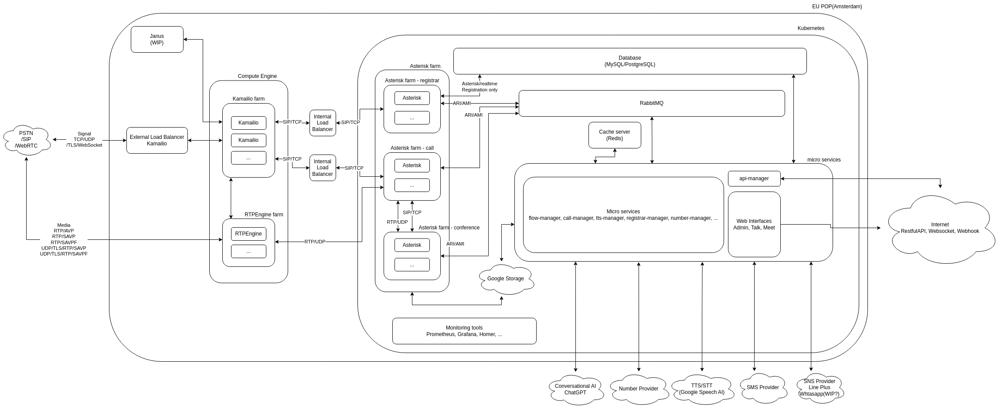

# VoIPbin Monorepo

VoIPbin is a cloud-native, open-source CPaaS platform for programmable voice communication. This repository is the primary backend services monorepo — it contains the 34 Go microservices that handle call routing, AI pipelines, conferencing, billing, messaging, and more.

This is one of VoIPbin's main repositories. It covers the backend service layer; other infrastructure (Kamailio, Kubernetes configs) lives in separate repos.

## 🧱 Why a Monorepo?

VoIPBin uses a **monorepo** to manage all backend services in a single codebase. This approach is intentional and comes with many advantages:

### ✅ Benefits

- **Single source of truth**: All services live in one place, ensuring consistency and traceability.
- **Easier refactoring**: Shared logic and APIs can be updated across services without versioning headaches.
- **Shared tooling**: Common CI/CD pipelines, Go versioning, linting, and codegen setup apply to all modules.
- **Simplified onboarding**: New developers only need to clone one repo to access the entire system.
- **Better visibility**: Understanding the system as a whole becomes easier when everything is in one place.

## 🔍 What is VoIPbin?

VoIPbin is a **VoIP backend platform** designed to help teams quickly deploy and operate communication workflows — from simple call routing to AI-assisted conversation flows.

It is the only production-grade open-source CPaaS platform that you can fully self-host, with a focus on flexibility, modularity, and full control over your stack.

### Use cases include:

- Building programmable call flows
- Running AI-powered callbots or IVRs
- Handling mass outbound call campaigns
- Creating scalable conferencing tools
- Integrating SMS, Email, and Webhooks
- Recording, transcribing, and summarizing calls
- Managing VoIP customers, agents, and usage

---

## 🚀 What You Can Do with VoIPbin

- **Agent Interfaces**: Let your agents receive calls and interact via a simple web interface.
- **Admin Console**: Manage flows, routing, agents, campaigns, and more.
- **Programmable Flows**: Define rich call behaviors via flow JSON or API.
- **AI Assistants**: Inject AI into your call flows with VoIPbin's chatbot integration.
- **Conferencing**: Set up rooms with recording, moderator controls, and breakout support.
- **Multichannel Support**: Mix voice, SMS, email, and more.
- **Modular Services**: Pick only the features you need — everything runs independently.
- **Self-hosting and Cloud-friendly**: Deploy on GCP (or any Kubernetes setup) with full customization.

---

## 🌐 Helpful Links

- 🔧 [Admin Console](https://admin.voipbin.net/) — Manage everything visually
- 📞 [Agent Page](https://talk.voipbin.net/) — VoIP-enabled agent interface
- 📘 [API Documentation](https://api.voipbin.net/docs/) — Explore and test VoIPbin APIs
- 🌍 [Project Site](http://voipbin.net/) — Landing page for VoIPbin

---

## 🧭 Directory Overview

The monorepo includes many backend services under separate directories:

| Directory                  | Purpose                                       |
|----------------------------|-----------------------------------------------|
| `bin-agent-manager`        | Manages agent presence and actions            |
| `bin-ai-manager`           | AI chatbot and LLM orchestration              |
| `bin-api-manager`          | External API gateway for VoIPbin              |
| `bin-billing-manager`      | Billing and subscription tracking             |
| `bin-call-manager`         | Inbound/outbound call routing and control     |
| `bin-campaign-manager`     | Outbound dialing campaigns                    |
| `bin-common-handler`       | Shared logic and RPC layer across services    |
| `bin-conference-manager`   | Audio conferencing features                   |
| `bin-contact-manager`      | Customer contact records and lookup           |
| `bin-conversation-manager` | Multi-channel conversation tracking           |
| `bin-customer-manager`     | Customer accounts and relationships           |
| `bin-dbscheme-manager`     | Database schemas and migrations               |
| `bin-direct-manager`       | SIP URI hash routing and direct dial logic    |
| `bin-email-manager`        | Email sending and inbox parsing               |
| `bin-flow-manager`         | Flow execution engine                         |
| `bin-hook-manager`         | Webhook receivers                             |
| `bin-message-manager`      | SMS and messaging                             |
| `bin-number-manager`       | DID and number provisioning                   |
| `bin-openapi-manager`      | Shared OpenAPI specs                          |
| `bin-outdial-manager`      | Outbound call dialer                          |
| `bin-pipecat-manager`      | Realtime AI voice pipeline (Go/Python hybrid) |
| `bin-queue-manager`        | Call queueing and routing logic               |
| `bin-rag-manager`          | Retrieval-augmented generation backend        |
| `bin-registrar-manager`    | SIP registrar (UDP/TCP/WebRTC)                |
| `bin-route-manager`        | Routing logic and policies                    |
| `bin-sentinel-manager`     | Kubernetes-aware health/monitoring sentinel   |
| `bin-storage-manager`      | File storage backend                          |
| `bin-tag-manager`          | Labeling and tagging                          |
| `bin-talk-manager`         | Talk/agent realtime backend                   |
| `bin-timeline-manager`     | Per-resource timeline events                  |
| `bin-transcribe-manager`   | Audio transcription                           |
| `bin-transfer-manager`     | Call transfer logic                           |
| `bin-tts-manager`          | Text-to-Speech integration                    |
| `bin-webhook-manager`      | Webhook sender                                |
| `voip-asterisk-proxy`      | Integration proxy for Asterisk                |
| `voip-kamailio-proxy`      | Kamailio SIP proxy integration                |
| `voip-rtpengine-proxy`     | RTPEngine media proxy integration             |

---


## 🛠️ How to Get Started

> ⚠️ VoIPbin is not a plug-and-play application.
> 
> It's a platform composed of multiple microservices, SIP/media infrastructure (e.g., Asterisk, RTPEngine), Kubernetes-based deployments, and pluggable third-party integrations for telephony, AI, and other backends. You don't just "run it" — you assemble and deploy it based on your architecture.

This monorepo handles only part of voipbin services.




That said, here's how to begin:

### Understand the Architecture

VoIPbin is composed of multiple services that run independently and communicate over HTTP, gRPC, SIP, and WebRTC. You’ll need:

* A Kubernetes environment (we recommend GCP GKE)
* Compute engine with static public IP Address
* A public domain with TLS (e.g., via Cloudflare)
* A media path (RTPEngine or equivalent)
* Optionally, Asterisk instances for call bridging, conferencing, and SIP registration

We recommend reading the platform architecture guide (coming soon) before setup.

### Clone the Repo

```
   $ git clone https://github.com/voipbin/monorepo.git
   $ cd monorepo
```

### Configure Your Secrets

```
export CC_AUTHTOKEN_<PROVIDER>=***
export CC_SSL_CERT_API_BASE64=xxx
...
```
Check each service’s README (or environment loader) for what it needs.

### Deploy to Kubernetes
You'll need a Kubernetes manifest or Helm chart per service. For now, these are maintained privately or in internal repositories — contact us if you'd like access to deployment blueprints.


## 📫 Questions or Feedback?
We’re here to help. Visit voipbin.net or reach out to the team via the contact link on the site.

## 📞 Need Help?
If you're exploring VoIPBin for your own product, team, or integration — feel free to reach out. We're building it to empower engineers like you.

