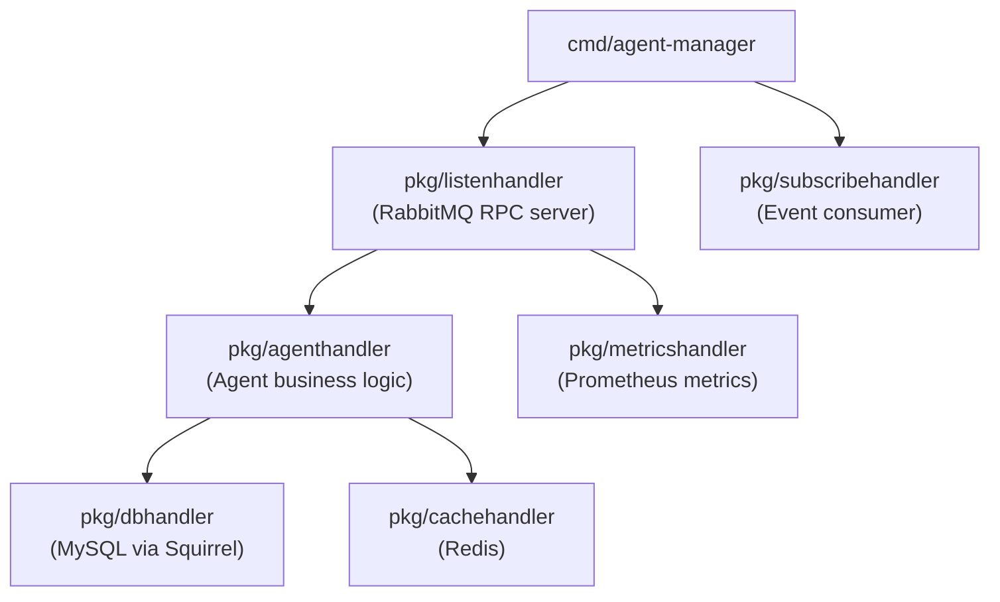

# Architecture: bin-agent-manager

## Component Overview

## Layer Responsibilities

| Package | Role | Key Types |
|---------|------|-----------|
| `pkg/agenthandler` | Core agent logic: CRUD, login/auth, status management, permission updates, password reset, address management | `agent.Agent`, `agent.Status`, `agent.Permission` |
| `pkg/metricshandler` | Prometheus metrics registration and recording for agent operations | Prometheus counter/histogram types |
| `pkg/listenhandler` | RabbitMQ RPC request router (regex pattern matching) | `sock.Request`, `sock.Response` |
| `pkg/subscribehandler` | Consumes events from call-manager, customer-manager, and webhook-manager to react to external state changes | queue event structs |
| `pkg/dbhandler` | MySQL CRUD using Squirrel query builder | all model structs |
| `pkg/cachehandler` | Redis fast-path lookups for agents | `agent.Agent` |
| `models/agent` | Agent data model, status constants, permission flags, ring method | `agent.Agent`, `agent.Status`, `agent.Permission` |

## Request Routing

Requests arrive via RabbitMQ queue `bin-manager.agent-manager.request`. The `listenhandler` matches each request's URI against regex patterns and dispatches to the appropriate handler function.

| Route Pattern | Method | Description |
|---------------|--------|-------------|
| `/v1/agents/count_by_customer$` | GET | Count agents by customer ID |
| `/v1/agents$` | POST | Create a new agent |
| `/v1/agents\?(.*)`| GET | List agents with filters/pagination |
| `/v1/agents/{{UUID}}/login$` | POST | Authenticate an agent (returns token) |
| `/v1/agents/{{UUID}}$` | GET/PUT/DELETE | Get, update, or delete an agent |
| `/v1/agents/{{UUID}}/addresses$` | GET/POST/DELETE | Manage agent SIP/contact addresses |
| `/v1/agents/{{UUID}}/tag_ids$` | PUT | Update agent tag IDs |
| `/v1/agents/{{UUID}}/status$` | PUT | Update agent status (available/away/busy/offline) |
| `/v1/agents/{{UUID}}/password$` | PUT | Change agent password |
| `/v1/agents/{{UUID}}/permission$` | PUT | Update agent permission flags |
| `/v1/agents/{{UUID}}/direct-hash-regenerate$` | POST | Regenerate the direct-access hash |
| `/v1/agents/get_by_customer_id_address$` | GET | Look up an agent by customer ID and SIP address |
| `/v1/login$` | POST | Global login endpoint (all agents) |
| `/v1/password-forgot$` | POST | Initiate password reset flow (send email) |
| `/v1/password-reset$` | POST | Complete password reset with token |
