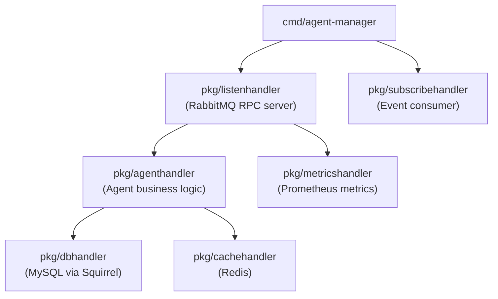

# Architecture: bin-agent-manager

## Component Overview

```mermaid
graph TD
    CMD["cmd/agent-manager"] --> LH["pkg/listenhandler\n(RabbitMQ RPC server)"]
    CMD --> SH["pkg/subscribehandler\n(Event consumer)"]

    LH --> AH["pkg/agenthandler\n(Agent business logic)"]
    LH --> MH["pkg/metricshandler\n(Prometheus metrics)"]

    AH --> DBH["pkg/dbhandler\n(MySQL via Squirrel)"]
    AH --> Cache["pkg/cachehandler\n(Redis)"]
```

## Layer Responsibilities

| Package | Role | Key Types |
|---------|------|-----------|
| `pkg/agenthandler` | Core agent logic: CRUD, login/auth, status management, permission updates, password reset, address management | `agent.Agent`, `agent.Status`, `agent.Permission` |
| `pkg/metricshandler` | Prometheus metrics registration and recording for agent operations | Prometheus counter/histogram types |
| `pkg/listenhandler` | RabbitMQ RPC request router (regex pattern matching) | `sock.Request`, `sock.Response` |
| `pkg/subscribehandler` | Consumes events from call-manager, customer-manager, and webhook-manager to react to external state changes | queue event structs |
| `pkg/dbhandler` | MySQL CRUD using Squirrel query builder | all model structs |
| `pkg/cachehandler` | Redis fast-path lookups for agents | `agent.Agent` |
| `models/agent` | Agent data model, status constants, permission flags, ring method | `agent.Agent`, `agent.Status`, `agent.Permission` |

## Request Routing

Requests arrive via RabbitMQ queue `bin-manager.agent-manager.request`. The `listenhandler` matches each request's URI against regex patterns and dispatches to the appropriate handler function.

| Route Pattern | Method | Description |
|---------------|--------|-------------|
| `/v1/agents/count_by_customer$` | GET | Count agents by customer ID |
| `/v1/agents$` | POST | Create a new agent |
| `/v1/agents\?(.*)`| GET | List agents with filters/pagination |
| `/v1/agents/{{UUID}}/login$` | POST | Authenticate an agent (returns token) |
| `/v1/agents/{{UUID}}$` | GET/PUT/DELETE | Get, update, or delete an agent |
| `/v1/agents/{{UUID}}/addresses$` | GET/POST/DELETE | Manage agent SIP/contact addresses |
| `/v1/agents/{{UUID}}/tag_ids$` | PUT | Update agent tag IDs |
| `/v1/agents/{{UUID}}/status$` | PUT | Update agent status (available/away/busy/offline) |
| `/v1/agents/{{UUID}}/password$` | PUT | Change agent password |
| `/v1/agents/{{UUID}}/permission$` | PUT | Update agent permission flags |
| `/v1/agents/{{UUID}}/direct-hash-regenerate$` | POST | Regenerate the direct-access hash |
| `/v1/agents/get_by_customer_id_address$` | GET | Look up an agent by customer ID and SIP address |
| `/v1/login$` | POST | Global login endpoint (all agents) |
| `/v1/password-forgot$` | POST | Initiate password reset flow (send email) |
| `/v1/password-reset$` | POST | Complete password reset with token |

## Events Consumed

Since VOIP-1406 the subscribe queue `bin-manager.agent-manager.subscribe` receives its service events through pattern bindings on the global topic exchange `bin-manager.event` (declared idempotently at boot), one pattern per dispatch pair. Since VOIP-1407 this topic-pattern binding is the **sole intake mechanism** for these events:

| Pattern | Dispatch |
|---------|----------|
| `call-manager.groupcall.*.created` | groupcall created handling |
| `call-manager.groupcall.*.progressing` | groupcall progressing handling |
| `customer-manager.customer.*.deleted` | customer deletion cleanup |
| `customer-manager.customer.*.created` | customer creation handling |

The exact pattern set is pinned by `pkg/subscribehandler/binding_golden_test.go`.

- The VOIP-1258 webhook-topic bind (`#` on `bin-manager.webhook-manager.event.topic`) is a separate, unrelated migration and is unchanged by VOIP-1407; it still coexists with the bindings above.
- The old per-service fanout subscriptions (`QueueSubscribe` to `bin-manager.call-manager.event` and `bin-manager.customer-manager.event`) and the fanout-unbind step that used to follow a successful topic bind have been removed from `Run()` entirely (VOIP-1407). A topic-pattern bind failure now returns a fatal error from `Run()` immediately; there is no fanout fallback left to degrade to.

## Events Published

Exchange: the global topic exchange `bin-manager.event`, routing key `agent-manager.<resource>.<subscription-id>.<action>`.

Both `cmd/agent-manager` and `cmd/agent-control` construct their NotifyHandler with `notifyhandler.WithGlobalTopicPublish()`. **As of VOIP-1407, this is the sole publish path** — the previous per-service fanout exchange `bin-manager.agent-manager.event` is no longer published to, and (per the operational runbook in `docs/reference/rabbitmq-queues-reference.md`) will eventually be deleted from the broker. This service's publish-side behavior change comes entirely from `bin-common-handler/pkg/notifyhandler`'s shared library update (its own consumer-side subscribehandler code also changed separately for VOIP-1407, see the Events Consumed section above). Both construction sites must stay in lockstep on this option — enabling it in only one would leave consumers with gaps depending on which process published. A topic publish failure now propagates to the caller as an error (previously it was swallowed silently).

Every agent event is addressed by the agent's OWN id (the default top-level `id` fallback; no `eventtopic.SubscriptionIdentifier` override exists in this service), so a consumer following one agent binds `agent-manager.agent.<agent-id>.#` and receives all four event types. Note `agent_status_updated` splits on the FIRST underscore, keeping the resource segment `agent` and putting `status_updated` in the action segment. The exact keys are pinned by `models/agent/routingkey_golden_test.go`; the schema lives in the monorepo `docs/plans/2026-08-27-voip-1404-global-topic-exchange-design.md`.

| Event type | Trigger | Publish path |
|-----------|---------|--------------|
| `agent.EventTypeAgentCreated` | Agent created | `PublishWebhookEvent` |
| `agent.EventTypeAgentUpdated` | Agent info, addresses, tag IDs, password, or permission updated | `PublishEvent` + `PublishWebhookEvent` |
| `agent.EventTypeAgentDeleted` | Agent deleted | `PublishWebhookEvent` |
| `agent.EventTypeAgentStatusUpdated` | Agent status changed (available/away/busy/offline/ringing) | `PublishWebhookEvent` |
