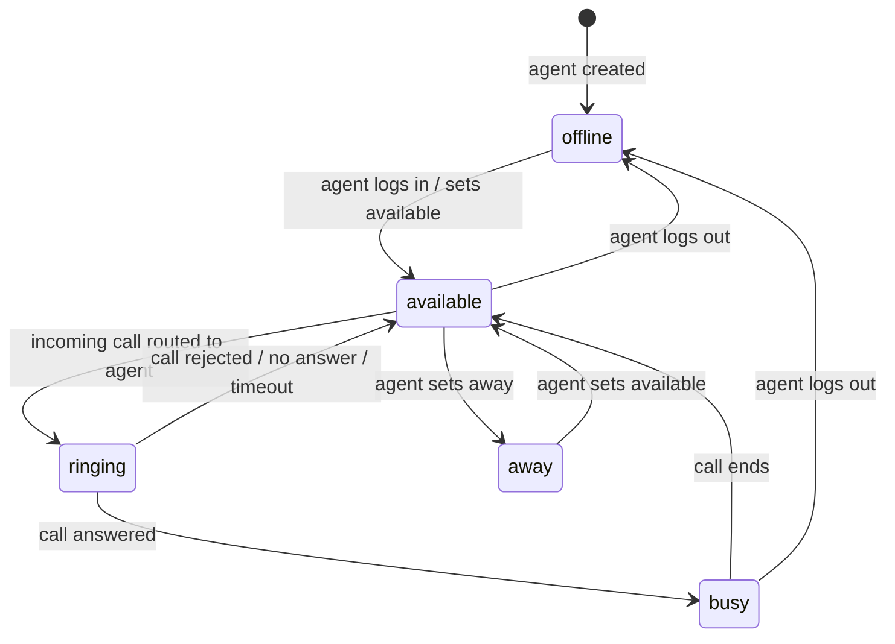

# Domain: bin-agent-manager

## Domain Entities

### Agent

A person (call center operator) who handles inbound and outbound calls through the VoIPbin platform. Agents belong to a customer account, have a set of contact addresses (SIP URIs), configurable permissions, and a real-time status reflecting their availability.

Key fields: `customer_id`, `name`, `extension`, `addresses` (SIP contact URIs), `status`, `ring_method`, `permission`, `tag_ids`, `direct_hash`.

Statuses: `available`, `away`, `busy`, `offline`, `ringing`.

Ring methods: `ringall` (all addresses called simultaneously), `linear` (addresses tried in order).

### Permission

A bitfield system organizing access rights at two levels:

- **Project-level** (`permission_project`): Platform-wide flags, e.g., super-admin access.
- **Customer-level** (`permission_customer`): Account-scoped flags — agent (base access), admin (account management), manager (reporting and config).

Permissions are stored as integer bitmasks and checked bitwise.

## Key Business Rules

1. **Status transitions are event-driven**: Agent status changes from `available` → `ringing` when an incoming call is routed; from `ringing` → `busy` when answered; and back to `available` when the call ends. This service subscribes to call-manager events to drive these transitions automatically.

2. **Password reset requires a configured base URL**: The `password_reset_base_url` config flag must be set for the password-forgot flow to function. If unset, password reset emails will not contain a valid link.

3. **Addresses are SIP contact URIs**: Each agent can have multiple addresses (e.g., SIP extension, softphone URI). The `get_by_customer_id_address` endpoint enables reverse lookup from a SIP URI to an agent — used by call-manager when a call arrives at a known address.

4. **Tag IDs enable queue routing**: Agents are tagged; queues filter available agents by matching tag IDs. Updating an agent's `tag_ids` immediately affects which queues can route to them.

5. **Customer deletion cascades to agents**: This service subscribes to `customer-manager` events. When a customer is deleted, all associated agents are cleaned up.

6. **Webhook events trigger external notifications**: This service subscribes to `webhook-manager` events to handle webhook delivery outcomes that may affect agent state.

7. **Events published on agent state changes**: Agent created, deleted, updated, and status-updated events are published to `bin-manager.agent-manager.event` for downstream consumers (e.g., queue-manager for agent availability tracking).

## State Machines

### Agent Status Lifecycle

