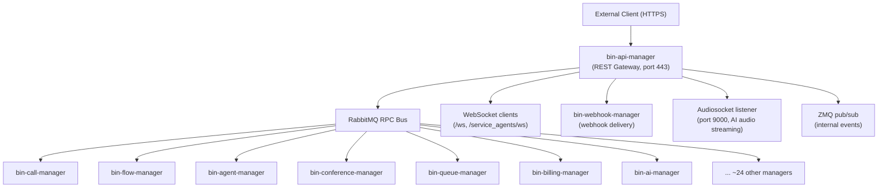

# bin-api-manager Architecture

## Component Overview

`bin-api-manager` is the sole HTTP/REST API gateway for the entire VoIPbin platform. It receives all external REST requests and fans them out to ~30 backend services via RabbitMQ RPC. Business logic lives entirely in the backend services — this service owns authentication, authorization, and protocol translation.



### Main Structural Packages

| Package | Location | Purpose |
|---------|----------|---------|
| `server/` | HTTP handlers | Implements the generated `openapi_server.ServerInterface`; one file per resource group |
| `pkg/servicehandler/` | Business delegation | Auth check + RabbitMQ RPC fan-out; one file per resource type |
| `pkg/dbhandler/` | Data access | MySQL + Redis cache (customer, accesskey, token data owned by api-manager) |
| `pkg/cachehandler/` | Redis cache | Session and token caching |
| `pkg/subscribehandler/` | Event consumption | Subscribes to backend manager event queues |
| `pkg/websockhandler/` | WebSocket fan-out | Pushes events to authenticated WebSocket clients |
| `pkg/streamhandler/` | Audio streaming | Audiosocket protocol handler for AI/Pipecat audio path |
| `pkg/zmqpubhandler/` | ZMQ publish | Internal pub/sub event publishing |
| `pkg/zmqsubhandler/` | ZMQ subscribe | Internal pub/sub event consumption |
| `lib/middleware/` | HTTP middleware | JWT/accesskey authentication, customer frozen check |
| `gens/openapi_server/` | Generated code | oapi-codegen output from `bin-openapi-manager/openapi/openapi.yaml` |

### Code Generation

Server code is generated from `bin-openapi-manager/openapi/openapi.yaml` using `oapi-codegen`. The OpenAPI spec is the single source of truth for the public API contract. To regenerate:

```bash
cd ../bin-openapi-manager && go generate ./...
cd ../bin-api-manager && go generate ./...
```

Never hand-edit `gens/openapi_server/gen.go`.

---

## Middleware Stack

Requests pass through the following middleware layers before reaching a handler:

1. **TLS termination** — SSL certificates loaded from base64-encoded flags at startup (`-ssl_cert_base64`, `-ssl_private_base64`).

2. **CORS** — Configured in Gin to allow cross-origin requests from known client domains (admin console, agent UI).

3. **Request ID injection** — A unique request ID is attached to each request and propagated through logs and error envelopes.

4. **Prometheus instrumentation** — Every request is timed; labels include method and path. Metric: `api_manager_receive_request_process_time`.

5. **JWT / Accesskey authentication** (`lib/middleware/authenticate.go`) — Validates credentials before any protected handler runs. See [auth.md](auth.md) for details.

6. **Customer frozen check** — After authentication succeeds, if the customer account status is `frozen`, all requests except `DELETE /auth/unregister` are rejected with `403 ACCOUNT_FROZEN`.

7. **Handler dispatch** — Routes to the concrete `server/` handler, which calls `pkg/servicehandler/`.

Public endpoints (no authentication required):
- `POST /auth/signup`
- `POST /auth/boot`
- `POST /auth/email-verify`
- `POST /auth/password-forgot`
- `GET/POST /auth/password-reset`

---

## Backend Services

Each resource group in the REST API maps to one (or occasionally two) backend services. `pkg/servicehandler/` holds the mapping. Requests are dispatched via `bin-common-handler/pkg/sockhandler` which wraps the RabbitMQ RPC protocol.

### How requests reach backend services

1. HTTP request arrives and passes middleware.
2. `server/<resource>.go` handler parses the request and calls `serviceHandler.<ResourceAction>(ctx, agent, ...)`.
3. `pkg/servicehandler/<resource>.go` performs permission checks (`hasPermission`), then calls `h.reqHandler.<ServiceV1ResourceAction>(ctx, ...)`.
4. `reqHandler` (from `bin-common-handler/pkg/requesthandler`) sends an RPC message to the target service's queue.
5. The backend service processes the request and replies; the reply is forwarded as the HTTP response.

### Backend service groups

| REST Domain | Backend Service | Notes |
|------------|----------------|-------|
| `/auth/*` | `bin-customer-manager` | JWT issuance; login/signup/unregister live here |
| `/customer`, `/customers/*` | `bin-customer-manager` | Singular = self-service; plural = admin-only |
| `/agents/*`, `/extensions/*` | `bin-agent-manager` | Agent CRUD, permissions, status |
| `/calls/*`, `/groupcalls/*`, `/conferencecalls/*`, `/queuecalls/*` | `bin-call-manager` | Call lifecycle, hold/mute/recording/TTS |
| `/campaigns/*`, `/campaigncalls/*` | `bin-campaign-manager` | Outbound campaign management |
| `/conferences/*` | `bin-conference-manager` | Conference rooms |
| `/queues/*` | `bin-queue-manager` | ACD queues |
| `/flows/*`, `/activeflows/*` | `bin-flow-manager` | IVR flow definition and execution |
| `/billings/*`, `/billing_account/*`, `/billing_accounts/*` | `bin-billing-manager` | Billing records and account balance |
| `/numbers/*`, `/available_numbers` | `bin-number-manager` | DID/phone number provisioning |
| `/messages/*` | `bin-message-manager` | SMS/messaging |
| `/emails/*` | `bin-email-manager` | Email channel |
| `/contacts/*` | `bin-contact-manager` | Contact directory |
| `/conversations/*`, `/conversation_accounts/*` | `bin-conversation-manager` | Omnichannel conversation threads |
| `/ais/*`, `/aicalls/*`, `/aisummaries/*`, `/aimessages/*` | `bin-ai-manager` | AI agents, AI call sessions, summaries |
| `/rags/*` | `bin-rag-manager` | Retrieval-augmented generation knowledge bases |
| `/transcribes/*`, `/transcripts` | `bin-transcribe-manager` | Speech-to-text transcription |
| `/speakings/*` | `bin-tts-manager` (pipecat) | Text-to-speech speaking sessions |
| `/storage_accounts/*`, `/storage_files/*` | `bin-storage-manager` | File/media storage (GCS) |
| `/tags/*` | `bin-tag-manager` | Resource tagging |
| `/teams/*` | `bin-agent-manager` | Agent teams |
| `/timelines/*` | `bin-timeline-manager` | Event timeline and SIP analysis |
| `/outdials/*`, `/outplans/*` | `bin-outdial-manager` | Outbound dialing lists and plans |
| `/providers/*`, `/providercalls/*` | `bin-direct-manager` | SIP trunk providers |
| `/trunks/*` | `bin-transfer-manager` | Call transfer |
| `/routes/*` | `bin-route-manager` | Routing rules |
| `/recordings/*`, `/recordingfiles/*` | `bin-call-manager` + storage | Recording metadata and file retrieval |
| `/outbound_config`, `/outbound_configs/*` | `bin-call-manager` | Outbound call configuration |
| `/accesskeys/*` | local db (api-manager) | API access key CRUD (managed locally, no RPC) |
| `/aggregated-events` | `bin-hook-manager` | Webhook event aggregation |
| `/service_agents/*` | various (agent-scoped proxy) | Agent-facing subset of resources with scoped auth |
| `/ws` | local (websockhandler) | WebSocket upgrade; real-time event push to clients |

Event re-emission: `pkg/subscribehandler/` consumes events from backend queues (`bin-manager.webhook-manager.event`, `bin-manager.agent-manager.event`, `bin-manager.talk-manager.event`) and pushes them to WebSocket clients and `bin-webhook-manager` for HTTP delivery.
