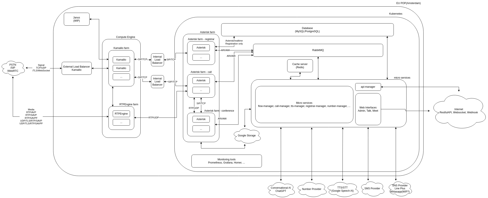

.. _architecture-overview:

Overview
========
VoIPBIN is a cloud-native Communication Platform as a Service (CPaaS) built on modern microservices architecture. The platform provides comprehensive communication capabilities including PSTN calls, WebRTC, SMS, conferencing, AI-powered features, and workflow orchestration.

VoIPBIN is designed from the ground up for scalability, reliability, and developer productivity, enabling businesses to build sophisticated communication solutions through simple API calls.

High-Level System Architecture
-------------------------------

VoIPBIN consists of three major architectural layers:

.. code::

    ┌──────────────────────────────────────────────────────────────────┐
    │                      Client Applications                         │
    │  (Web Apps, Mobile Apps, Server-to-Server Integrations)          │
    └────────────────────────┬─────────────────────────────────────────┘
                             │ HTTPS/REST API
                             ▼
    ┌──────────────────────────────────────────────────────────────────┐
    │                     API Gateway Layer                            │
    │                    (bin-api-manager)                             │
    │  • Authentication & Authorization                                │
    │  • Rate Limiting & Throttling                                    │
    │  • Request Routing & Load Balancing                              │
    └────────────────────────┬─────────────────────────────────────────┘
                             │ RabbitMQ RPC
                             ▼
    ┌──────────────────────────────────────────────────────────────────┐
    │                  Microservices Layer                             │
    │  ┌──────────────┐  ┌──────────────┐  ┌──────────────┐            │
    │  │ Call Manager │  │ Flow Manager │  │  AI Manager  │            │
    │  └──────────────┘  └──────────────┘  └──────────────┘            │
    │  ┌──────────────┐  ┌──────────────┐  ┌──────────────┐            │
    │  │Chat Manager  │  │ SMS Manager  │  │Queue Manager │            │
    │  └──────────────┘  └──────────────┘  └──────────────┘            │
    │  ┌──────────────┐  ┌──────────────┐  ┌──────────────┐            │
    │  │Agent Manager │  │ Billing Mgr  │  │Webhook Mgr   │            │
    │  └──────────────┘  └──────────────┘  └──────────────┘            │
    │                    ... 30+ services                              │
    └────────────────────────┬─────────────────────────────────────────┘
                             │
                             ▼
    ┌──────────────────────────────────────────────────────────────────┐
    │              Real-Time Communication Layer                       │
    │  ┌──────────────┐  ┌──────────────┐  ┌──────────────┐            │
    │  │  Kamailio    │  │   Asterisk   │  │  RTPEngine   │            │
    │  │ (SIP Proxy)  │  │(Media Server)│  │(Media Proxy) │            │
    │  └──────────────┘  └──────────────┘  └──────────────┘            │
    └──────────────────────────────────────────────────────────────────┘

    ┌──────────────────────────────────────────────────────────────────┐
    │                  Shared Infrastructure                           │
    │  • MySQL Database  • Redis Cache  • RabbitMQ  • Kubernetes       │
    └──────────────────────────────────────────────────────────────────┘

Architectural Layers
--------------------

**1. API Gateway Layer**

The API Gateway (bin-api-manager) serves as the single entry point for all external requests:

* **Authentication**: JWT-based authentication for all API requests
* **Authorization**: Permission checks based on customer and agent roles
* **Request Routing**: Routes authenticated requests to appropriate backend services via RabbitMQ RPC
* **Protocol Translation**: Converts HTTP/REST to internal RabbitMQ messaging
* **Response Aggregation**: Collects responses from backend services and returns to clients

**2. Microservices Layer**

VoIPBIN consists of 30+ specialized Go microservices, organized by domain:

**Communication Services:**
* bin-call-manager: Call lifecycle and routing
* bin-conference-manager: Conference bridge management
* bin-sms-manager: SMS messaging
* bin-chat-manager: Real-time chat

**AI Services:**
* bin-ai-manager: AI assistant, transcription, summarization
* bin-transcribe-manager: Speech-to-text processing
* bin-tts-manager: Text-to-speech synthesis

**Workflow Services:**
* bin-flow-manager: Call flow orchestration and IVR
* bin-queue-manager: Call queue management
* bin-campaign-manager: Outbound campaign automation

**Management Services:**
* bin-agent-manager: Agent state and presence
* bin-billing-manager: Usage tracking and billing
* bin-webhook-manager: Webhook delivery
* bin-storage-manager: File and media storage

**3. Real-Time Communication Layer**

See :ref:`RTC Architecture <architecture-rtc>` for detailed information about the VoIP stack.

Core Design Principles
----------------------

VoIPBIN is designed around these key architectural principles:

**Microservices Architecture**

.. code::

    Service Isolation:
    ┌────────────┐     ┌────────────┐     ┌────────────┐
    │  Service A │     │  Service B │     │  Service C │
    │            │     │            │     │            │
    │  • Domain  │     │  • Domain  │     │  • Domain  │
    │  • Logic   │     │  • Logic   │     │  • Logic   │
    │  • Data    │     │  • Data    │     │  • Data    │
    └──────┬─────┘     └──────┬─────┘     └──────┬─────┘
           │                  │                  │
           └──────────────────┴──────────────────┘
                    Message Queue (RabbitMQ)

* **Domain Isolation**: Each service owns its domain logic and data
* **Independent Deployment**: Services can be deployed independently
* **Technology Flexibility**: Services can use different technologies as needed
* **Fault Isolation**: Failure in one service doesn't cascade

**Event-Driven Architecture**

.. code::

    Event Flow:
    ┌──────────────┐     Event        ┌──────────────┐
    │   Service    │────────────────▶ │   Message    │
    │  (Publisher) │                  │    Queue     │
    └──────────────┘                  └───────┬──────┘
                                              │
                                              ├────────────────┐
                                              │                │
                                              ▼                ▼
                                     ┌────────────┐   ┌────────────┐
                                     │ Subscriber │   │ Subscriber │
                                     │ Service A  │   │ Service B  │
                                     └────────────┘   └────────────┘

* **Asynchronous Communication**: Services communicate via events
* **Loose Coupling**: Publishers don't know about subscribers
* **Scalability**: Multiple subscribers can process events in parallel
* **Reliability**: Message queues provide guaranteed delivery

**API Gateway Pattern**

.. code::

    External Request Flow:

    Client App                  API Gateway              Backend Services
        │                           │                           │
        │  HTTPS/REST               │                           │
        ├──────────────────────────▶│                           │
        │                           │  1. Authenticate          │
        │                           │  2. Authorize             │
        │                           │  3. Route Request         │
        │                           │                           │
        │                           │  RabbitMQ RPC             │
        │                           ├──────────────────────────▶│
        │                           │                           │
        │                           │  Response                 │
        │                           │◀──────────────────────────┤
        │  JSON Response            │                           │
        │◀──────────────────────────┤                           │
        │                           │                           │

* **Single Entry Point**: All external traffic goes through one gateway
* **Security Layer**: Authentication and authorization at the edge
* **Protocol Translation**: HTTP to internal messaging protocols
* **Service Discovery**: Gateway knows how to reach all services

**Shared Data Layer**

.. code::

    Data Architecture:

    ┌────────────┐  ┌────────────┐  ┌────────────┐
    │  Service   │  │  Service   │  │  Service   │
    │      A     │  │      B     │  │      C     │
    └──────┬─────┘  └───────┬────┘  └────────┬───┘
           │                │                │
           ├────────────────┼────────────────┤
           │                │                │
           ▼                ▼                ▼
    ┌───────────────────────────────────────────┐
    │           Redis Cache (Hot Data)          │
    └───────────────────────────────────────────┘
           ▼                ▼                ▼
    ┌───────────────────────────────────────────┐
    │         MySQL Database (Cold Data)        │
    └───────────────────────────────────────────┘

* **Shared MySQL**: Single source of truth for all data
* **Redis Cache**: Fast access to frequently used data
* **Consistent Schema**: All services use common database schema
* **Transaction Support**: ACID guarantees for critical operations

Communication Channels
----------------------

VoIPBIN supports multiple communication channels through dedicated gateways:

**Voice Communication:**

* **PSTN**: Traditional phone calls via carrier integrations
* **WebRTC**: Browser-based voice and video calls
* **SIP**: Direct SIP trunking for enterprise customers

**Messaging:**

* **SMS**: Text messaging via carrier integrations
* **Chat**: Real-time chat with WebSocket support
* **Email**: Email notifications and campaigns

**AI-Enhanced Communication:**

* **AI Assistants**: Voice-enabled AI agents for customer service
* **Transcription**: Real-time and batch speech-to-text
* **Summarization**: Call summarization and insights
* **Sentiment Analysis**: Real-time emotion detection

Integration Capabilities
------------------------

VoIPBIN provides multiple integration methods:

**REST API:**

* Comprehensive REST API for all platform features
* OpenAPI/Swagger documentation
* SDKs for multiple languages

**WebSocket:**

* Real-time event streaming
* Bi-directional media streaming
* Live transcription feeds

**Webhooks:**

* Event notifications to external systems
* Configurable retry policies
* Signature verification for security

**Direct Database Access:**

* Read replicas for reporting
* Analytics database for business intelligence

Key Architectural Benefits
--------------------------

VoIPBIN's architecture is designed to deliver these advantages:

**Scalability**

* **Horizontal Scaling**: Add more service instances to handle increased load
* **Independent Scaling**: Scale only the services that need more capacity
* **Auto-Scaling**: Kubernetes automatically scales based on metrics
* **Global Distribution**: Deploy services across multiple regions

**Reliability**

* **Fault Isolation**: Issues in one service don't affect others
* **Circuit Breakers**: Prevent cascading failures
* **Automatic Failover**: Kubernetes restarts failed containers
* **SIP Session Recovery**: Maintain calls even when servers crash
* **Message Persistence**: RabbitMQ ensures no messages are lost

**Security**

* **API Gateway Security**: All authentication at the edge
* **Service Isolation**: Services communicate via internal network only
* **Encryption**: TLS for all external communication
* **Secret Management**: Kubernetes secrets for sensitive data
* **Audit Logging**: Complete audit trail of all operations

**Developer Productivity**

* **Simple REST API**: Easy to integrate with any application
* **Comprehensive Docs**: Detailed documentation with examples
* **Webhook Events**: Real-time notifications of system events
* **Test Environment**: Sandbox for development and testing
* **SDK Support**: Official SDKs for popular languages

**Operational Excellence**

* **Centralized Logging**: All logs aggregated in one place
* **Metrics & Monitoring**: Prometheus metrics for all services
* **Distributed Tracing**: Track requests across services
* **Health Checks**: Automated health monitoring
* **Zero-Downtime Deploys**: Rolling updates without service interruption

Service Dependencies
--------------------

VoIPBIN services have well-defined dependencies for coordinated operations:

.. code::

    Core Service Dependencies:

    ┌─────────────────────────────────────────────────────────────────┐
    │                     bin-api-manager                             │
    │                    (API Gateway)                                │
    │  ─────────────────────────────────────────────────────────────  │
    │    Depends on: ALL backend services for RPC routing             │
    └─────────────────────────────────────────────────────────────────┘
                                 │
         ┌───────────────────────┼───────────────────────┐
         │                       │                       │
         ▼                       ▼                       ▼
    ┌─────────────┐        ┌─────────────┐        ┌─────────────┐
    │bin-call-mgr │        │bin-flow-mgr │        │bin-ai-mgr   │
    └──────┬──────┘        └──────┬──────┘        └──────┬──────┘
           │                      │                      │
           │                      │                      │
           ▼                      ▼                      ▼
    ┌─────────────┐        ┌─────────────┐        ┌─────────────┐
    │bin-billing  │        │bin-call-mgr │        │bin-transcribe│
    │bin-webhook  │        │bin-queue-mgr│        │bin-tts-mgr  │
    │bin-number   │        │bin-ai-mgr   │        │bin-pipecat  │
    └─────────────┘        └─────────────┘        └─────────────┘

**Key Dependency Patterns:**

.. code::

    Call Processing Chain:
    bin-call-manager
      ├──▶ bin-flow-manager      (IVR and call flows)
      ├──▶ bin-billing-manager   (usage tracking)
      ├──▶ bin-webhook-manager   (event notifications)
      ├──▶ bin-transcribe-manager (call transcription)
      └──▶ bin-number-manager    (phone number lookup)

    AI Voice Pipeline:
    bin-pipecat-manager
      ├──▶ bin-ai-manager        (LLM coordination)
      ├──▶ bin-call-manager      (call control)
      └──▶ bin-transcribe-manager (STT)

    Flow Orchestration:
    bin-flow-manager
      ├──▶ bin-call-manager      (call actions)
      ├──▶ bin-queue-manager     (queue operations)
      ├──▶ bin-ai-manager        (AI interactions)
      └──▶ bin-conference-manager (conference bridges)

    Infrastructure Monitoring:
    bin-sentinel-manager
      └──▶ bin-call-manager      (SIP session recovery events)

**Circular Dependencies:**

VoIPBIN avoids circular dependencies through:

* **Event-Driven Decoupling**: Services publish events, others subscribe
* **Gateway Orchestration**: API Gateway coordinates cross-service operations
* **Shared Data Layer**: Services share data via MySQL, not direct calls

Technology Stack
----------------

VoIPBIN is built on modern, proven technologies:

**Backend Services:**

* **Language**: Go (Golang) for all microservices
* **API Framework**: Gin for HTTP routing
* **RPC**: RabbitMQ for inter-service communication
* **Database**: MySQL for persistent storage
* **Cache**: Redis for session and hot data

**Real-Time Communication:**

* **SIP Proxy**: Kamailio for SIP routing
* **Media Server**: Asterisk for call processing
* **Media Proxy**: RTPEngine for RTP handling

**Infrastructure:**

* **Container Runtime**: Docker for containerization
* **Orchestration**: Kubernetes (GKE) for container management
* **Cloud Provider**: Google Cloud Platform
* **Monitoring**: Prometheus + Grafana for metrics
* **Logging**: ELK stack for centralized logging

**Message Queue:**

* **Broker**: RabbitMQ for async messaging
* **Event Bus**: ZeroMQ for pub/sub events

This architecture enables VoIPBIN to deliver enterprise-grade communication services at scale while maintaining developer simplicity and operational excellence.
