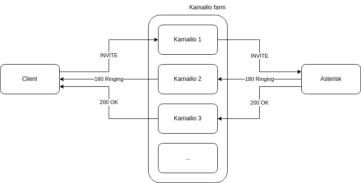
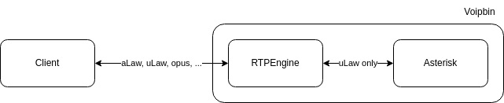
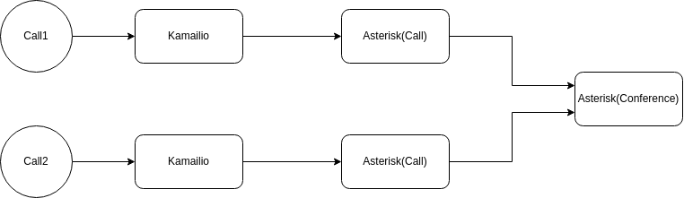

.. _architecture-rtc:

RTC(Real-Time Communication)
============================

VoIP
----

In voipbin, VoIP stacks are consist with Kamailio, Asterisk, RTPEngine.

.. image:: _static/images/architecture_rtc_voip.png
    :alt: Architecture VoIP

The VoIPBIN architecture utilizes a stateless Kamailio farm, ensuring high availability and fault tolerance. 
Kamailio instances are designed to operate in a stateless mode, allowing them to scale dynamically and recover seamlessly. 

This configuration enables zero-downtime operations, as traffic is automatically redirected to other Kamailio instances through a load balancer whenever an instance becomes unavailable.

The architecture also integrates an RTPEngine farm and an Asterisk-call farm to handle SIP signaling and RTP media streams effectively.

* SIP Traffic Flow: Incoming and outgoing SIP traffic is distributed by the load balancer to the Kamailio instances. Kamailio handles the signaling and routes it to the appropriate Asterisk-call instance based on the session requirements.
* RTP Media Flow: Media streams (RTP) are processed by the RTPEngine farm, which works in tandem with Kamailio to manage the media paths efficiently. This separation of signaling and media handling ensures scalability and optimal performance.

The accompanying diagram illustrates the end-to-end flow:

* Calls are initiated and routed through the load balancer to the stateless Kamailio farm.
* SIP signaling is processed by Kamailio and routed to the appropriate Asterisk-call instance.
* Media streams are directed through the RTPEngine farm to handle RTP traffic.

This modular design ensures that VoIPBIN can provide reliable, scalable, and robust VoIP services, accommodating high traffic loads while maintaining seamless operation.

Kamailio
--------
The Kamailio is an open-source SIP server that provides a flexible and scalable platform for handling SIP signaling.

* https://www.kamailio.org/

In the voipbin, the Kamailio farm is responsible for managing SIP signaling, including call routing, registration, and authentication as the edge router.

Key features of voipbin's Kamailio include:

* Load balancing: Distributing incoming SIP traffic across multiple Kamailio instances to ensure optimal performance and fault tolerance.
* Stateless: Operating in a stateless mode to enable dynamic scaling and seamless failover. It allowes Kamailio instances to be added or removed without affecting ongoing calls.

In the picture above, the Kamailio is receiving the SIP traffic from the client and forwarding it to the Asterisk. But the followed SIP messages are going to the different Kamailio instances.

Asterisk
--------
Asterisk is an open-source communications platform that provides a wide range of telephony services, including call processing, voicemail, and conferencing.

VoIPBIN employs three distinct Asterisk farms to optimize scalability, stability, and failover:

* Asterisk-Call: Handles call processing, including call setup, media handling, and call termination.
* Asterisk-Conference: Manages conference calls, including setup, participant management, and termination.
* Asterisk-Registrar: Handles SIP registration, including user authentication and registration lifecycle management.

Each Asterisk farm operates independently to ensure modularity, allowing for targeted scaling and fault isolation. However, Asterisk-Call and Asterisk-Conference communicate when bridging calls into a conference session.

RTPEngine
----------
The RTPEngine is an open-source media proxy that provides real-time transport protocol (RTP) processing and media handling capabilities.

In the voipbin, RTPEngine farm is responsible for codec edge server. All transcoding and media handling are done by the RTPEngine.
For internal, the voipbin uses ulaw codec only. But for external, it can be changed to other codecs. The RTPEngine is responsible for transcoding the codec for internal and external.

Conference
----------

In Voipbin, conference functionality is powered by the Asterisk-Conference component.

VoIPbin leverages a dedicated Asterisk-Conference component for handling conference calls. This approach offers several advantages:

* Isolation and Scalability: By separating conference handling from general call processing (handled by Asterisk-Call components), VoIPbin ensures stable and scalable conference services. This isolation minimizes the impact of conference-related issues on other call flows.
* Flexibility: The Asterisk-Conference component can be independently scaled and optimized based on conference usage patterns.
* Centralized Management: All conference-related operations, including creation, management, and termination, are managed centrally by the Asterisk-Conference component.

Conference Flow
+++++++++++++++

* Call Initiation: When a call flow requires a conference (e.g., through "connect" or "conference_join" actions), the Flow Manager initiates a new call to the designated Asterisk-Conference component.
* Conference Establishment: The Asterisk-Conference component establishes a dedicated bridge for the conference participants.
* Participant Joining: Participants are added to the conference bridge, either simultaneously or sequentially, as determined by the call flow.
* Conference Interaction: Participants can interact within the conference, including voice and video communication, screen sharing (if enabled), and other conference-specific features.
* Conference Termination: When the conference ends (e.g., all participants leave, or the conference is explicitly terminated), the Asterisk-Conference component releases resources and cleans up the conference bridge.

1:1 Calls as a Special Case of Conferencing
+++++++++++++++++++++++++++++++++++++++++++
VoIPbin considers 1:1 calls as a special case of conferencing with only two participants. 
This approach provides a consistent and unified framework for handling both 1:1 calls and multi-party conferences within the system.

This kind of approach gives these advantages.

* Simplified Development and Maintenance: By treating 1:1 calls as conferences, VoIPbin can leverage the same underlying infrastructure and logic for both scenarios, simplifying development and maintenance.
* Enhanced Flexibility: This approach allows for seamless transitions between 1:1 calls and multi-party conferences, enabling dynamic changes to call scenarios as needed.
* Improved Resource Utilization: By utilizing the same conference infrastructure for both 1:1 calls and multi-party conferences, VoIPbin can optimize resource allocation and improve overall system efficiency.

SIP Session Recovery
--------------------
VoIPBIN provides **SIP session recovery** to maintain active SIP sessions even when an Asterisk instance crashes unexpectedly. This feature prevents issues such as call drops, abrupt conference exits, and media channel failures by making the client perceive the session as uninterrupted.

.. youtube:: GMd-pOwyrtA

How It Works
++++++++++++

When an Asterisk instance crashes, all SIP sessions managed by that instance disappear immediately. Normally, because there is no BYE message, clients experience unexpected call termination. VoIPBIN recovers sessions through the following steps:

Detailed Steps
++++++++++++++

1. **Crash Detection**
The `sentinel-manager` quickly detects the abnormal termination of an Asterisk instance.

2. **Session Lookup**
The internal database is queried to retrieve all sessions handled by the failed instance.

3. **SIP Field Collection (via HOMER)**
The HOMER API is used to obtain SIP header information such as Call-ID, From/To headers, Routes, etc.

4. **Create SIP Channels on Another Asterisk**
A healthy Asterisk instance is selected, and new SIP channels are created with the same SIP information as the original sessions.

5. **Set Recovery Channel Variables**
The following channel variables are set to ensure the new INVITE is recognized as a continuation of the original session:

* PJSIP_RECOVERY_FROM_DISPLAY
* PJSIP_RECOVERY_FROM_URI
* PJSIP_RECOVERY_FROM_TAG
* PJSIP_RECOVERY_TO_DISPLAY
* PJSIP_RECOVERY_TO_URI
* PJSIP_RECOVERY_TO_TAG
* Call-ID, CSeq, Routes, and other SIP headers are similarly restored.

6. **Send Recovery INVITE**
The INVITE reuses the original Call-ID and tags, so the client interprets it as a re-INVITE and maintains the session.

7. **Restore RTP and SIP Sessions**
Signaling and media are fully re-established, restoring the call to its previous state.

8. **Resume Flow Execution**
The recovered session resumes Flow execution from just before the crash:  
- If the user was on a call with another party, the conversation continues without interruption.  
- If the user was in a conference, they are reconnected to the same conference bridge.

Asterisk Patch for Recovery
+++++++++++++++++++++++++++

To support this functionality, VoIPBIN patches Asterisk's PJSIP stack to override SIP header fields based on channel variables:

This patch allows a newly created SIP channel to impersonate the original one, making the recovery INVITE appear as a legitimate continuation of the previous session.

.. code::

    val_from_display_c_str = pbx_builtin_getvar_helper(session->channel, "PJSIP_RECOVERY_FROM_DISPLAY");
    val_from_uri_c_str     = pbx_builtin_getvar_helper(session->channel, "PJSIP_RECOVERY_FROM_URI");
    val_from_tag_c_str     = pbx_builtin_getvar_helper(session->channel, "PJSIP_RECOVERY_FROM_TAG");

    val_to_display_c_str   = pbx_builtin_getvar_helper(session->channel, "PJSIP_RECOVERY_TO_DISPLAY");
    val_to_uri_c_str       = pbx_builtin_getvar_helper(session->channel, "PJSIP_RECOVERY_TO_URI");
    val_to_tag_c_str       = pbx_builtin_getvar_helper(session->channel, "PJSIP_RECOVERY_TO_TAG");

    // Call-ID, CSeq, Routes, and others are handled similarly

The full patch is available on GitHub:

* https://github.com/voipbin/etc/blob/main/asterisk/add_pjsip_recovery.patch
