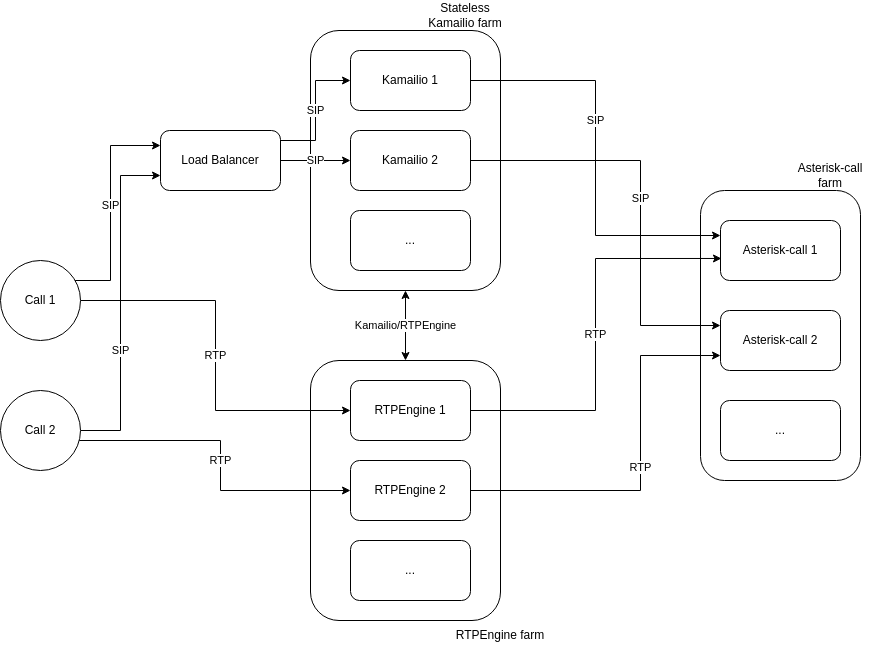

.. _architecture-rtc:

RTC(Real-Time Communication)
============================

VoIP
----

In voipbin, VoIP stacks are consist with Kamailio, Asterisk, RTPEngine.

The Voipbin architecture utilizes a stateless Kamailio farm, ensuring high availability and fault tolerance. 
Kamailio instances are designed to operate in a stateless mode, allowing them to scale dynamically and recover seamlessly. 

This configuration enables zero-downtime operations, as traffic is automatically redirected to other Kamailio instances through a load balancer whenever an instance becomes unavailable.

The architecture also integrates an RTPEngine farm and an Asterisk-call farm to handle SIP signaling and RTP media streams effectively.

* SIP Traffic Flow: Incoming and outgoing SIP traffic is distributed by the load balancer to the Kamailio instances. Kamailio handles the signaling and routes it to the appropriate Asterisk-call instance based on the session requirements.
* RTP Media Flow: Media streams (RTP) are processed by the RTPEngine farm, which works in tandem with Kamailio to manage the media paths efficiently. This separation of signaling and media handling ensures scalability and optimal performance.

The accompanying diagram illustrates the end-to-end flow:

* Calls are initiated and routed through the load balancer to the stateless Kamailio farm.
* SIP signaling is processed by Kamailio and routed to the appropriate Asterisk-call instance.
* Media streams are directed through the RTPEngine farm to handle RTP traffic.

This modular design ensures that Voipbin can provide reliable, scalable, and robust VoIP services, accommodating high traffic loads while maintaining seamless operation.

Conference
----------

In Voipbin, conference functionality is powered by the Asterisk-Conference component.

.. image:: _static/images/architecture_rtc_conference.png
    :alt: Architecture Conference

VoIPbin leverages a dedicated Asterisk-Conference component for handling conference calls. This approach offers several advantages:

* Isolation and Scalability: By separating conference handling from general call processing (handled by Asterisk-Call components), VoIPbin ensures stable and scalable conference services. This isolation minimizes the impact of conference-related issues on other call flows.
* Flexibility: The Asterisk-Conference component can be independently scaled and optimized based on conference usage patterns.
* Centralized Management: All conference-related operations, including creation, management, and termination, are managed centrally by the Asterisk-Conference component.

Conference Flow
+++++++++++++++

* Call Initiation: When a call flow requires a conference (e.g., through "connect" or "conference_join" actions), the Flow Manager initiates a new call to the designated Asterisk-Conference component.
* Conference Establishment: The Asterisk-Conference component establishes a dedicated bridge for the conference participants.
* Participant Joining: Participants are added to the conference bridge, either simultaneously or sequentially, as determined by the call flow.
* Conference Interaction: Participants can interact within the conference, including voice and video communication, screen sharing (if enabled), and other conference-specific features.
* Conference Termination: When the conference ends (e.g., all participants leave, or the conference is explicitly terminated), the Asterisk-Conference component releases resources and cleans up the conference bridge.

1:1 Calls as a Special Case of Conferencing
+++++++++++++++++++++++++++++++++++++++++++
VoIPbin considers 1:1 calls as a special case of conferencing with only two participants. 
This approach provides a consistent and unified framework for handling both 1:1 calls and multi-party conferences within the system.

This kind of approach gives these advantages.

* Simplified Development and Maintenance: By treating 1:1 calls as conferences, VoIPbin can leverage the same underlying infrastructure and logic for both scenarios, simplifying development and maintenance.
* Enhanced Flexibility: This approach allows for seamless transitions between 1:1 calls and multi-party conferences, enabling dynamic changes to call scenarios as needed.
* Improved Resource Utilization: By utilizing the same conference infrastructure for both 1:1 calls and multi-party conferences, VoIPbin can optimize resource allocation and improve overall system efficiency.
