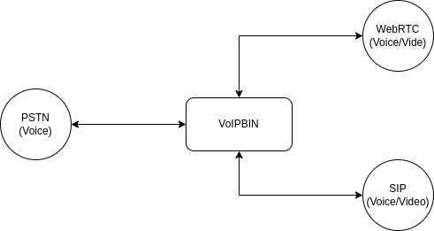
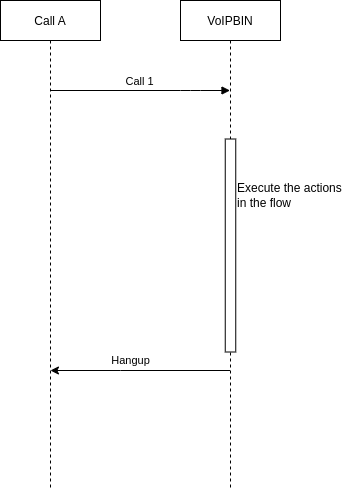

.. _call-overview:

Overview
========
The VoIPBIN call API provides a straightforward and convenient way to develop high-quality call applications in the Cloud. With the VoIPBIN API, developers can leverage familiar web technologies to build scalable and feature-rich call applications, giving them the power to control inbound and outbound call flows using JSON-based VoIPBIN actions. Additionally, the API offers capabilities to record and store inbound or outbound calls, create conference calls, and send text-to-speech messages in multiple languages with different gender and accents.

With the VoIPBIN API you can:

- Build apps that scale with the web technologies you are already using.
- Control the flow of inbound and outbound calls in JSON with VoIPBIN's actions.
- Record and store inbound or outbound calls.
- Create conference calls.
- Send text-to-speech messages in 50 languages with different gender and accents.

Protocol
--------
VoIPBIN offers support for various call/video protocols, enabling users to join the same conference room and communicate with one another seamlessly. The flexibility in protocol options ensures efficient and reliable communication between different devices and platforms.

PSTN/Phone Number Format
------------------------
In the VoIPBIN APIs, all PSTN/Phone numbers must adhere to the `+E164 <https://en.wikipedia.org/wiki/E.164>`_ format. This format standardizes the representation of phone numbers to facilitate smooth communication and interoperability across different systems.

Key requirements for phone numbers within the VoIPBIN APIs:

* The phone number must have the '+' symbol at the beginning.
* The number should not contain any special characters, such as spaces, parentheses, or hyphens.

For example, a US phone number should be represented as +16062067563, and a Korea phone number should be represented as +821021656521.

Extension Number Format
-----------------------
The extension numbers used in the VoIPBIN system can be customized according to specific requirements. However, they must adhere to the following limitation:

* Extension numbers should not contain any special characters, such as spaces, parentheses, or hyphens.

The absence of special characters ensures consistent and reliable processing of extension numbers within the VoIPBIN system, promoting smooth communication and interaction.

Call Lifecycle
--------------
Every call in VoIPBIN follows a predictable lifecycle from creation to termination. Understanding this lifecycle helps you build reliable applications that respond correctly to call state changes.

**State Diagram**

::

                                   ┌──────────────┐
                                   │   dialing    │
                                   │ (call starts)│
                                   └──────┬───────┘
                                          │
                    ┌─────────────────────┼─────────────────────┐
                    │                     │                     │
                    ▼                     ▼                     ▼
             ┌────────────┐        ┌────────────┐        ┌────────────┐
             │  ringing   │        │ canceling  │        │  hangup    │
             │ (dest rang)│        │ (caller    │        │ (failed)   │
             └─────┬──────┘        │  cancels)  │        └────────────┘
                   │               └─────┬──────┘
                   │                     │
                   ▼                     │
            ┌─────────────┐              │
            │ progressing │              │
            │ (answered)  │              │
            └──────┬──────┘              │
                   │                     │
          ┌────────┴────────┐            │
          ▼                 ▼            │
    ┌────────────┐   ┌────────────┐      │
    │terminating │   │  hangup    │      │
    │  (ending   │   │  (remote   │      │
    │   locally) │   │  hangup)   │      │
    └─────┬──────┘   └────────────┘      │
          │                              │
          └──────────────┬───────────────┘
                         ▼
                  ┌────────────┐
                  │   hangup   │
                  │  (final)   │
                  └────────────┘

**State Descriptions**

+---------------+------------------------------------------------------------------+
| Status        | What is happening                                                |
+===============+==================================================================+
| dialing       | Call has been created. The system is attempting to reach the     |
|               | destination through the phone network.                           |
+---------------+------------------------------------------------------------------+
| ringing       | The destination device is ringing. The person being called can   |
|               | now answer.                                                      |
+---------------+------------------------------------------------------------------+
| progressing   | The call has been answered. Both parties can now hear each       |
|               | other. Media (audio/video) is flowing.                           |
+---------------+------------------------------------------------------------------+
| terminating   | The system is ending the call. This happens when your            |
|               | application hangs up or a flow action ends the call.             |
+---------------+------------------------------------------------------------------+
| canceling     | The caller is canceling before the destination answered.         |
|               | Only happens for outgoing calls.                                 |
+---------------+------------------------------------------------------------------+
| hangup        | The call has ended. This is the final state - no further         |
|               | changes are possible.                                            |
+---------------+------------------------------------------------------------------+

**Key Behaviors**

- States only move forward, never backward. A call that reached "progressing" cannot go back to "ringing".
- Once a call reaches "hangup", it cannot change anymore.
- The "canceling" state only applies to outgoing calls (when the originator hangs up before answer).

What Happens At Each Stage
--------------------------

**During Dialing**

When you create an outbound call or receive an inbound call, the call enters the dialing state.

::

    Your App                    VoIPBIN                    Destination
       │                           │                            │
       │  POST /v1/calls           │                            │
       │──────────────────────────▶│                            │
       │                           │  SIP INVITE                │
       │                           │───────────────────────────▶│
       │                           │                            │
       │  Call object              │                            │
       │  status: "dialing"        │                            │
       │◀──────────────────────────│                            │

At this point:

- VoIPBIN is trying to reach the destination
- No audio is flowing yet
- The call may fail if the network is unreachable

**During Ringing**

The destination device is ringing. The person can pick up the phone.

::

       │                           │                            │
       │                           │  180 Ringing               │
       │                           │◀───────────────────────────│
       │  Webhook: call_updated    │                            │
       │  status: "ringing"        │       ♪ Ring Ring ♪        │
       │◀──────────────────────────│                            │

At this point:

- The destination phone is ringing
- Early media (ringback tone) may be playing
- The caller is waiting for an answer

**During Progressing (Answered)**

The call has been answered. This is when real communication begins.

::

       │                           │                            │
       │                           │  200 OK                    │
       │                           │◀───────────────────────────│
       │  Webhook: call_updated    │                            │
       │  status: "progressing"    │   ◀═══════════════════▶    │
       │◀──────────────────────────│        (Audio flows)       │

At this point:

- Both parties can hear each other
- Flow actions start executing (if defined)
- Recording can begin
- Media controls (hold, mute) become available

**During Hangup**

The call has ended. Check the hangup_by and hangup_reason fields to understand why.

::

       │                           │                            │
       │                           │  BYE                       │
       │                           │◀───────────────────────────│
       │  Webhook: call_updated    │                            │
       │  status: "hangup"         │                            │
       │  hangup_by: "remote"      │                            │
       │  hangup_reason: "normal"  │                            │
       │◀──────────────────────────│                            │

Understanding Hangup Reasons
----------------------------
When a call ends, VoIPBIN tells you why it ended. This helps you build appropriate responses for different scenarios.

**Hangup Reason Values**

+-------------+------------------------------------------------------------------+
| Reason      | What happened                                                    |
+=============+==================================================================+
| normal      | The call ended normally after a conversation. Someone hung up.  |
+-------------+------------------------------------------------------------------+
| failed      | The call never connected. Network issues prevented the call     |
|             | from reaching the destination.                                  |
+-------------+------------------------------------------------------------------+
| busy        | The destination is already on another call.                     |
+-------------+------------------------------------------------------------------+
| cancel      | The caller hung up before the destination answered.             |
+-------------+------------------------------------------------------------------+
| timeout     | The call exceeded maximum allowed duration after being          |
|             | answered.                                                       |
+-------------+------------------------------------------------------------------+
| noanswer    | The destination phone rang but nobody picked up.                |
+-------------+------------------------------------------------------------------+
| dialout     | VoIPBIN's dialing timeout expired before the destination        |
|             | answered. Different from noanswer - this is our timeout.        |
+-------------+------------------------------------------------------------------+
| amd         | The Answering Machine Detection (AMD) action detected a         |
|             | voicemail and hung up according to your settings.               |
+-------------+------------------------------------------------------------------+

**Hangup By Values**

+-----------+--------------------------------------------------------------------+
| Value     | What it means                                                      |
+===========+====================================================================+
| remote    | The other party hung up first. You were still in the call.        |
+-----------+--------------------------------------------------------------------+
| local     | Your application or flow action ended the call.                   |
+-----------+--------------------------------------------------------------------+

**Common Scenarios**

::

    Scenario: Normal conversation
    ────────────────────────────
    hangup_by: "remote"
    hangup_reason: "normal"
    → The other person hung up after talking

    Scenario: Missed call
    ────────────────────────────
    hangup_by: "remote"
    hangup_reason: "noanswer"
    → Phone rang but nobody answered

    Scenario: Your app ended the call
    ────────────────────────────
    hangup_by: "local"
    hangup_reason: "normal"
    → Your flow action or API call ended it

    Scenario: Network problem
    ────────────────────────────
    hangup_by: "remote"
    hangup_reason: "failed"
    → Call never connected due to network issues

Media Control Operations
------------------------
Once a call is in the "progressing" state (answered), you can control the audio in several ways. Each operation is independent - you can combine them as needed.

**Hold**

Pauses the call. The other party hears silence (or music if MOH is enabled).

::

    Before Hold                          After Hold
    ┌─────────┐     audio      ┌─────────┐     ┌─────────┐     silence   ┌─────────┐
    │ Caller  │ ◀═══════════▶  │ VoIPBIN │     │ Caller  │ ────────────▶ │ VoIPBIN │
    └─────────┘                └─────────┘     └─────────┘  (or music)   └─────────┘

- Use hold when the caller needs to wait (e.g., while transferring)
- The caller stays connected but cannot hear ongoing activity
- Unhold resumes normal audio

**Mute**

Silences audio in one or both directions without putting the call on hold.

::

    Mute "in"                    Mute "out"                   Mute "both"
    ┌────┐  ───X──▶  ┌────┐     ┌────┐  ◀──X───  ┌────┐      ┌────┐  ──X──  ┌────┐
    │ A  │  ◀──────  │ B  │     │ A  │  ───────▶ │ B  │      │ A  │  ──X──  │ B  │
    └────┘           └────┘     └────┘           └────┘      └────┘         └────┘
    A cannot hear B            A cannot be heard           Complete silence

- "in": The call cannot hear incoming audio
- "out": The call's audio is not sent to others
- "both": Complete silence in both directions

**Recording**

Captures the call audio for later playback.

::

    ┌─────────┐         ┌─────────┐         ┌─────────┐
    │ Caller  │ ◀═════▶ │ VoIPBIN │ ◀═════▶ │  Dest   │
    └─────────┘         └────┬────┘         └─────────┘
                             │
                             ▼ (recording)
                        ┌─────────┐
                        │  File   │
                        └─────────┘

- recording_id shows the current recording (if active)
- recording_ids lists all recordings made during this call's lifetime
- You can start and stop recording multiple times in one call

Call Chaining
-------------
VoIPBIN's call concept differs from traditional 1:1 calls. A single logical conversation may involve multiple call objects linked together.

**The Two-Call Model**

When you make a call from A to B through VoIPBIN, there are actually two separate calls:

::

    Traditional View:     A ─────────────────────▶ B

    VoIPBIN Reality:      A ◀─── Call 1 ───▶ VoIPBIN ◀─── Call 2 ───▶ B
                                   │                        │
                                   └────────────────────────┘
                                          (bridged audio)

**Why Two Calls?**

This design enables powerful features:

- **Recording**: VoIPBIN can record both sides independently
- **Conferencing**: Add more parties without changing the original calls
- **Transfer**: Move calls between agents without dropping the caller
- **Flow Control**: Run different actions on each call leg

**Master and Chained Calls**

When calls are related, they form a chain:

::

    ┌─────────────────────────────────────────────────────┐
    │                    Master Call                       │
    │  master_call_id: 00000000-0000-0000-0000-000000000000 │
    │  chained_call_ids: [call-2-id, call-3-id]            │
    └─────────────────────────┬───────────────────────────┘
                              │
              ┌───────────────┼───────────────┐
              ▼               ▼               ▼
        ┌──────────┐    ┌──────────┐    ┌──────────┐
        │ Call 2   │    │ Call 3   │    │ Call 4   │
        │ master:  │    │ master:  │    │ master:  │
        │ call-1-id│    │ call-1-id│    │ call-1-id│
        └──────────┘    └──────────┘    └──────────┘

**Chaining Behaviors**

- When the master call hangs up, all chained calls automatically hang up
- Chained calls can only be added while the master is in dialing, ringing, or progressing state
- Each chained call tracks its master via the master_call_id field

**Common Use Case: Transfer**

::

    Step 1: Caller and Agent talking
    ┌────────┐       ┌─────────┐       ┌────────┐
    │ Caller │◀─────▶│ VoIPBIN │◀─────▶│ Agent  │
    └────────┘       └────┬────┘       └────────┘
                          │
                     Master Call

    Step 2: Agent initiates transfer to Supervisor
    ┌────────┐       ┌─────────┐       ┌────────┐
    │ Caller │◀─────▶│ VoIPBIN │       │ Agent  │ (on hold)
    └────────┘       └────┬────┘       └────────┘
                          │
                          ├──────────▶ ┌────────────┐
                          │            │ Supervisor │ (ringing)
                     Chained Call      └────────────┘

    Step 3: Supervisor answers, Agent drops
    ┌────────┐       ┌─────────┐       ┌────────────┐
    │ Caller │◀─────▶│ VoIPBIN │◀─────▶│ Supervisor │
    └────────┘       └─────────┘       └────────────┘

Timestamps Explained
--------------------
Each call tracks important moments in its lifecycle:

::

    Timeline of a successful call:

    │ tm_create                    tm_ringing          tm_progressing              tm_hangup
    │     │                            │                    │                          │
    ▼     ▼                            ▼                    ▼                          ▼
    ──────●────────────────────────────●────────────────────●──────────────────────────●──────▶
          │                            │                    │                          │
          │◀─── dialing ──────────────▶│◀─── ringing ──────▶│◀──── progressing ───────▶│
          │                            │                    │                          │
       Call created              Phone started           Call answered            Call ended
                                   ringing

+------------------+--------------------------------------------------------------+
| Timestamp        | When it's set                                                |
+==================+==============================================================+
| tm_create        | When the call object was created in VoIPBIN                  |
+------------------+--------------------------------------------------------------+
| tm_ringing       | When the destination phone started ringing                   |
+------------------+--------------------------------------------------------------+
| tm_progressing   | When the call was answered                                   |
+------------------+--------------------------------------------------------------+
| tm_hangup        | When the call ended                                          |
+------------------+--------------------------------------------------------------+
| tm_update        | Last time any call property changed                          |
+------------------+--------------------------------------------------------------+

**Calculating Durations**

::

    Ring duration = tm_progressing - tm_ringing
    Talk duration = tm_hangup - tm_progressing
    Total duration = tm_hangup - tm_create

Route Failover
--------------
When an outgoing call fails during dialing or ringing, VoIPBIN can automatically try alternate routes.

::

    ┌─────────────────────────────────────────────────────────────────┐
    │                       Call Attempt Flow                          │
    └─────────────────────────────────────────────────────────────────┘

                              Create Call
                                   │
                                   ▼
                           ┌──────────────┐
                           │   Route 1    │
                           │  (Primary)   │
                           └──────┬───────┘
                                  │
                          ┌───────┴───────┐
                          ▼               ▼
                     Connected?       Failed?
                          │               │
                          ▼               ▼
                      Success      ┌──────────────┐
                                   │   Route 2    │
                                   │  (Backup)    │
                                   └──────┬───────┘
                                          │
                                  ┌───────┴───────┐
                                  ▼               ▼
                             Connected?       Failed?
                                  │               │
                                  ▼               ▼
                              Success      ┌──────────────┐
                                           │   Route 3    │
                                           │  (Last try)  │
                                           └──────┬───────┘
                                                  │
                                                  ▼
                                            Final Result

**Failover Rules**

Not all failures trigger failover. VoIPBIN only tries the next route when recovery is possible:

+------------------------+----------+------------------------------------------------+
| Hangup Reason          | Failover | Why                                            |
+========================+==========+================================================+
| failed                 | Yes      | Network issue - another route might work       |
+------------------------+----------+------------------------------------------------+
| busy                   | No       | The person is busy - trying again won't help   |
+------------------------+----------+------------------------------------------------+
| noanswer               | No       | They didn't answer - their choice              |
+------------------------+----------+------------------------------------------------+
| cancel                 | No       | Caller cancelled - no need to retry            |
+------------------------+----------+------------------------------------------------+
| normal                 | No       | Call succeeded - nothing to retry              |
+------------------------+----------+------------------------------------------------+

**No Failover Cases**

Failover is disabled in these situations:

- Incoming calls (the route is fixed by the caller)
- Conference calls
- Calls where flow execution already started (early_execution flag)

Incoming call
-------------
The VoIPBIN system provides the functionality to receive incoming calls from external parties. This feature allows users to accept and handle incoming calls through their VoIP services. Incoming calls are crucial for various communication applications and call center setups as they enable users to receive inquiries, provide support, and engage with customers, clients, or other users.
When an incoming call is received, the VoIPBIN system processes the call request and prepares for call handling based on the specified parameters and configurations.

Execution of Call Flow for incoming call
----------------------------------------
The execution of the call flow for incoming calls involves a simple yet effective sequence of actions:

::

    External Caller                VoIPBIN                    Your Flow
          │                           │                           │
          │  INVITE (call request)    │                           │
          │──────────────────────────▶│                           │
          │                           │  Lookup destination       │
          │                           │  Find matching flow       │
          │                           │                           │
          │  100 Trying               │                           │
          │◀──────────────────────────│                           │
          │                           │  Execute flow actions     │
          │                           │──────────────────────────▶│
          │  180 Ringing / 200 OK     │                           │
          │◀──────────────────────────│◀──────────────────────────│
          │                           │                           │

* **Call Verification**: When an incoming call is received, the VoIPBIN system verifies the call's authenticity and checks for any potential security risks, such as spoofed or fraudulent calls. This verification process ensures that legitimate calls are allowed to proceed.
* **Determine Call Flow**: After successful verification, the system determines the appropriate call flow based on the destination of the incoming call. The call flow includes a set of predefined actions and configurations tailored to handle calls directed to a specific user, department, or interactive voice response (IVR) system.
* **Execute Call Flow**: Once the call flow is determined, the system proceeds to execute it without delay. The call flow actions are triggered in accordance with the predefined configuration for the call destination.
* **End the Call**: After executing the call flow actions, the system initiates the process of ending the call. The call is terminated, and the connection with the external party is disconnected.

By following this streamlined call flow process, the VoIPBIN system efficiently handles incoming calls, ensures their secure and verified handling, and executes the appropriate flow actions based on the call destination. After executing the call flow, the system promptly ends the call, completing the call handling process for the incoming call. Customizable flow actions allow users to tailor the call handling process according to their application's needs, optimizing user experience and call management efficiency.

Outgoing call
-------------
The VoIPBIN system offers the outgoing call feature, enabling users to initiate calls to external parties through their VoIP services. This feature is commonly used in various communication applications and call center setups to establish connections with customers, clients, or other users outside the organization.
To utilize the outgoing call feature, users need to provide the necessary call parameters, such as the destination phone number, caller ID information, and any additional call settings. These parameters are submitted to the VoIPBIN system, which then processes the request and attempts to establish a connection with the specified destination.

Execution of Call Flow for outgoing call
----------------------------------------
Once the outgoing call request is initiated, the VoIPBIN system starts the process of connecting to the destination phone number. During this phase, the system waits for the called party to answer the call. The call flow refers to the sequence of actions and events that occur from the moment the call is initiated until it is successfully answered or terminated.

::

    Your Application               VoIPBIN                    Destination
          │                           │                           │
          │  POST /v1/calls           │                           │
          │  (with flow actions)      │                           │
          │──────────────────────────▶│                           │
          │                           │  INVITE                   │
          │                           │──────────────────────────▶│
          │  Call created             │                           │
          │  status: "dialing"        │  180 Ringing              │
          │◀──────────────────────────│◀──────────────────────────│
          │                           │                           │
          │  Webhook: "ringing"       │  200 OK (answered)        │
          │◀──────────────────────────│◀──────────────────────────│
          │                           │                           │
          │  Webhook: "progressing"   │  ◀═══════════════════▶    │
          │◀──────────────────────────│  Execute flow actions     │
          │                           │                           │

The call flow execution occurs as follows:

* **Initiation**: The user triggers the outgoing call request, providing the necessary call parameters.
* **Call Setup**: The VoIPBIN system processes the request and establishes a connection with the destination phone number.
* **Wait for Call Answer**: After the call setup, the system waits for the called party to answer the call. This waiting period involves ringing the called party's phone and monitoring the call status.
* **Call Answered**: Once the called party answers the outgoing call, the system proceeds to execute the predefined call flow actions.
* **Flow Actions Execution**: The call flow actions are a set of customizable operations that are executed upon call answer. These actions can include call recording, call routing, call analytics, notifications, and post-call actions, among others.

The call flow execution is critical for ensuring a smooth and efficient communication experience. By customizing the flow actions, users can tailor the call handling process to meet the specific requirements of their application or service, enhancing user engagement and overall call management.

.. image:: _static/images/call_outgoing.png

Error handling and Termination
------------------------------
During the incoming/outgoing call process, various errors may occur, such as call failures or network issues.
The VoIPBIN system have robust error handling mechanisms to gracefully manage such situations. In case of a failed call attempt or call rejection, the system log relevant information for further analysis or reporting purposes.

**Common Error Scenarios**

+----------------------+------------------------------------------------------------------+
| Scenario             | What happens                                                     |
+======================+==================================================================+
| Network unreachable  | Call fails immediately with hangup_reason: "failed"             |
+----------------------+------------------------------------------------------------------+
| Destination busy     | Call ends with hangup_reason: "busy" - no retry                 |
+----------------------+------------------------------------------------------------------+
| No answer timeout    | Call ends with hangup_reason: "noanswer" after ring timeout     |
+----------------------+------------------------------------------------------------------+
| Dial timeout         | Call ends with hangup_reason: "dialout" - our timeout expired   |
+----------------------+------------------------------------------------------------------+
| Call rejected        | Call ends with hangup_reason: "noanswer" - destination refused  |
+----------------------+------------------------------------------------------------------+

Call concept
-------------
The concept of a call in VoIPBIN departs from the traditional 1:1 call model. Here's an overview:

In Voipbin, a call includes source, destination, and additional metadata. Moreover, the call can be associated with multiple other calls, creating a dynamic journey that goes beyond the standard 1:1 connection. Envision a call's trajectory as it connects to an agent and then diverges to another destination.

In Voipbin, the conventional call scenario A -> B is delineated by two distinct calls:

.. code::

    A            VoIPBIN            B
    |<-- Call 1 --->|               |
    |               |<--- Call 2 -->|
    |<-----RTP----->|<-----RTP----->|

Comparison: Traditional Call Concept vs VoIPBIN Call Concept
++++++++++++++++++++++++++++++++++++++++++++++++++++++++++++

Traditional Call Concept

* Follows a 1:1 model where a call is a direct connection between a source and a destination.
* Typically involves a straightforward flow from the caller to the recipient.
* Limited in handling complex call journeys or interactions with multiple parties.

VoIPBIN Call Concept

* Deviates from the traditional 1:1 model, allowing for more intricate call structures.
* Encompasses source, destination, and additional metadata in a call.
* Permits connections to multiple other calls, creating dynamic call journeys.
* Visualizes a call's path, which may involve connecting to an agent and branching to additional destinations.

In summary, while the traditional call concept adheres to a simple point-to-point model, the VoIPBIN call concept introduces a more flexible and multifaceted approach, accommodating diverse call scenarios and interactions.
