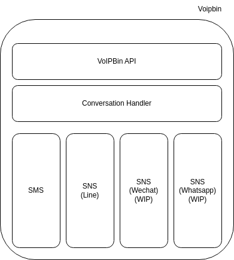
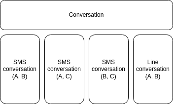

.. _conversation-overview:

Overview
========
VoIPBIN Conversations empowers developers to build engaging and cross-channel messaging experiences with ease, using just a few API calls. Users can initiate a conversation through SMS/MMS and seamlessly continue it over other channels such as Chat or SNS (Social Networking Service). The Conversations API enables developers to create conversations, add participants, and set up webhooks to monitor and intercept any relevant events occurring within a conversation.

Unified conversation
--------------------
VoIPBIN Conversations provides support for various types of methods, allowing for a unified and cohesive communication experience for users.

.. image:: _static/images/conversation_overview_unified_conversation.png

With unified conversation capabilities, users can switch between different channels seamlessly without any disruption. For instance, a conversation may begin with an SMS, and the user can effortlessly continue the same conversation using a chat platform or a social networking service. This unified approach simplifies communication for users and ensures that they can engage in meaningful interactions across different channels without any friction.

By leveraging VoIPBIN Conversations, developers can create versatile messaging solutions that deliver a seamless and consistent experience for users, regardless of the communication channels they choose to utilize. This flexibility enables businesses to engage with their customers efficiently and effectively, providing a cohesive and engaging messaging experience across a diverse range of platforms and channels.

Seperated conversation room
----------------------------
VoIPBIN's conversation feature ensures a well-organized messaging experience by creating distinct conversation rooms. When a new message is sent or received, VoIPBIN examines the communication method and participants. If the properties (method/participants) match an existing conversation room, the message is added to that room. In cases where there are no matching properties, a new conversation room is created.

With VoIPBIN's conversation capability, users are liberated from worrying about the communication method. Simply send the message to the conversation room using the Conversation API, and VoIPBIN seamlessly translates the message to the appropriate method, streamlining the entire communication process.

