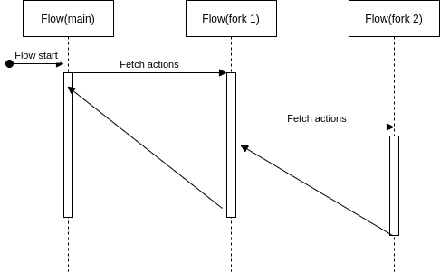

.. _flow-overview:

Overview
========
The Flow in VoIPBIN is a powerful set of instructions that guides the platform on how to handle incoming calls. When someone calls one of your VoIPBIN numbers or destinations, the platform looks up the associated URL and sends a request. The Flow instructions are then read to determine the appropriate actions to be taken, such as recording the call, playing a message, or prompting the caller to press digits on their keypad.

At its core, the Flow is an array of JSON objects with special tags defined by VoIPBIN, enabling users to build their own Programmable Voice applications.

.. _flow-overview-how_the_flow_works:

How the flow works
------------------
When an incoming call is received on one of your VoIPBIN numbers or destinations, the platform identifies the associated URL and sends a request.

The Flow instructions are then processed, providing a step-by-step guide on how to handle the call. This might involve greeting the caller, presenting options, gathering input, or executing various actions based on the caller's response.

Understanding Flow Execution
----------------------------
Think of a Flow like a recipe. Each action is a step, and VoIPBIN follows the steps one by one until the recipe is complete.

**The Execution Cursor**

VoIPBIN uses a "cursor" to track where it is in the flow - like a finger pointing at the current step:

::

    Flow Actions Array:
    +---------+   +---------+   +---------+   +---------+   +---------+
    | answer  |-->|  talk   |-->| digits  |-->| branch  |-->| hangup  |
    +---------+   +---------+   +---------+   +---------+   +---------+
                       ^
                       |
                    cursor
                  (current step)

As each action completes, the cursor moves to the next one. When the cursor reaches the end, the flow is complete.

**What Happens During Execution**

::

    +---------------------------------------------------------------------+
    |                    Flow Execution Engine                            |
    +---------------------------------------------------------------------+
                                    |
                                    v
                           +---------------+
                           |  Get next     |
                           |  action       |
                           +-------+-------+
                                   |
                                   v
                           +---------------+
                      +----|  End of flow? |----+
                      |yes +---------------+ no |
                      |                         |
                      v                         v
               +------------+          +----------------+
               |   Stop     |          | Execute action |
               |  (done)    |          +-------+--------+
               +------------+                  |
                                               v
                                    +---------------------+
                                    | What kind of result?|
                                    +----------+----------+
                                               |
                        +----------------------+----------------------+
                        |                      |                      |
                        v                      v                      v
                 +------------+         +------------+         +------------+
                 |   Next     |         |   Wait     |         |   Block    |
                 | (continue) |         | (external) |         |  (pause)   |
                 +-----+------+         +------------+         +------------+
                       |
                       | loop back
                       +---------------------------------------------->

Action Execution Patterns
-------------------------
Actions behave differently depending on their type. Understanding these patterns helps you predict flow behavior.

**Immediate Actions (Execute and Continue)**

These actions complete instantly and the cursor moves to the next action:

::

    +----------+     +----------+     +----------+
    |  goto    |---->|  branch  |---->| variable |
    +----------+     +----------+     +----------+
         |                |                |
         +----------------+----------------+
                          |
                   Cursor moves immediately

Examples: ``goto``, ``branch``, ``variable_set``, ``condition_variable``

**Media Actions (Wait for Completion)**

These actions take time and the flow waits for them to finish:

::

    +----------+     +------------------------------+     +----------+
    |  talk    |---->|  Playing "Welcome to..."     |---->|  next    |
    +----------+     |  (audio playing, please wait)|     |  action  |
                     +------------------------------+     +----------+
                                  |
                        Cursor waits here until
                        audio finishes playing

Examples: ``talk``, ``play``, ``digits_receive``, ``recording_start``

**Fire-and-Forget Actions (Dispatch and Continue)**

These actions send something out but don't wait for a response:

::

    +------------+     +--------------------+
    | email_send |---->| Email dispatched!  |----> Continue immediately
    +------------+     | (delivery is async)|
                       +--------------------+

Examples: ``message_send``, ``email_send``, ``webhook_send``

**Blocking Actions (Pause Until Triggered)**

These actions pause the flow until something external happens:

::

    +----------+     +------------------------------+
    |  block   |---->|  Flow is paused...           |
    +----------+     |  Waiting for API call to     |
                     |  resume execution            |
                     +------------------------------+
                                  |
                     Call POST /activeflows/{id}/execute
                                  |
                                  v
                     +------------------------------+
                     |  Flow resumes, cursor moves  |
                     +------------------------------+

Examples: ``block``

**Nested Actions (Push a Stack)**

Some actions start a sub-flow that runs inside the main flow:

::

    Main Flow:                                Nested Stack (from queue_join):
    +--------+  +------------+               +-----------------------------+
    | answer |->| queue_join |-------------->| wait_flow actions...        |
    +--------+  +------------+               | (talk, play, etc.)          |
                      ^                      +-------------+---------------+
                      |                                    |
                      |      When agent answers or         |
                      |      caller hangs up               |
                      +------------------------------------+
                              Return to main flow

Examples: ``queue_join``, ``ai_talk``, ``conference_join``, ``fetch_flow``

Branching and Decision Making
-----------------------------
Flows can make decisions and take different paths based on conditions.

**The Branch Action**

The ``branch`` action reads a variable and jumps to different actions based on its value:

::

    +----------------------------------------------------------------------+
    |                         Branch Decision                              |
    +----------------------------------------------------------------------+

                              Variable value?
                                    |
                    +---------------+---------------+
                    |               |               |
                    v               v               v
                  "1"             "2"           (default)
                    |               |               |
                    v               v               v
            +------------+  +------------+  +------------+
            |  Sales     |  |  Support   |  |  Operator  |
            |  menu      |  |  menu      |  |  (fallback)|
            +------------+  +------------+  +------------+

**How Variables Get Set**

Variables are set by previous actions and then read by branch:

::

    Step 1: Collect input
    +-----------------+
    | digits_receive  |  -->  User presses "2"
    +-----------------+       voipbin.call.digits = "2"

    Step 2: Branch based on input
    +-----------------+
    |     branch      |  -->  Read voipbin.call.digits
    |                 |       Value is "2"
    | variable:       |       Jump to Support menu
    |  voipbin.call.  |
    |  digits         |
    +-----------------+

**Condition Actions**

For more complex logic, use condition actions:

::

    condition_variable:
    +-------------------------------------------------------------------+
    |  IF ${customer.tier} equals "premium"                             |
    |     → Continue to next action (VIP treatment)                     |
    |  ELSE                                                             |
    |     → Jump to false_target_id (standard treatment)                |
    +-------------------------------------------------------------------+

Available conditions:
- ``equal``, ``not_equal``
- ``greater``, ``less``
- ``greater_equal``, ``less_equal``

The Variable System
-------------------
Variables store information during flow execution. They're like sticky notes that actions can write and read.

**Built-in Variables**

VoIPBIN automatically creates these variables:

::

    +-----------------------------------------------------------------+
    |                    Built-in Variables                           |
    +---------------------------------+-------------------------------+
    | voipbin.activeflow.id           | Current activeflow ID         |
    +---------------------------------+-------------------------------+
    | voipbin.activeflow.reference_id | The call/conversation ID      |
    +---------------------------------+-------------------------------+
    | voipbin.call.digits             | DTMF digits received          |
    +---------------------------------+-------------------------------+
    | voipbin.call.caller_id          | Caller's phone number         |
    +---------------------------------+-------------------------------+
    | voipbin.message.text            | Received message content      |
    +---------------------------------+-------------------------------+
    | voipbin.recording.id            | Current recording ID          |
    +---------------------------------+-------------------------------+

**Custom Variables**

You can set your own variables with the ``variable_set`` action:

::

    {
      "type": "variable_set",
      "option": {
        "key": "customer.language",
        "value": "en-US"
      }
    }

**Using Variables in Actions**

Variables are substituted using ``${variable.name}`` syntax:

::

    {
      "type": "talk",
      "option": {
        "text": "Hello ${customer.name}, welcome back!",
        "language": "${customer.language}"
      }
    }

Before this action executes, VoIPBIN replaces the placeholders:

::

    Before: "Hello ${customer.name}, welcome back!"
    After:  "Hello John Smith, welcome back!"

.. _flow-overview-unified_flow:

Unified flow
------------
VoIPBIN's Unified Flow feature is a game-changer, allowing users to create a single flow that can be attached to multiple communication channels, including voice and video calls, SMS, and RESTful API triggers.

With Unified Flow, users can design a custom flow that defines the actions to be taken when a specific channel request is received. VoIPBIN then automatically executes this flow, ensuring a consistent experience for customers across various channels.

.. _flow-overview-non_linear_action_execution:

Non-linear action execution
---------------------------
VoIPBIN's Flow provides the flexibility of Non-Linear action execution.

Users can customize their actions in both linear and non-linear ways, allowing them to define complex logic and decision trees to handle various call scenarios.

::

    Linear Execution:
    +---+   +---+   +---+   +---+
    | 1 |-->| 2 |-->| 3 |-->| 4 |
    +---+   +---+   +---+   +---+

    Non-Linear Execution (with goto and branch):
    +---+   +---+   +---+   +---+
    | 1 |-->| 2 |-->| 3 |-->| 4 |
    +---+   +-+-+   +---+   +-+-+
              |               |
              |   +-----------+
              |   | (goto back to 2)
              v   v
            +-------+
            | Loop! |
            +-------+

.. image:: _static/images/flow_overview_non_linear.png

.. _flow-overview-flow_fork:

Flow fork
------------
Certain flow actions, such as fetch, fetch_flow, queue_join, and more, enable flow forking.

When the flow is forked, the execution cursor moves to the forked flow and starts executing the actions within it. Once the forked flow reaches its end, the execution cursor moves back to the following action of the forking action, continuing the flow execution.

::

    Main Flow                         Forked Flow (from queue_join)
    +---------+                      +---------------------------------+
    | answer  |                      |                                 |
    +----+----+                      |  +------+   +------+   +------+ |
         |                           |  | talk |-->| play |-->| talk | |
         v                           |  +------+   +------+   +------+ |
    +------------+                   |         Wait Flow               |
    | queue_join |==================>+---------------------------------+
    +----+-------+                            |
         |                                    | (returns when done)
         |<===================================+
         |
         v
    +----------+
    | continue |
    +----------+

.. _flow-overview-actions:

Actions
-------
Within VoIPBIN, actions dictate the course of the platform's response in a given flow, encompassing tasks such as initiating calls, playing sounds or prompts, activating text-to-speech, sending SMS or DTMFs, and dispatching SNS messages. These diverse actions serve as indispensable building blocks for crafting customized voice applications, ensuring the creation of uniquely tailored call experiences for users.

VoIPBIN's Flow provides developers with a versatile and robust toolkit, empowering them to forge dynamic voice applications, efficiently manage incoming calls, and curate personalized call encounters. Through its non-linear execution, cohesive flow capabilities, and an array of actions including SMS, DTMFs, SNS messages, and more, VoIPBIN's Flow unveils limitless possibilities for the development of sophisticated and interactive voice applications, precisely tailored to meet specific business needs.

**Action Categories**

+------------------+-----------------------------------------------+------------------------+
| Category         | Actions                                       | Behavior               |
+==================+===============================================+========================+
| Media            | talk, play, recording_start, recording_stop   | Wait for completion    |
+------------------+-----------------------------------------------+------------------------+
| Input            | digits_receive, transcribe_start              | Wait for input         |
+------------------+-----------------------------------------------+------------------------+
| Control          | goto, branch, condition_*, stop, empty        | Immediate              |
+------------------+-----------------------------------------------+------------------------+
| Communication    | message_send, email_send, webhook_send        | Fire and forget        |
+------------------+-----------------------------------------------+------------------------+
| Nested           | queue_join, ai_talk, conference_join, fetch   | Push stack, return     |
+------------------+-----------------------------------------------+------------------------+
| Call Control     | answer, hangup, hold, mute, connect, transfer | Immediate or wait      |
+------------------+-----------------------------------------------+------------------------+

.. _flow-overview-flow_execution:

Flow execution
--------------
In VoIPBIN, the execution of flows is versatile and can be initiated through various methods:

Incoming/Outgoing Calls
+++++++++++++++++++++++

VoIPBIN facilitates flow execution with both incoming and outgoing calls. Users have the option to register a flow to a specific number. Upon an incoming call to the registered number, VoIPBIN will seamlessly execute the associated flow.
Users can also initiate a call with a predefined flow. Once the outgoing call is answered, the attached flow will be triggered.

::

    Incoming Call Flow:
    +--------------+      +-----------------+      +---------------+
    |  Caller dials|----->|  VoIPBIN looks  |----->|  Flow starts  |
    |  your number |      |  up the number  |      |  executing    |
    +--------------+      +-----------------+      +---------------+

    Outgoing Call Flow:
    +--------------+      +-----------------+      +---------------+
    |  POST /calls |----->|  Call connects  |----->|  Flow starts  |
    |  with actions|      |  (answered)     |      |  executing    |
    +--------------+      +-----------------+      +---------------+

Received Messages
++++++++++++++++++

VoIPBIN allows users to register flows to received messages. When a message is received, the registered flow will be executed.
For example, you can register the flow like the below.

.. code::

  ...
  {
    "type": "branch",
    "option": {
      "variable": "voipbin.message.text",
      "target_ids": {
        "call me": "7a1e8c4c-aaea-11ed-9f0f-bffcc31ca3c3",
        "text me": "79fd8c9a-aaea-11ed-a238-0b094a49c637",
        "text developer": "73107b70-d56b-4b47-b331-dc4f2ac43a5b"
      }
    }
  }
  ...

In the provided example, the system examines the content of the received message using **voipbin.message.text** and proceeds to compare the message text.
Should the message text match the specified criterion, such as "call me," the flow execution cursor will be directed to the designated action ID (7a1e8c4c-aaea-11ed-9f0f-bffcc31ca3c3) for subsequent execution.
See the :ref:`Variable Reference <variable-variable>` for all available variables.

Outbound Campaigns
++++++++++++++++++

The VoIPBIN platform integrates flows into outbound campaigns, providing a structured and automated approach to execution.

API
+++

Users have the flexibility to trigger flows through API calls. This API integration empowers developers to seamlessly incorporate and activate flows within their applications.
These diverse methods offer users and developers flexibility in integrating and executing flows based on their specific needs and scenarios.
See the `Activeflow API Reference <https://api.voipbin.net/redoc/#tag/Activeflow>`_ for API details.
And due to the absence of any media-based incoming or outgoing elements in the API, certain actions within the flow—such as answer, talk, transcribe, and others—will be ignored. Instead, the execution cursor will proceed to the next action in the sequence.

Flow Lifecycle
--------------
Understanding when flows start, run, and end helps you design reliable applications.

**Flow States**

::

    +------------+         +------------+         +------------+
    |  Created   |-------->|  Running   |-------->|   Ended    |
    +------------+         +------------+         +------------+
          |                      |                      |
          |                      |                      |
    Activeflow          Cursor executing         Final state
    instance created    actions                  (no more changes)

**What Ends a Flow**

A flow ends when any of these happen:

::

    +-----------------------------------------------------------------+
    |                    Flow Termination Triggers                    |
    +-----------------------------------------------------------------+

    1. End of actions reached
       +---+   +---+   +---+   +---------+
       | 1 |-->| 2 |-->| 3 |-->|  END    |  ← Cursor reaches end
       +---+   +---+   +---+   +---------+

    2. Stop action executed
       +---+   +------+
       | 1 |-->| stop |  ← Explicit stop command
       +---+   +------+

    3. Call hangs up (for call-based flows)
       +---+   +---+   +---+
       | 1 |-->| 2 |-->| X |  ← Caller or callee hung up
       +---+   +---+   +---+

    4. API stop request
       POST /activeflows/{id}/stop  ← External stop command

**After Flow Ends**

When a flow ends, if ``on_complete_flow_id`` is set, the next flow starts automatically (see below).

Flow Actions and Interrupt Actions
----------------------------------

VoIPBIN's Flow is built on an action-based engine. Each flow is defined as a JSON array of actions, where a "cursor" tracks the current execution point. Under normal circumstances, the cursor advances sequentially from one action to the next based on the flow's logic. This modular design lets you compose a variety of call-handling scenarios—from answering calls and playing prompts to branching based on caller input.

Standard Flow Actions
++++++++++++++++++++++
Standard flow actions are the building blocks of your call handling logic. Examples include:

* Answer: Picks up the incoming call.
* Talk: Plays a TTS message or pre-recorded audio.
* Digits Receive: Gathers DTMF input from the caller.
* Branch: Directs the flow based on collected input.

Each action is executed in sequence, and upon completion, the flow cursor moves to the next action defined in the JSON array. For example:

.. code::

  {
    "id": "9bc851be-f05e-11ef-a1e0-77ec628521e0",
    "type": "flow",
    "name": "Sample Call Flow",
    "actions": [
      {
        "id": "9c8ebac0-f05e-11ef-b9ae-4b8aecc935fe",
        "type": "answer"
      },
      {
        "id": "9c30642a-f05e-11ef-8674-ebba44c5cb0f2",
        "type": "talk",
        "option": {
          "text": "Welcome to VoIPBIN",
          "language": "en-US"
        }
      },
      {
        "id": "9c659370-f05e-11ef-b141-63708262508b",
        "type": "digits_receive",
        "option": {
          "duration": 5000,
          "length": 1
        }
      },
      {
        "id": "9cb2962a-f05e-11ef-ae35-2374e1ae16df",
        "type": "branch",
        "option": {
          "variable": "voipbin.call.digits",
          "target_ids": {
            "1": "9c30642a-f05e-11ef-8674-ebba44c5cb0f2",
          }
        }
      }
    ]
  }

In this example, the flow proceeds step-by-step—from answering the call to playing a welcome message, receiving DTMF input, and branching accordingly.

Interrupt Actions
++++++++++++++++++

Interrupt actions are specialized commands that can be triggered asynchronously—at any point during the flow—to handle unexpected events or to initiate high-priority tasks. Unlike standard actions, interrupt actions are designed to override or temporarily suspend the normal flow progression.

::

    Normal Flow Execution              Interrupt Arrives!
    +---+   +---+   +---+             +-----------------+
    | 1 |-->| 2 |-->| 3 |<------------| Transfer Request|
    +---+   +---+   +---+             +-----------------+
                 ^                            |
                 |                            v
                 |                    +-----------------+
                 |                    | Interrupt takes |
                 +--------------------| over, then      |
                   (resume later)     | returns         |
                                      +-----------------+

Common interrupt actions include:

* Attended Transfer: Initiates a transfer even if the call is mid-flow. This allows an operator to consult with a transferee before completing the transfer.
* Transcribe: Starts real-time transcription of the call. This can be triggered on demand without waiting for the current flow action to complete.
* Recording: Begins or stops call recording independently of the flow's sequential actions.
* Text-to-Speech (TTS): Plays a TTS message at any moment, regardless of the flow's current state.

How Interrupt Actions Work
+++++++++++++++++++++++++++

Interrupt actions are implemented through dedicated API endpoints. When an interrupt is invoked, the platform either temporarily pauses the current flow or dynamically inserts the interrupt action into the execution sequence. Once the interrupt is handled, the flow resumes from the appropriate point.

For example, while the call is waiting for DTMF input in the standard flow, an attended transfer interrupt may be triggered via a separate API call. This immediate action takes precedence over the flow's waiting state, ensuring that time-sensitive operations are executed without delay.

Integration and Best Practices
+++++++++++++++++++++++++++++++

* Flexibility: Use standard flow actions to define your routine call-handling steps, and rely on interrupt actions for events that require immediate attention.
* API Integration: Interrupt actions can be initiated via dedicated API calls, enabling your application to react in real time to dynamic call events.
* Flow Resumption: After an interrupt action completes, VoIPBIN resumes the flow from the designated point, ensuring a seamless call experience.

By combining sequential flow actions with the ability to trigger interrupt actions at any time, VoIPBIN provides a robust, programmable environment that can handle both predictable call scenarios and unexpected events with equal ease.

The on complete flow id
-----------------------

The on_complete_flow_id allows a flow to automatically trigger another flow in a new session once the current flow completes. This feature addresses a key limitation of call-based flows: when a call ends, the flow execution ends immediately, preventing any post-call actions (After Call Work) from running.

With on_complete_flow_id, developers can define a follow-up flow that executes after the call or flow ends, enabling tasks such as call-summary generation, sending emails, processing recordings, or running analytics.

How it works
+++++++++++++

::

    +-----------------------------------------------------------------------+
    |                    On Complete Flow Chain                             |
    +-----------------------------------------------------------------------+

    Flow A (Main Call Flow)                  Flow B (After Call Work)
    +-------------------------+             +-------------------------+
    | answer                  |             | fetch recording         |
    | talk "Hello"            |             | ai_summarize            |
    | connect to agent        |             | email_send summary      |
    | (call happens...)       |             | webhook_send analytics  |
    | hangup                  |             |                         |
    |                         |             |                         |
    | on_complete_flow_id: B  |------------>| (inherits variables)    |
    +-------------------------+             +-------------------------+
              |                                        |
              | Call ends                              | Flow B starts
              | Flow A stops                           | automatically
              v                                        v

.. code::

  Caller             VoIPBIN Engine              Flow A                Flow B
  |                      |                        |                     |
  | --- Incoming Call -->|                        |                     |
  |                      |-- Start Flow A ------->|                     |
  |                      |                        | Execute actions     |
  |                      |                        | answer/talk/...     |
  |                      |                        |                     |
  | <-- Call Progress -->|                        |                     |
  |                      |                        |                     |
  X --- Hangup --------->|                        |                     |
                         |-- Stop Flow A -------->|                     |
                         |                        X (Flow A stops)      |
                         |                                              |
                         |                                              |
              Check on_complete_flow_id                                 |
                         |                                              |
                         |                                              |
                         |-- Start NEW session ------------------------>|
                         |                                           (inherit variables)
                         |                                              |
                         |-- Start Flow B ----------------------------->|
                                                                        | Execute ACW actions
                                                                        | summarize/email/...
                                                                        |
                                                                        X (Flow B ends)
                                                                          If Flow B has on_complete_flow_id
                                                                          and depth < 5 then start another chain

When a flow ends—either by reaching the end of its action list, encountering a stop action, or due to call termination—VoIPBIN checks whether on_complete_flow_id is defined.

If so, VoIPBIN starts the referenced flow as a new independent session.

Most runtime variables from the original flow (e.g., ${voipbin.recording.id}, ${voipbin.call.id}) are inherited automatically, allowing seamless post-call workflows without requiring manual variable passing.

**Variable Inheritance**

::

    Flow A ends with these variables:
    +-----------------------------------------+
    | voipbin.call.id = "abc-123"             |
    | voipbin.recording.id = "rec-456"        |
    | customer.name = "John"                  |
    | voipbin.activeflow.complete_count = 0   |
    +-----------------------------------------+
                         |
                         | copied to
                         v
    Flow B starts with these variables:
    +-----------------------------------------+
    | voipbin.call.id = "abc-123"             |  ← inherited
    | voipbin.recording.id = "rec-456"        |  ← inherited
    | customer.name = "John"                  |  ← inherited
    | voipbin.activeflow.complete_count = 1   |  ← incremented
    +-----------------------------------------+

Execution limits
----------------

To prevent infinite recursion, VoIPBIN enforces:

::

    Flow A --> Flow B --> Flow C --> Flow D --> Flow E --> STOP
      |          |          |          |          |
    count=0    count=1    count=2    count=3    count=4
                                                  |
                                                  | count=5 would be blocked
                                                  v
                                            Maximum depth reached

* A maximum of 5 chained on-complete executions. Beyond this limit, no further follow-up flows are triggered.

* Circular references should be avoided, even though safeguards exist.

Behavior on termination
-----------------------

* If the flow fails, on_complete_flow_id is not triggered.

* If the flow is forcefully terminated (e.g., due to call hangup), the on-complete flow still runs.

Example
--------

.. code:: json

  {
    "id": "flow_initial",
    "on_complete_flow_id": "flow_after_call_work"
  }

This configuration ensures that when *flow_initial* completes—regardless of how the call ended—the *flow_after_call_work* flow starts immediately in a new session, while preserving key session variables from the original flow.

Error Handling in Flows
-----------------------
When something goes wrong during flow execution, VoIPBIN handles it gracefully.

**Error Scenarios**

+------------------------+----------------------------------------------------------+
| Scenario               | What happens                                             |
+========================+==========================================================+
| Invalid action         | Action is skipped, flow continues to next action         |
+------------------------+----------------------------------------------------------+
| Media action fails     | Error logged, flow continues or stops based on severity  |
+------------------------+----------------------------------------------------------+
| External service down  | Fire-and-forget actions continue, blocking ones may fail |
+------------------------+----------------------------------------------------------+
| Infinite loop detected | Flow stops after max iterations (safety limit)           |
+------------------------+----------------------------------------------------------+
| Call hangs up          | Flow ends immediately, on_complete_flow runs if set      |
+------------------------+----------------------------------------------------------+

**Safety Limits**

VoIPBIN prevents runaway flows with built-in limits:

::

    Maximum iterations per execution cycle: 1000
    Maximum total executions per activeflow: 100
    Maximum on_complete_flow chain depth: 5

If these limits are exceeded, the flow stops automatically to protect system resources.

**Best Practices for Error Handling**

1. **Set default branches**: Always include a ``default_target_id`` in branch actions
2. **Use timeouts**: Configure appropriate durations for input actions
3. **Log with webhooks**: Send important events to your webhook for monitoring
4. **Plan for hangup**: Remember that call-based flows end when the call ends
