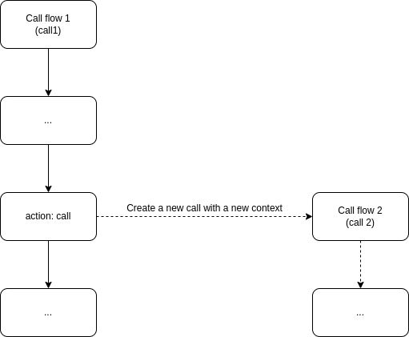

.. _flow-struct-action:

Action
======

.. _flow-struct-action-action:

Action
------

.. code::

    {
        "id": "<string>",
        "next_id": "<string>",
        "type": "<string>",
        "option": {
            ...
        },
        "tm_execute": "<string>"
    }

* ``id`` (UUID): The action's unique identifier within the flow. Auto-generated by the server if omitted on creation via ``POST /flows``. Only set this explicitly when other actions need to reference it (e.g., ``goto``, ``branch``, ``condition_*`` target IDs).
* ``next_id`` (UUID): Override for the next action to execute after this one. If empty or ``00000000-0000-0000-0000-000000000000``, the cursor moves to the next action in the array sequentially.
* ``type`` (enum string): The action type. Determines what this action does and which ``option`` fields are valid. See :ref:`Type <flow-struct-action-type>`.
* ``option`` (Object): Action-specific configuration. Structure depends on the ``type`` field. See individual action type sections below.
* ``tm_execute`` (String, timestamp): Timestamp when this action was last executed. Read-only, populated at runtime in activeflow responses.

.. note:: **AI Implementation Hint**

   When building a flow's ``actions`` array, you can omit ``id`` for most actions. Only set ``id`` on actions that are targets of ``goto``, ``branch``, or ``condition_*`` actions. The ``next_id`` field is rarely needed -- it overrides the default sequential execution. Use ``goto`` actions instead for clearer flow control.

.. _flow-struct-action-type:

Type
----

======================= ==========================================================================
type                    Description
======================= ==========================================================================
ai_summary              Generate an AI summary of the call or conversation reference.
ai_talk                 Start an interactive AI-powered conversation using STT/TTS.
ai_task                 Execute an AI-driven task (e.g., an autonomous AI assistant/team action).
amd                     Answering machine detection. Detects whether the call was answered by a human or machine.
answer                  Answer an incoming call. Required before media actions (``talk``, ``play``) on inbound calls.
beep                    Play a beep sound. Commonly used before recording to signal the caller.
block                   Block (pause) action execution until an external "continue" request resumes the flow.
branch                  Read a variable value and jump to a matching target action ID. Use for IVR menu routing.
call                    Start a new independent outgoing call with its own flow. Does not block the current flow.
case_create             Create a CRM case for the current call/conversation reference.
condition_call_digits   **Deprecated**. Use ``condition_variable`` instead. Condition check on received digits.
condition_call_status   **Deprecated**. Use ``condition_variable`` instead. Condition check on call status.
condition_datetime      Condition check on current UTC time. Useful for business hours routing.
condition_variable      Condition check on any variable value. Supports ``==``, ``!=``, ``>``, ``>=``, ``<``, ``<=``.
confbridge_join         Join the call to a confbridge (conference bridge).
conference_join         Join the call to a conference. Nested action -- flow forks into the conference.
connect                 Create outbound call(s) to destination(s) and bridge them with the current call.
conversation_send       Send a text message to an existing conversation.
digits_receive          Wait for DTMF digit input from the caller. Sets ``voipbin.call.digits`` variable.
digits_send             Send DTMF tones to the call.
echo                    Echo the call's audio stream back to the caller. Useful for testing.
email_send              Send an email to one or more destinations. Fire-and-forget or synchronous.
external_media_start    Start an external media stream (RTP) to/from an external host.
external_media_stop     Stop the external media stream.
fetch                   Fetch actions from a remote URL endpoint. Forks the flow with the fetched actions.
fetch_flow              Fetch actions from an existing VoIPBIN flow by ID. Forks the flow.
goto                    Jump to another action by ID. Use ``loop_count`` to prevent infinite loops.
hangup                  Hang up the current call.
message_send            Send an SMS/message to one or more destinations. Fire-and-forget.
mute                    Mute the call.
play                    Play audio file(s) from the given URL(s). Waits for playback to complete.
queue_join              Join the caller to a queue. Nested action -- flow forks into the queue's wait flow.
recording_start         Start recording the call audio. Sets ``voipbin.recording.id`` variable.
recording_stop          Stop the current call recording.
sleep                   Pause flow execution for a specified duration (milliseconds).
stop                    Stop the flow execution immediately.
stream_echo             Echo the RTP stream including DTMF digit reception.
talk                    Generate audio via TTS from text or SSML and play it. Waits for playback to complete.
transcribe_start        Start real-time speech-to-text transcription of the call.
transcribe_stop         Stop real-time transcription.
transcribe_recording    Transcribe call recordings (post-call) and send results to webhook.
variable_set            Set a custom variable value for use in subsequent actions.
webhook_send            Send an HTTP request to an external URL. Can be sync (wait for response) or async.
======================= ==========================================================================

.. note::

   ``agent_call``, ``chatbot_talk``, and ``hangup_relay`` are not valid action types in the current
   platform. Use ``connect`` in place of ``agent_call``, ``ai_talk`` in place of ``chatbot_talk``, and
   ``hangup`` (with the ``reference_id`` option) in place of ``hangup_relay``.

.. _flow-struct-action-ai_summary:

AI Summary
----------
Generate an AI summary of the current call or conversation reference.

Parameters
++++++++++
.. code::

    {
        "type": "ai_summary",
        "option": {
            "on_end_flow_id": "<string>",
            "reference_type": "<string>",
            "reference_id": "<string>",
            "language": "<string>"
        }
    }

* ``on_end_flow_id`` (UUID, optional): Flow to execute when the summary finishes.
* ``reference_type`` (enum string, optional): Type of the resource being summarized (e.g. ``call``).
* ``reference_id`` (UUID, optional): ID of the resource being summarized. If omitted, the current activeflow's reference is used.
* ``language`` (String, optional): Language in BCP47 format (e.g., ``en-US``).

.. _flow-struct-action-ai_talk:

AI Talk
-------
Start an interactive AI-powered conversation using STT/TTS.

Parameters
++++++++++
.. code::

    {
        "type": "ai_talk",
        "option": {
            "assistance_type": "<string>",
            "assistance_id": "<string>",
            "duration": <number>
        }
    }

* ``assistance_type`` (enum string): Type of assistance to use. One of ``ai``, ``team``.
* ``assistance_id`` (UUID): ID of the AI or team providing the assistance.
* ``duration`` (Integer): Maximum duration for the AI talk session, in seconds.
* ``ai_id`` (UUID): **Deprecated**. Use ``assistance_type``/``assistance_id`` instead. Kept for backward compatibility with existing flows.

Example
+++++++
.. code::

    {
        "type": "ai_talk",
        "option": {
            "assistance_type": "ai",
            "assistance_id": "eb1ac5c0-ff63-47e2-bcdb-5da9c336eb4b",
            "duration": 300
        }
    }

.. _flow-struct-action-ai_task:

AI Task
-------
Execute an AI-driven task (e.g., an autonomous AI assistant/team action).

Parameters
++++++++++
.. code::

    {
        "type": "ai_task",
        "option": {
            "assistance_type": "<string>",
            "assistance_id": "<string>"
        }
    }

* ``assistance_type`` (enum string): Type of assistance to use. One of ``ai``, ``team``.
* ``assistance_id`` (UUID): ID of the AI or team executing the task.
* ``ai_id`` (UUID): **Deprecated**. Use ``assistance_type``/``assistance_id`` instead. Kept for backward compatibility with existing flows.

.. _flow-struct-action-amd:

AMD
---
Answering machine detection.

Parameters
++++++++++
.. code::

    {
        "type": "amd",
        "option": {
            "machine_handle": "<string>",
            "async": <boolean>
        }
    }

* ``machine_handle`` (enum string): Action to take if a machine answered the call. See :ref:`Machine handle <flow-struct-action-amd-machinehandle>`.
* ``async`` (Boolean): If ``false``, the flow will block until AMD detection completes. If ``true``, detection runs in the background. Default: ``false``.

.. _flow-struct-action-amd-machinehandle:

Machine handle
++++++++++++++
=========== =====================================================================
Type        Description
=========== =====================================================================
hangup      Hang up the call immediately if an answering machine is detected.
continue    Continue the flow execution regardless of whether a machine or human answered.
=========== =====================================================================

Example
+++++++
.. code::

    {
        "type": "amd",
        "option": {
            "machine_handle": "hangup",
            "async": true
        }
    }

.. _flow-struct-action-answer:

Answer
------
Answer the call

Parameters
++++++++++
.. code::

    {
        "type": "answer"
    }

Example
+++++++
.. code::

    {
        "type": "answer"
    }

.. _flow-struct-action-beep:

Beep
------
Make a beep sound.

Parameters
++++++++++
.. code::

    {
        "type": "beep"
    }

Example
+++++++
.. code::

    {
        "type": "beep"
    }

.. _flow-struct-action-block:

Block
------
Block (pause) action execution until an external request resumes the flow.

Parameters
++++++++++
.. code::

    {
        "type": "block"
    }

Example
+++++++
.. code::

    {
        "type": "block"
    }

.. _flow-struct-action-branch:

Branch
------
Branch the flow.
It gets the variable from the activeflow and move the activeflow cursor to the selected target id.

Parameters
++++++++++
.. code::

    {
        "type": "branch",
        "option": {
            "variable": "<string>",
            "default_target_id": "<string>",
            "target_ids": {
                "<string>": <string>,
            }
        }
    }

* ``variable`` (String): The variable name to read for branching. Available variables are listed :ref:`here <variable-variable>`. Default: ``voipbin.call.digits``. If empty, the default variable is used.
* ``default_target_id`` (UUID): Action ID to jump to when no ``target_ids`` key matches the variable value. Must reference an ``id`` of another action in the same flow.
* ``target_ids`` (Object): Map of variable value (String) to action ID (UUID). Each key is a possible variable value, and the corresponding value is the action ``id`` to jump to.

Example
+++++++
.. code::

    {
        "type": "branch",
        "option": {
            "default_target_id": "ed9705ca-c524-11ec-a3fb-8feb7731ad45",
            "target_ids": {
                "1": "c3eb8e62-c524-11ec-94c5-abafec8af561",
                "2": "dc87123e-c524-11ec-89c6-5fb18da14034",
                "3": "e70fb030-c524-11ec-b657-ebec72f097ef"
            }
        }
    }

.. _flow-struct-action-call:

Call
----
Make a new outbound call in a new context.

Parameters
++++++++++
.. code::

    {
        "type": "call",
        "option": {
            "source": {
                ...
            },
            "destinations": [
                {
                    ...
                },
                ...
            ],
            "flow_id": "<string>"
            "actions": [
                {
                    ...
                }
            ],
            "chained": <boolean>,
            "early_execution": <boolean>,
            "anonymous": "<string>"
        }
    }

* ``source`` (Object): Source address. See :ref:`Address <common-struct-address-address>`.
* ``destinations`` (Array of Object): Array of destination addresses. See :ref:`Address <common-struct-address-address>`.
* ``flow_id`` (UUID): Flow ID to attach to the new call. Obtained from ``GET /flows``. If not set, the ``actions`` array is used instead.
* ``actions`` (Array of Object): Inline array of actions for the new call's flow. Used only if ``flow_id`` is not set.
* ``chained`` (Boolean): If ``true``, the new call will be hung up when the master call hangs up. Default: ``false``.
* ``early_execution`` (Boolean): If ``true``, VoIPBIN will execute the flow when the call starts ringing (before answer). Default: ``false``.
* ``anonymous`` (String, Optional): Controls anonymous caller ID for the outbound PSTN call. One of: ``"yes"`` (always hide caller ID), ``"no"`` (always show), ``"auto"`` (inherit from incoming call's Privacy header). Default: ``"auto"``. Only affects PSTN destinations (``type: "tel"``).

Example
+++++++
.. code::

    {
        "id": "e34ab97a-c53a-4eb4-aebf-36767a528f00",
        "next_id": "00000000-0000-0000-0000-000000000000",
        "type": "call",
        "option": {
            "source": {
                "type": "tel",
                "target": "+821100000001"
            },
            "destinations": [
                {
                    "type": "tel",
                    "target": "+821100000002"
                }
            ],
            "actions": [
                {
                    "type": "talk",
                    "option": {
                        "text": "hello, this is test message.",
                        "language": "en-US"
                    }
                }
            ],
            "chained": false
        }
    }

.. _flow-struct-action-case_create:

Case Create
-----------
Create a CRM case for the current call/conversation reference.

Parameters
++++++++++
.. code::

    {
        "type": "case_create",
        "option": {
            "name": "<string>",
            "detail": "<string>",
            "note": "<string>",
            "sync": <boolean>
        }
    }

* ``name`` (String): Case name.
* ``detail`` (String): Case detail/description.
* ``note`` (String): Additional note for the case.
* ``sync`` (Boolean): If ``true``, the flow waits for the case creation to complete before continuing. Default: ``false``.

.. note::

   The case is automatically linked to the reference (e.g., the call or conversation) of the current activeflow. There is no ``reference_id`` option -- it cannot be set explicitly.

.. _flow-struct-action-confbridge_join:

Confbridge Join
----------------
Join to the confbridge.

Parameters
++++++++++
.. code::

    {
        "type": "confbridge_join",
        "option": {
            "confbridge_id": "<string>"
        }
    }

* ``confbridge_id`` (UUID): Target confbridge ID to join.

.. _flow-struct-action-condition_call_digits:

Condition Call Digits
---------------------
Deprecated. Use the condition_variable instead.
Check the condition of received digits.
If the conditions are met, the system proceeds to the next action.
If the conditions are not met, the voipbin directs the call to a false_target_id for further processing.

Parameters
++++++++++
.. code::

    {
        "type": "condition_call_digits",
        "option": {
            "length": <number>,
            "key": "<string>",
            "false_target_id": "<string>"
        }
    }

* ``length`` (Integer): Expected length of received digits to match.
* ``key`` (String): Digit string to match against received digits.
* ``false_target_id`` (UUID): Action ID to jump to when the condition is not met. Must reference an ``id`` of another action in the same flow.

Example
+++++++
.. code::

    {
        "type": "condition_call_digits",
        "option": {
            "length": 10,
            "false_target_id": "e3e50e6c-9c8b-11ec-8031-0384a8fcd1e2"
        }
    }

.. _flow-struct-action-condition_call_status:

Condition Call Status
---------------------
Deprecated. Use the condition_variable instead.
Check the condition of call's status.
It checks the call's status and if it matched with condition then move to the next action. If not, move to the false_target_id.

Parameters
++++++++++
.. code::

    {
        "type": "condition_call_status",
        "option": {
            "status": <number>,
            "false_target_id": "<string>"
        }
    }

* ``status`` (enum string): Call status to match against. See :ref:`Status <call-struct-call-status>`.
* ``false_target_id`` (UUID): Action ID to jump to when the condition is not met. Must reference an ``id`` of another action in the same flow.

Example
+++++++
.. code::

    {
        "type": "condition_call_status",
        "option": {
            "status": "progressing",
            "false_target_id": "e3e50e6c-9c8b-11ec-8031-0384a8fcd1e2"
        }
    }

.. _flow-struct-action-condition_datetime:

Condition Datetime
---------------------
Check the condition of the time.
It checks the current time(UTC) and if it matched with condition then move to the next action. If not, move to the false_target_id.

Parameters
++++++++++
.. code::

    {
        "type": "condition_datetime",
        "option": {
            "condition": <number>,

            "minute": <number>,
            "hour": <number>,
            "day": <number>,
            "month": <number>,
            "weekdays": [
                <number>,
                ...
            ],

            "false_target_id": "<string>"
        }
    }

* ``condition`` (enum string): Comparison operator. One of ``==``, ``!=``, ``>``, ``>=``, ``<``, ``<=``.
* ``minute`` (Integer): Minute to match (0-59). Set to ``-1`` to match all minutes (wildcard).
* ``hour`` (Integer): Hour to match (0-23, UTC). Set to ``-1`` to match all hours (wildcard).
* ``day`` (Integer): Day of month to match (1-31). Set to ``-1`` to match all days (wildcard).
* ``month`` (Integer): Month to match (1-12). Set to ``0`` to match all months (wildcard).
* ``weekdays`` (Array of Integer): List of weekday numbers. Sunday: ``0``, Monday: ``1``, Tuesday: ``2``, Wednesday: ``3``, Thursday: ``4``, Friday: ``5``, Saturday: ``6``. Empty array matches all days.
* ``false_target_id`` (UUID): Action ID to jump to when the condition is not met. Must reference an ``id`` of another action in the same flow.

Example
+++++++
.. code::

    {
        "type": "condition_datetime",
        "option": {
            "condition": ">=",
            "minute": 0,
            "hour": 8,
            "day": -1,
            "month": 0,
            "weekdays": [],
            "false_target_id": "d08582ee-1b3d-11ed-a43e-9379f27c3f7f"
        }
    }

.. _flow-struct-action-condition_variable:

Condition Variable
---------------------
Check the condition of the given variable.
It checks the call's status and if it matched with condition then move to the next action. If not, move to the false_target_id.

Parameters
++++++++++
.. code::

    {
        "type": "condition_variable",
        "option": {
            "condition": "<string>",
            "variable": "<string>",
            "value_type": "<string>",
            "value_string": "<string>",
            "value_number": <number>,
            "value_length": <number>,
            "false_target_id": "<string>"
        }
    }

* ``condition`` (enum string): Comparison operator. One of ``==``, ``!=``, ``>``, ``>=``, ``<``, ``<=``.
* ``variable`` (String): Variable name to check. Available variables are listed :ref:`here <variable-variable>`.
* ``value_type`` (enum string): Type of comparison value. One of ``string``, ``number``, ``length``.
* ``value_string`` (String): Comparison value when ``value_type`` is ``string``.
* ``value_number`` (Number): Comparison value when ``value_type`` is ``number``.
* ``value_length`` (Integer): Comparison value when ``value_type`` is ``length``. Compares the character length of the variable's value.
* ``false_target_id`` (UUID): Action ID to jump to when the condition is not met. Must reference an ``id`` of another action in the same flow.

Example
+++++++
.. code::

    {
        "type": "condition_variable",
        "option": {
            "condition": "==",
            "variable": "voipbin.call.source.target",
            "value_type": "string",
            "value_string": "+821100000001",
            "false_target_id": "fb2f4e2a-b030-11ed-bddb-976af892f5a3"
        }
    }

.. _flow-struct-action-conference_join:

Conference Join
---------------
Join to the conference

Parameters
++++++++++
.. code::

    {
        "type": "conference_join",
        "option": {
            "conference_id": "<string>"
        }
    }

* ``conference_id`` (UUID): Conference ID to join. Obtained from ``GET /conferences`` or the response of ``POST /conferences``.

Example
+++++++
.. code::

    {
        "type": "conference_join",
        "option": {
            "conference_id": "367e0e7a-3a8c-11eb-bb08-f3c3f059cfbe"
        }
    }

.. _flow-struct-action-connect:

Connect
-------
Originate to the other destination(s) and connect to them each other.

Parameters
++++++++++
.. code::

    {
        "type": "connect",
        "option": {
            "source": {...},
            "destinations": [
                ...
            ],
            "early_media": <boolean>,
            "relay_reason": <boolean>,
            "anonymous": "<string>"
        }
    }

* ``source`` (Object): Source address for the outbound call leg. See :ref:`Address <common-struct-address-address>`.
* ``destinations`` (Array of Object): Array of destination addresses to ring. If multiple destinations are provided, all ring simultaneously (ring-all). See :ref:`Address <common-struct-address-address>`.
* ``early_media`` (Boolean): If ``true``, allows early media (audio before answer, e.g., ringback tone). Default: ``false``.
* ``relay_reason`` (Boolean): If ``true``, relays the hangup reason from the connected call back to the master call. Default: ``false``.
* ``anonymous`` (String, Optional): Controls anonymous caller ID for the outbound PSTN leg. One of: ``"yes"`` (always hide caller ID), ``"no"`` (always show), ``"auto"`` (inherit from incoming call's Privacy header). Default: ``"auto"``. Only affects PSTN destinations (``type: "tel"``).

Example
+++++++
.. code::

    {
        "type": "connect",
        "option": {
            "source": {
                "type": "tel",
                "target": "+11111111111111"
            },
            "destinations": [
                {
                    "type": "tel",
                    "target": "+222222222222222"
                }
            ]
        }
    }

.. _flow-struct-action-conversation_send:

Conversation send
-----------------
Send the message to the conversation.

Parameters
++++++++++
.. code::

    {
        "type": "conversation_send",
        "option": {
            "conversation_id": "<string>",
            "text": "<string>",
            "sync": <boolean>
        }
    }

* ``conversation_id`` (UUID): Target conversation ID. Obtained from ``GET /conversations``.
* ``text`` (String): Text message content to send. Supports ``${variable}`` substitution.
* ``sync`` (Boolean): If ``true``, the flow waits until the message is delivered. If ``false``, the message is sent asynchronously and the flow continues immediately. Default: ``false``.

Example
+++++++
.. code::

    {
        "type": "conversation_send",
        "option": {
            "conversation_id": "b5ef5e64-f7ca-11ec-bbe9-9f74186a2a72",
            "text": "hello world, this is test message.",
            "sync": false
        }
    }

.. _flow-struct-action-digits_receive:

Digits Receive
--------------
Receives the digits for given duration or numbers.

Parameters
++++++++++
.. code::

    {
        "type": "digits_receive",
        "option": {
            "duration": <number>,
            "length": <number>,
            "key": "<string>"
        }
    }

* ``duration`` (Integer): Maximum wait time in milliseconds for DTMF input. The flow continues to the next action after this duration expires. Example: ``5000`` for 5 seconds.
* ``length`` (Integer): Maximum number of DTMF digits to collect before continuing. Default: ``1``. The flow continues as soon as this many digits are received.
* ``key`` (String): Termination key. If set, this DTMF key (e.g., ``#``) ends digit collection immediately. The termination key is included in the resulting ``voipbin.call.digits`` variable value.

Example
+++++++
.. code::

    {
        "type": "digits_receive",
        "option": {
            "duration": 10000,
            "length": 3,
            "key": "#"
        }
    }

.. _flow-struct-action-digits_send:

Digits Send
-----------
Sends the digits with given duration and interval.

Parameters
++++++++++
.. code::

    {
        "type": "digits_send",
        "option": {
            "digits": "<string>",
            "duration": <number>,
            "interval": <number>
        }
    }

* ``digits`` (String): The digit string to send. Allowed characters: ``0-9``, ``A-D``, ``#``, ``*``. Maximum 100 characters.
* ``duration`` (Integer): Duration of each DTMF tone in milliseconds. Allowed range: 100-1000.
* ``interval`` (Integer): Interval between sending consecutive keys in milliseconds. Allowed range: 0-5000.

Example
+++++++
.. code::

    {
        "type": "digits_send",
        "option": {
            "digits": "1234567890",
            "duration": 500,
            "interval": 500
        }
    },

.. _flow-struct-action-echo:

Echo
----
Echoing the call.

Parameters
++++++++++
.. code::

    {
        "type": "echo",
        "option": {
            "duration": <number>,
        }
    }

* ``duration`` (Integer): Echo duration in milliseconds.

Example
+++++++
.. code::

    {
        "type": "echo",
        "option": {
            "duration": 30000
        }
    }

.. _flow-struct-action-email_send:

Email send
----------
Send an email.

Parameters
++++++++++
.. code::

    {
        "type": "email_send",
        "option": {
            "destinations": [
                {
                    ...
                },
                ...
            ],
            "subject": "<string>",
            "content": "<string>",
            "attachments": [
                {
                    ...
                },
                ...
            ]
        }
    }

* ``destinations`` (Array of Object): Array of destination addresses. See :ref:`Address <common-struct-address-address>`.
* ``subject`` (String): Email subject line.
* ``content`` (String): Email body content. Supports ``${variable}`` substitution.
* ``attachments`` (Array of Object, optional): Attachments to include with the email.

.. _flow-struct-action-external_media_start:

External Media Start
--------------------
Start the external media.

Parameters
++++++++++
.. code::

    {
        "type": "external_media_start",
        "option": {
            "external_host": "<string>",
            "encapsulation": "<string>",
            "transport": "<string>",
            "transport_data": "<string>",
            "connection_type": "<string>",
            "format": "<string>",
            "direction_listen": "<string>",
            "direction_speak": "<string>",
            "data": "<string>"
        }
    }

* ``external_host`` (String): External media target host address (e.g., ``192.168.1.100:8000``).
* ``encapsulation`` (String): Media encapsulation protocol. Default: ``rtp``.
* ``transport`` (String): Network transport protocol. Default: ``udp``.
* ``transport_data`` (String): Transport-specific data.
* ``connection_type`` (String): Connection type. Default: ``client``.
* ``format`` (String): Audio codec format. Default: ``ulaw``.
* ``direction_listen`` (String): Direction to listen for incoming external media.
* ``direction_speak`` (String): Direction to send outgoing external media.
* ``data`` (String): Reserved for future use.

.. _flow-struct-action-external_media_stop:

External Media Stop
--------------------
Stop the external media.

Parameters
++++++++++
.. code::

    {
        "type": "external_media_stop",
    }

.. _flow-struct-action-fetch:

Fetch
-----
Fetch the next flow from the remote.

Parameters
++++++++++
.. code::

    {
        "type": "fetch",
        "option": {
            "event_url": "<string>",
            "event_method": "<string>"
        }
    }

* ``event_url`` (String): The URL to fetch flow actions from. Must be a publicly accessible HTTPS endpoint.
* ``event_method`` (enum string): HTTP method to use for the fetch request. Values: ``GET``, ``POST``.

Example
+++++++
.. code::

    {
        "type": "fetch",
        "option": {
            "event_method": "POST",
            "event_url": "https://webhook.site/e47c9b40-662c-4d20-a288-6777360fa211"
        }
    }

.. _flow-struct-action-fetch_flow:

Fetch Flow
----------
Fetch the next flow from the existing flow.

Parameters
++++++++++
.. code::

    {
        "type": "fetch_flow",
        "option": {
            "flow_id": "<string>"
        }
    }

* ``flow_id`` (UUID): The ID of the flow to fetch actions from. Obtained from ``GET /flows`` or the response of ``POST /flows``.

Example
+++++++
.. code::

    {
        "type": "fetch_flow",
        "option": {
            "flow_id": "212a32a8-9529-11ec-8bf0-8b89df407b6e"
        }
    }

.. _flow-struct-action-goto:

Goto
----
Move the action execution.

Parameters
++++++++++
.. code::

    {
        "type": "goto",
        "option": {
            "target_id": "<string>",
            "loop_count": <integer>
        }
    }

* ``target_id`` (UUID): Action ID to jump to. Must reference an ``id`` of another action in the same flow.
* ``loop_count`` (Integer): Maximum number of times this goto will execute. After exceeding the count, the goto is skipped and execution continues to the next action. Always set this to prevent infinite loops.

Example
+++++++
.. code::

    {
        "type": "goto",
        "option": {
            "target_id": "ca4ddd74-9c8d-11ec-818d-d7cf1487e8df",
            "loop_count": 2
        }
    }

.. _flow-struct-action-hangup:

Hangup
------
Hangup the call.

Parameters
++++++++++
.. code::

    {
        "type": "hangup",
        "option": {
            "reason": "<string>",
            "reference_id": "<string>"
        }
    }

* ``reason`` (String, optional): Hangup reason code. See :ref:`Call hangup reason <call-struct-call-hangupreason>`.
* ``reference_id`` (UUID, optional): If set, hangs up the call with the same reason as this referenced call ID. This overwrites the ``reason`` option. Obtained from ``GET /calls`` or a call-related variable (e.g., ``${voipbin.call.id}``).

Example
+++++++
.. code::

    {
        "type": "hangup"
    }

.. _flow-struct-action-message_send:

Message send
------------
Send a message.

Parameters
++++++++++
.. code::

    {
        "type": "message_send",
        "option": {
            "source": {
                ...
            },
            "destinations": [
                {
                    ...
                },
                ...
            ],
            "text": "<string>"
        }
    }

* ``source`` (Object): Source address for the message. See :ref:`Address <common-struct-address-address>`. Must be a number you own, obtained from ``GET /numbers``.
* ``destinations`` (Array of Object): Array of destination addresses. See :ref:`Address <common-struct-address-address>`.
* ``text`` (String): Message text content. Supports ``${variable}`` substitution.

.. _flow-struct-action-mute:

Mute
----
Mute the call.

Parameters
++++++++++
.. code::

    {
        "type": "mute"
    }

Example
+++++++
.. code::

    {
        "type": "mute"
    }

.. _flow-struct-action-play:

Play
----
Plays the linked file.

Parameters
++++++++++
.. code::

    {
        "type": "play",
        "option": {
            "stream_urls": [
                "<string>",
                ...
            ]
        }
    }

* ``stream_urls`` (Array of String): Array of audio file URLs to play sequentially. Supported formats include WAV, MP3. URLs must be publicly accessible.

Example
+++++++
.. code::

    {
        "type": "play",
        "option": {
            "stream_urls": [
                "https://github.com/pchero/asterisk-medias/raw/master/samples_codec/pcm_samples/example-mono_16bit_8khz_pcm.wav"
            ]
        }
    }

.. _flow-struct-action-queue_join:

Queue Join
----------
Join to the queue.

Parameters
++++++++++
.. code::

    {
        "type": "queue_join",
        "option": {
            "queue_id": "<string>"
        }
    }

* ``queue_id`` (UUID): Target queue ID to join. Obtained from ``GET /queues`` or the response of ``POST /queues``.

Example
+++++++
.. code::

    {
        "type": "queue_join",
        "option": {
            "queue_id": "99bf739a-932f-433c-b1bf-103d33d7e9bb"
        }
    }

.. _flow-struct-action-recording_start:

Recording Start
---------------
Starts the call recording.

Parameters
++++++++++
.. code::

    {
        "type": "recording_start",
        "option": {
            "format": "<string>",
            "end_of_silence": <integer>,
            "end_of_key": "<string>",
            "duration": <integer>,
            "beep_start": <boolean>,
            "on_end_flow_id": "<string>"
        }
    }

* ``format`` (enum string): Audio encoding format. Values: ``wav``, ``mp3``, ``ogg``.
* ``end_of_silence`` (Integer): Maximum duration of silence in seconds before recording stops automatically. Set to ``0`` for no limit.
* ``end_of_key`` (enum string): DTMF key that stops the recording. Values: ``none``, ``any``, ``*``, ``#``.
* ``duration`` (Integer): Maximum recording duration in seconds. Set to ``0`` for no limit.
* ``beep_start`` (Boolean): If ``true``, play a beep tone when recording begins.
* ``on_end_flow_id`` (UUID, optional): Flow to execute when the recording ends.

Example
+++++++
.. code::

    {
        "type": "recording_start",
        "option": {
            "format": "wav"
        }
    }

.. _flow-struct-action-recording_stop:

Recording Stop
--------------
Stops the call recording.

Parameters
++++++++++
.. code::

    {
        "type": "recording_stop"
    }

Example
+++++++
.. code::

    {
        "type": "recording_stop"
    }

.. _flow-struct-action-sleep:

Sleep
--------------
Sleep the call.

Parameters
++++++++++
.. code::

    {
        "type": "sleep",
        "option": {
            "duration": <number>
        }
    }

* ``duration`` (Integer): Sleep duration in milliseconds. Example: ``10000`` for 10 seconds.

.. _flow-struct-action-stream_echo:

Stream Echo
-----------
Echoing the RTP stream including the digits receive.

Parameters
++++++++++
.. code::

    {
        "type": "stream_echo",
        "option": {
            "duration": <number>
        }
    }

* ``duration`` (Integer): Echo duration in milliseconds.

Example
+++++++
.. code::

    {
        "type": "stream_echo",
        "option": {
            "duration": 10000
        }
    }

.. _flow-struct-action-talk:

Talk
----
Text to speech. SSML(https://www.w3.org/TR/speech-synthesis/) supported.

Parameters
++++++++++
.. code::

    {
        "type": "talk",
        "option": {
            "text": "<string>",
            "language": "<string>",
            "provider": "<string>",
            "voice_id": "<string>",
            "digits_handle": "<string>",
            "async": <boolean>
        }
    }

* ``text`` (String): Text to convert to speech. Supports plain text and SSML (https://cloud.google.com/text-to-speech/docs/ssml). Supports ``${variable}`` substitution.
* ``language`` (String): Language in BCP47 format. Examples: ``en-US``, ``ko-KR``, ``ja-JP``. The value may be a two-letter language code (e.g., ``en``) or language code with country/region (e.g., ``en-US``).
* ``provider`` (enum string): TTS provider. Optional. Values: ``gcp`` (Google Cloud TTS), ``aws`` (AWS Polly). Default: ``gcp``. If the selected provider fails, the system automatically falls back to the alternative provider with the default voice for the language.
* ``voice_id`` (String): Provider-specific voice identifier. Optional. Examples: ``en-US-Wavenet-D`` (GCP), ``Joanna`` (AWS). On fallback, the voice_id is reset to the alternative provider's default voice.
* ``digits_handle`` (enum string): How to handle DTMF input received during playback. See :ref:`Digits handle <flow-struct-action-talk-digits_handle>`. Optional.
* ``async`` (Boolean): If ``true``, the flow continues immediately without waiting for the talk to complete. If ``false``, the flow waits until playback is done. Default: ``false``.

.. _flow-struct-action-talk-digits_handle:

Digits handle
++++++++++++++
=========== =====================================================================
Type        Description
=========== =====================================================================
next        If any DTMF digit is received during TTS playback, stop playback immediately and move to the next action. Useful for "press any key to skip" patterns.
=========== =====================================================================

Example
+++++++
.. code::

    {
        "type": "talk",
        "option": {
            "text": "Hello. Welcome to voipbin. This is test message. Please enjoy the voipbin service. Thank you. Bye",
            "language": "en-US"
        }
    }

.. _flow-struct-action-transcribe_recording:

Transcribe recording
--------------------
Transcribe the call's recordings.

Parameters
++++++++++
.. code::

    {
        "type": "transcribe_recording",
        "option": {
            "language": "<string>",
            "provider": "<string>",
            "direction": "<string>",
            "on_end_flow_id": "<string>"
        }
    }

* ``language`` (String): Language in BCP47 format (e.g., ``en-US``).
* ``provider`` (String, optional): STT provider to use: ``gcp`` or ``aws``. If omitted, VoIPBIN selects the best available provider automatically.
* ``direction`` (String, optional): Audio direction to transcribe: ``in``, ``out``, or ``both``. Defaults to ``both``.
* ``on_end_flow_id`` (UUID, optional): Flow to execute when the transcription ends.

Example
+++++++
.. code::

    {
        "type": "transcribe_recording",
        "option": {
            "language": "en-US",
            "provider": "gcp",
            "direction": "both"
        }
    }

.. _flow-struct-action-transribe_start:

Transcribe start
----------------
Start the STT(Speech to text) transcribe in realtime.

Parameters
++++++++++
.. code::

    {
        "type": "transcribe_start",
        "option": {
            "language": "<string>",
            "provider": "<string>",
            "direction": "<string>",
            "on_end_flow_id": "<string>"
        }
    }

* ``language`` (String): Language in BCP47 format. Examples: ``en-US``, ``ko-KR``. The value may be a two-letter language code (e.g., ``en``) or language code with country/region (e.g., ``en-US``).
* ``provider`` (String, optional): STT provider to use: ``gcp`` or ``aws``. If omitted, VoIPBIN selects the best available provider automatically.
* ``direction`` (String, optional): Audio direction to transcribe: ``in``, ``out``, or ``both``. Defaults to ``both``.
* ``on_end_flow_id`` (UUID, optional): Flow to execute when the transcription ends.

Example
+++++++
.. code::

    {
        "type": "transcribe_start",
        "option": {
            "language": "en-US",
            "provider": "gcp",
            "direction": "both"
        }
    }

.. _flow-struct-action-transcribe_stop:

Transcribe stop
---------------
Stop the transcribe talk in realtime.

Parameters
++++++++++
.. code::

    {
        "type": "transcribe_stop"
    }

Example
+++++++
.. code::

    {
        "type": "transcribe_stop"
    }

.. _flow-struct-action-variable_set:

Variable Set
---------------
Set a variable value for use in the flow.

Parameters
++++++++++
.. code::

    {
        "type": "variable_set",
        "option": {
            "key": "<string>",
            "value": "<string>"
        }
    }

* ``key`` (String): Variable name to set. Use dot notation for namespacing (e.g., ``customer.language``). This variable can then be referenced in subsequent actions using ``${key}`` syntax.
* ``value`` (String): Variable value to set. Supports ``${variable}`` substitution from existing variables.

Example
+++++++
.. code::

    {
        "type": "variable_set",
        "option": {
            "key": "Provider name",
            "value": "voipbin"
        }
    }

.. _flow-struct-action-webhook_send:

Webhook send
------------
Send a webhook.

Parameters
++++++++++
.. code::

    {
        "type": "webhook_send",
        "option": {
            "sync": boolean,
            "uri": "<string>",
            "method": "<string>",
            "data_type": "<string>",
            "data": "<string>"
        }
    }

* ``sync`` (Boolean): If ``true``, the flow waits for the webhook response before continuing. If ``false``, the request is sent asynchronously and the flow continues immediately. Use ``true`` when you need response data for branching.
* ``uri`` (String): Destination URL. Must be a publicly accessible HTTPS endpoint.
* ``method`` (enum string): HTTP method. Values: ``POST``, ``GET``, ``PUT``, ``DELETE``.
* ``data_type`` (String): Content-Type header value. Example: ``application/json``.
* ``data`` (String): Request body as a string. Supports ``${variable}`` substitution. For JSON payloads, escape inner quotes (e.g., ``"{\"key\": \"${variable}\"}"``).

.. note:: **AI Implementation Hint**

   When using ``sync: true``, the webhook response can set flow variables. The response body is parsed and variables are set from the response fields. When using ``sync: false``, no response data is available -- use this for logging and fire-and-forget notifications.

Example
+++++++
.. code::

    {
        "type": "webhook_send",
        "option": {
            "sync": true,
            "uri": "https://test.com",
            "method": "POST",
            "data_type": "application/json",
            "data": "{\"destination_number\": \"${voipbin.call.destination.target}\", \"source_number\": \"${voipbin.call.source.target}\"}"
        }
    }

