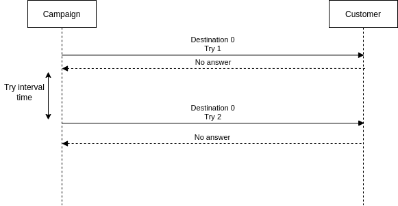

.. _outplan-struct-outplan:

Outplan
=======

.. _outplan-struct-outplan-outplan:

Outplan
-------

.. code::

    {
        "id": "<string>",
        "name": "<string>",
        "detail": "<string>",
        "source": {
            ...
        },
        "dial_timeout": 30000,
        "try_interval": 60000,
        "max_try_count_0": <number>,
        "max_try_count_1": <number>,
        "max_try_count_2": <number>,
        "max_try_count_3": <number>,
        "max_try_count_4": <number>,

        "tm_create": "<string>",
        "tm_update": "<string>",
        "tm_delete": "<string>"
    }

* id: Outplan's id.
* name: Outplan's name.
* detail: Outplan's detail.
* *source*: Source address. See detail :ref:`here <common-struct-address-address>`.
* dial_timeout: Timeout for dialing. milliseconds
* try_interval: Delay time for retry. milliseconds
* max_try_count_0: Maximum try count for destination 0.
* max_try_count_1: Maximum try count for destination 1.
* max_try_count_2: Maximum try count for destination 2.
* max_try_count_3: Maximum try count for destination 3.
* max_try_count_4: Maximum try count for destination 4.

example
+++++++

.. code::

    {
        "id": "d5fb7357-7ddb-4f2d-87b5-8ccbfd6c039e",
        "name": "test outplan",
        "detail": "outplan for test use.",
        "source": {
            "type": "tel",
            "target": "+15559876543",
            "target_name": "",
            "name": "",
            "detail": ""
        },
        "dial_timeout": 30000,
        "try_interval": 60000,
        "max_try_count_0": 5,
        "max_try_count_1": 5,
        "max_try_count_2": 5,
        "max_try_count_3": 5,
        "max_try_count_4": 5,
        "tm_create": "2022-04-28 01:50:23.414000",
        "tm_update": "2022-04-30 12:01:13.780469",
        "tm_delete": "9999-01-01 00:00:00.000000"
    }

Try interval
------------
When the VoIPBIN makes a retry dialing, it waits try interval after the previous call's end.

Max try count
-------------
The max try count configs max try count for the given destination.

.. image:: _static/images/outplan_struct_max_try_count.png
