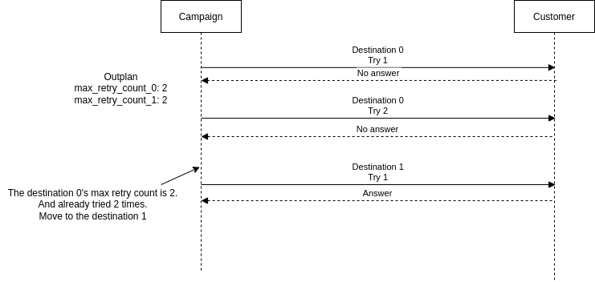

.. _outplan-struct-outplan:

Outplan
=======

.. _outplan-struct-outplan-outplan:

Outplan
-------

.. code::

    {
        "id": "<string>",
        "name": "<string>",
        "detail": "<string>",
        "source": {
            ...
        },
        "dial_timeout": 30000,
        "try_interval": 60000,
        "max_try_count_0": <number>,
        "max_try_count_1": <number>,
        "max_try_count_2": <number>,
        "max_try_count_3": <number>,
        "max_try_count_4": <number>,

        "tm_create": "<string>",
        "tm_update": "<string>",
        "tm_delete": "<string>"
    }

* ``id`` (UUID): The outplan's unique identifier. Returned when creating via ``POST /outplans`` or listing via ``GET /outplans``.
* ``name`` (String): Human-readable name for the outplan.
* ``detail`` (String): Detailed description of the outplan's strategy.
* ``source`` (Object): Source address (caller ID) used when dialing. See :ref:`Address <common-struct-address-address>`.
* ``dial_timeout`` (Integer): Maximum time in milliseconds to wait for the target to answer before marking as no-answer. For example, ``30000`` = 30 seconds.
* ``try_interval`` (Integer): Delay time in milliseconds between retry attempts to the same target. For example, ``3600000`` = 1 hour.
* ``max_try_count_0`` (Integer): Maximum number of dial attempts for ``destination_0`` on outdialtargets.
* ``max_try_count_1`` (Integer): Maximum number of dial attempts for ``destination_1`` on outdialtargets.
* ``max_try_count_2`` (Integer): Maximum number of dial attempts for ``destination_2`` on outdialtargets.
* ``max_try_count_3`` (Integer): Maximum number of dial attempts for ``destination_3`` on outdialtargets.
* ``max_try_count_4`` (Integer): Maximum number of dial attempts for ``destination_4`` on outdialtargets.
* ``tm_create`` (string, ISO 8601): Timestamp when the outplan was created.
* ``tm_update`` (string, ISO 8601): Timestamp of the last update to any outplan property.
* ``tm_delete`` (string, ISO 8601): Timestamp when the outplan was deleted. Set to ``9999-01-01 00:00:00.000000`` if not deleted.

.. note:: **AI Implementation Hint**

   The ``dial_timeout`` and ``try_interval`` fields are in **milliseconds**. Common conversions: 30 seconds = ``30000``, 1 minute = ``60000``, 1 hour = ``3600000``, 2 hours = ``7200000``. A ``tm_delete`` value of ``9999-01-01 00:00:00.000000`` is a sentinel meaning the resource has **not** been deleted.

Example
+++++++

.. code::

    {
        "id": "d5fb7357-7ddb-4f2d-87b5-8ccbfd6c039e",
        "name": "test outplan",
        "detail": "outplan for test use.",
        "source": {
            "type": "tel",
            "target": "+15559876543",
            "target_name": "",
            "name": "",
            "detail": ""
        },
        "dial_timeout": 30000,
        "try_interval": 60000,
        "max_try_count_0": 5,
        "max_try_count_1": 5,
        "max_try_count_2": 5,
        "max_try_count_3": 5,
        "max_try_count_4": 5,
        "tm_create": "2022-04-28 01:50:23.414000",
        "tm_update": "2022-04-30 12:01:13.780469",
        "tm_delete": "9999-01-01 00:00:00.000000"
    }

Try interval
------------
When VoIPBIN makes a retry dial attempt, it waits the ``try_interval`` duration (in milliseconds) after the previous call ends before dialing again.

.. image:: _static/images/outplan_struct_try_interval.png

Max try count
-------------
The ``max_try_count_N`` fields configure the maximum number of dial attempts for the corresponding ``destination_N`` on outdialtargets.

