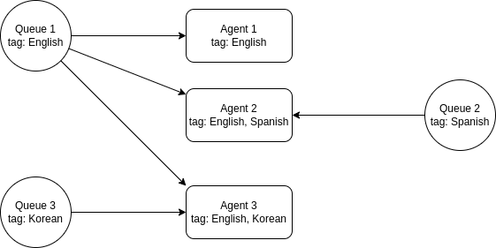
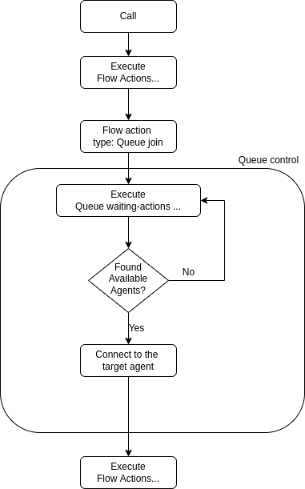

.. _queue-overview:

Overview
========

.. note:: **AI Context**

   * **Complexity:** High -- Queues require coordinating agents, tags, flows, and calls. Set up agents and tags first.
   * **Cost:** No direct charge for queue operations. Underlying calls are chargeable per call minute.
   * **Async:** Yes. ``POST /queues`` creates the queue synchronously, but calls entering a queue via the ``queue_join`` flow action are processed asynchronously. Poll ``GET /queues/{id}`` to monitor queue state, or use ``GET /queuecalls`` to track individual call progress.

Call queueing allows calls to be placed on hold without handling the actual inquiries or transferring callers to the desired party. While in the call queue, the caller is played pre-recorded music or messages. Call queues are often used in call centers when there are not enough staff to handle a large number of calls. Call center operators generally receive information about the number of callers in the call queue and the duration of the waiting time. This allows them to respond flexibly to peak demand by deploying extra call center staff.

With the VoIPBIN's queueing feature, businesses and call centers can effectively manage inbound calls, provide a smooth waiting experience for callers, and ensure that calls are efficiently distributed to available agents, improving overall customer service and call center performance.

The purpose of call queueing
----------------------------
Call queueing is intended to prevent callers from being turned away in the case of insufficient staff capacity. The purpose of the pre-recorded music or messages is to shorten the subjective waiting time. At the same time, call queues can be used for advertising products or services. As soon as the call can be dealt with, the caller is automatically transferred from the call queue to the member of staff responsible. If customer or contract data has to be requested in several stages, multiple downstream call queues can be used.

How Queue Routing Works
-----------------------
When a call joins a queue, a coordinated process begins to match the caller with an available agent.

**The Queue Journey**

::

    +-------------------------------------------------------------------------+
    |                       Call's Journey Through Queue                      |
    +-------------------------------------------------------------------------+

    1. Call Joins Queue          2. Wait Flow Plays         3. Agent Search
    +-----------------+         +-----------------+        +-----------------+
    |                 |         |  # Hold music   |        |  Check for      |
    |  queue_join     |-------->|  "Please wait"  |------->|  available      |
    |  action         |         |  announcements  |        |  agents         |
    +-----------------+         +-----------------+        +--------+--------+
                                        ^                          |
                                        |                    +-----+-----+
                                        |                    |           |
                                        |               No agents    Agent found!
                                        |                    |           |
                                        +--------------------+           |
                                          Retry every 1 second           |
                                                                         v
                                                              +-----------------+
                                                              |  4. Connect     |
                                                              |  agent to call  |
                                                              +--------+--------+
                                                                       |
                                                                       v
                                                              +-----------------+
                                                              |  5. Caller and  |
                                                              |  agent talking  |
                                                              +-----------------+

**What Happens Step by Step**

1. **Call Joins Queue**: When your flow executes a ``queue_join`` action, a queuecall is created
2. **Conference Bridge Created**: A private conference room is set up for this call
3. **Wait Flow Starts**: The caller hears music and announcements from your configured wait flow
4. **Agent Search Begins**: The system immediately starts looking for available agents
5. **Continuous Checking**: Every second, the system checks if any matching agents are now available
6. **Agent Found**: When an agent matches, they're invited to join the conference
7. **Service Begins**: Both parties are connected and can talk

Queuecall Lifecycle
-------------------
Every call in a queue moves through a series of states:

::

    +--------------------------------------------------------------------------+
    |                      Queuecall State Machine                             |
    +--------------------------------------------------------------------------+

                                +------------+
                                | initiating |
                                |  (brief)   |
                                +-----+------+
                                      |
                                      v
                           +------------------+
           wait_timeout--->|     waiting      |<---+
           exceeded        | (in wait flow)   |    |
               |           +--------+---------+    |
               |                    | agent found  | kick requested
               |                    v              |
               |           +------------------+    |
               |           |    connecting    |----+
               |           |  (dialing agent) |
               |           +--------+---------+
               |                    | agent joins
               |                    v
               |           +------------------+         service_timeout
               |           |     service      |<---------- exceeded
               |           | (agent on call)  |                |
               |           +--------+---------+                |
               |                    |                          |
               |    +----------+   +--------+--------+         |
               |    | kicking  |   v                 v         v
               +--->|          |  +------------+    +-------------+
               +--->| (kicked) |  |  abandoned |    |    done     |
                    +----------+  |  (failed)  |    | (success)   |
                                  +------------+    +-------------+

**State Descriptions**

.. list-table::
   :header-rows: 1

   * - State
     - What's happening
   * - initiating
     - Call just entered the queue. Conference bridge being set up.
   * - waiting
     - Caller is hearing wait flow. System is searching for agents.
   * - connecting
     - Agent found and being called. Caller still in wait flow.
   * - kicking
     - Call is being removed (kicked) from the queue.
   * - service
     - Agent and caller are connected. Conversation in progress.
   * - done
     - Call completed successfully. Agent finished helping caller.
   * - abandoned
     - Call ended before completion - caller hung up, timeout, etc.

Agent Searching
---------------
While the call is in the queue, the queue continuously searches for available agents to handle the call. Each queue has a ``tag_ids`` field used as a skill-based filter: only agents that share at least one tag with the queue are eligible, unless the queue has no tags configured at all.

**How Agent Matching Works**

::

    +--------------------------------------------------------------------------+
    |                      Agent Matching Process                              |
    +--------------------------------------------------------------------------+

    Queue Configuration:                    Agent Pool (same customer):
    +------------------------+             +--------------------------------+
    | customer_id: <id>      |             | Agent A - Tags: english, vip   |
    | Tag IDs: english,      |             |   Status: available            |
    |          billing       |             | Agent B - Tags: spanish        |
    |                        |             |   Status: available            |
    +------------------------+             | Agent C - Tags: english        |
              |                            |   Status: busy                 |
              v                            | Agent D - Tags: (none)         |
    +------------------------+             |   Status: available            |
    | Filter agents by:      |             +--------------------------------+
    |  * customer_id         |
    |  * status = available  |
    |  * tag_ids overlaps    |
    |    queue's tag_ids     |
    +------------------------+
              |
              v
    +--------------------------------------------------------------------------+
    | Results:                                                                 |
    |  [x] Agent A - available, shares "english" tag with the queue            |
    |  [ ] Agent B - available, but no tag overlap ("spanish" only), excluded  |
    |  [ ] Agent C - busy, excluded (status filter)                           |
    |  [ ] Agent D - available, but has no tags, excluded (no overlap)        |
    |                                                                          |
    |  -> One of the matching available agents is selected at random          |
    +--------------------------------------------------------------------------+

.. note:: **Queues with no tags apply no tag constraint**

   If a queue's ``tag_ids`` is empty, tag matching is skipped entirely and every available agent belonging to the queue's customer is eligible, regardless of the agent's own tags. This is the default for queues that don't use skill-based routing. Tag filtering only activates once you set ``tag_ids`` on the queue.

**Tag Field**

- ``Queue.tag_ids`` and each agent's ``tag_ids`` are both real, queryable fields, and are consulted at agent-selection time: an agent is only eligible for a queue with non-empty ``tag_ids`` if it shares **at least one** tag with the queue (an overlap/"any of" match, not "all of").
- ``GET /agents?tag_ids=...`` also filters server-side using the same overlap semantics -- only agents whose ``tag_ids`` contain at least one of the given ids are returned.
- Selection among the matching, available agents is still random (see :ref:`Routing Methods <queue-overview>` above) -- tags narrow the eligible pool, they don't order or rank within it.

.. note:: **AI Implementation Hint**

   To restrict which agents can receive calls from a queue, set the queue's ``tag_ids`` to the required skill(s) and make sure eligible agents carry at least one matching tag. Leaving a queue's ``tag_ids`` empty routes to any available agent of that customer.

**Agent Status**

The agent's status must be "available" to receive queue calls:

::

    Agent Statuses and Queue Eligibility:

    available  [x] Yes - Agent is ready to take calls
    ringing    [ ] No  - A call is currently being delivered to the agent
    busy       [ ] No  - Agent is already handling another call
    away       [ ] No  - Agent is temporarily away
    offline    [ ] No  - Agent is not logged in

**Selection Method**

When multiple agents match, the system uses random selection:

::

    Multiple agents available:
    +------------+   +------------+   +------------+
    |  Agent A   |   |  Agent C   |   |  Agent E   |
    | (matches)  |   | (matches)  |   | (matches)  |
    +------------+   +------------+   +------------+
          |               |               |
          +---------------+---------------+
                          |
                          v
                    Random Selection
                          |
                          v
                   One agent picked

Agent Status Transitions
------------------------
Agents move through a lifecycle as they handle queue calls.

**Status Transition Diagram**

::

    +----------+                        +----------+
    |  offline |-------- login -------->| available|
    +----------+                        +-----+----+
         ^                                    |
         |                              call routed (automatic)
         |                                    |
         |                                    v
         |                              +----------+
         |                              | ringing  |
         |                              +-----+----+
         |                                    |
         |                              agent answers (automatic)
         |                                    |
         |                                    v
         |                              +----------+
         +--------- logout -------------|   busy   |
                                        +-----+----+
                                              |
                                    call ends -- status stays "busy";
                                    agent must manually set a new status
                                              |
                                              v
                                        +----------+
                                        | available|
                                        |(if agent |
                                        | sets it) |
                                        +----------+

**Status Behaviors**

.. list-table::
   :header-rows: 1

   * - Transition
     - What happens
   * - login
     - Agent becomes available to receive queue calls
   * - call routed
     - Queue connects an available agent to a caller; status becomes ringing (automatic)
   * - agent answers
     - Status becomes busy (automatic)
   * - call ends
     - Status remains busy; the agent (or your application) must call ``PUT /agents/{id}/status`` to set it back to available
   * - logout
     - Agent goes offline; removed from queue matching

Multi-Queue Agent Scenarios
---------------------------
Agent selection is filtered by tag overlap (see :ref:`Agent Searching <queue-overview>`): an available agent is a candidate for a given queue only if the queue has no ``tag_ids`` configured, or the agent shares at least one tag with the queue. An agent with the right tags can still be eligible for several queues at once.

**Single Agent, Multiple Queues**

::

    Agent A (available, tags: english, billing, tech_support)

    +------------------------+     +------------------------+
    | Queue: English Billing |     | Queue: Tech Support    |
    | Tags: english, billing |     | Tags: tech_support     |
    +------------------------+     +------------------------+
              |                              |
              +--------- Agent A ------------+
              |  (eligible for both -- has   |
              |   a matching tag for each)   |
              v                              v
    Agent A can receive calls from EITHER queue

**Priority Handling**

When an agent matches multiple queues, the system picks the longest-waiting caller across all matching queues:

::

    Queue A: 3 callers waiting (oldest: 2 min)
    Queue B: 1 caller waiting (oldest: 5 min)   <-- This caller gets Agent A
    Queue C: 5 callers waiting (oldest: 30 sec)

**Tag Strategy for Multi-Queue**

::

    +-------------------------------------------------------------------------+
    |                     Multi-Queue Tag Strategy                            |
    +-------------------------------------------------------------------------+

    Tier 1 Agent (handles simple issues):
    Tags: [english, tier1, billing_basic, tech_basic]
         |
         +---> Matches: Basic Billing Queue, Basic Tech Queue

    Tier 2 Agent (handles complex issues):
    Tags: [english, tier2, billing_advanced, tech_advanced]
         |
         +---> Matches: Advanced Billing Queue, Advanced Tech Queue

    Supervisor (handles escalations):
    Tags: [english, supervisor, billing_basic, billing_advanced,
           tech_basic, tech_advanced]
         |
         +---> Matches: ALL queues (can help anywhere)

Flow Execution
---------------
A call placed in the queue will progress through the queue's waiting actions, continuing through pre-defined steps until an available agent is located. These waiting actions may involve playing pre-recorded music, messages, or custom actions, enhancing the caller's experience while awaiting assistance in the queue.

**Wait Flow Structure**

::

    +--------------------------------------------------------------------------+
    |                          Wait Flow Execution                             |
    +--------------------------------------------------------------------------+

    Caller enters queue
           |
           v
    +-----------------------------------------------------------------------+
    |                            Wait Flow Loop                             |
    |                                                                       |
    |    +----------+     +----------+     +----------+     +----------+    |
    |    | "Please  |---->|  # Hold  |---->| "Your    |---->|  # Hold  |    |
    |    |  hold"   |     |  music   |     | position |     |  music   |    |
    |    |  (talk)  |     |  (play)  |     |  is 3"   |     |  (play)  |    |
    |    +----------+     +----------+     +----------+     +----------+    |
    |         ^                                                    |        |
    |         |                                                    |        |
    |         +----------------------------------------------------+        |
    |                        (loops until agent found)                      |
    +-----------------------------------------------------------------------+
           |
           | Agent found!
           v
    +----------------+
    | Wait flow ends |
    | Service begins |
    +----------------+

**Wait Flow Features**

- **Looping**: The wait flow automatically repeats until the call is answered or times out
- **Custom Actions**: You can use any flow action that makes sense while waiting
- **Announcements**: Play position updates, estimated wait time, or promotional messages
- **Music**: Play hold music to make the wait feel shorter

Timeout Handling
----------------
Queues have two distinct timeout mechanisms to prevent calls from being stuck indefinitely:

**Wait Timeout**

Controls how long a caller can wait before being removed from the queue:

::

    +--------------------------------------------------------------------------+
    |                          Wait Timeout                                    |
    +--------------------------------------------------------------------------+

    Call joins queue                                     Wait timeout reached
         |                                                     |
         v                                                     v
    -----o-----------------------------------------------------o------------->
         |<--------------- wait_timeout (ms) ----------------->|    Time
         |                                                     |
         | Caller hears wait flow                              | Call is kicked
         | System searches for agents                          | Status: abandoned
         |                                                     |

- Set via queue's ``wait_timeout`` field (milliseconds)
- 0 means no timeout (wait forever)
- When exceeded, the call is removed with status "abandoned"

**Service Timeout**

Controls how long a conversation can last once connected:

::

    +--------------------------------------------------------------------------+
    |                         Service Timeout                                  |
    +--------------------------------------------------------------------------+

    Agent connects                                    Service timeout reached
         |                                                     |
         v                                                     v
    -----o-----------------------------------------------------o------------->
         |<------------- service_timeout (ms) ---------------->|    Time
         |                                                     |
         | Agent and caller talking                            | Call is ended
         | (status: service)                                   | Status: done
         |                                                     |

- Set via queue's ``service_timeout`` field (milliseconds)
- 0 means no timeout (talk forever)
- When exceeded, the call is ended gracefully

.. note:: **AI Implementation Hint**

   Timeout values are in **milliseconds**, not seconds. A 5-minute wait timeout is ``300000``, not ``300``. Setting ``0`` disables the timeout entirely (wait/talk forever). If callers are being disconnected unexpectedly, check that timeout values are not set in seconds by mistake.

**Timeout Scenarios**

::

    Scenario 1: Caller waits too long
    +----------+                                        +-----------+
    | waiting  |----- wait_timeout exceeded ----------->| abandoned |
    +----------+                                        +-----------+

    Scenario 2: Caller hangs up while waiting
    +----------+                                        +-----------+
    | waiting  |----- caller hangup ------------------->| abandoned |
    +----------+                                        +-----------+

    Scenario 3: Successful call, normal end
    +----------+   +-----------+   +---------+         +------+
    | waiting  |-->| connecting|-->| service |--hangup>| done |
    +----------+   +-----------+   +---------+         +------+

Queue Metrics and Tracking
--------------------------
Queues track detailed metrics for reporting and analysis:

**Per-Queue Statistics**

::

    +--------------------------------------------------------------------------+
    |                        Queue Statistics                                  |
    +--------------------------------------------------------------------------+

    Queue: "Customer Support"
    .. list-table::

       * - total_incoming_count
         - 1,234 calls entered this queue
       * - total_serviced_count
         - 1,100 calls reached an agent
       * - total_abandoned_count
         - 134 calls abandoned (11% abandon r

**Per-Queuecall Metrics**

Each call in the queue tracks:

::

    Queuecall: "abc-123-def"
    .. list-table::

       * - duration_waiting
         - 45,000 ms (45 seconds in wait flow
       * - duration_service
         - 180,000 ms (3 minutes with agent)
       * - tm_create
         - 2024-01-15 10:30:00 (entered queue
       * - tm_service
         - 2024-01-15 10:30:45 (agent connect
       * - tm_update
         - 2024-01-15 10:33:45 (last update)

**Calculating Service Levels**

You can calculate key performance indicators from these metrics:

::

    Service Level     = (total_serviced_count / total_incoming_count) × 100
                      = (1100 / 1234) × 100 = 89.1%

    Abandonment Rate  = (total_abandoned_count / total_incoming_count) × 100
                      = (134 / 1234) × 100 = 10.9%

    Average Wait Time = Sum of all duration_waiting / total_incoming_count

When No Agents Are Available
----------------------------
If no agents match or all matching agents are busy, the caller waits:

::

    +--------------------------------------------------------------------------+
    |                    No Agents Available Scenario                          |
    +--------------------------------------------------------------------------+

    10:00:00 - Call joins queue, no agents available
         |
         v
    +-------------------------------------------------------------------------+
    | System checks for agents every 1 second:                                |
    |                                                                         |
    | 10:00:01 - Check agents... none available                               |
    | 10:00:02 - Check agents... none available                               |
    | 10:00:03 - Check agents... none available                               |
    | 10:00:04 - Check agents... Agent A just became available!               |
    |                                                                         |
    | Caller hears wait flow the entire time                                  |
    +-------------------------------------------------------------------------+
         |
         v
    10:00:04 - Agent A is connected

**Retry Behavior**

- System retries every 1 second
- Caller continuously hears the wait flow
- As soon as any agent becomes available and matches, they're connected
- This continues until wait_timeout (if configured) or an agent answers

Conference Bridge Architecture
------------------------------
Each queuecall gets its own private conference bridge:

::

    +--------------------------------------------------------------------------+
    |                      Conference Bridge Model                             |
    +--------------------------------------------------------------------------+

    Queuecall for Caller A                    Queuecall for Caller B
    +-------------------------+              +-------------------------+
    | Conference Bridge #1    |              | Conference Bridge #2    |
    | +---------+ +---------+ |              | +---------+ +---------+ |
    | | Caller  | |  Agent  | |              | | Caller  | |  Agent  | |
    | |   A     | |   1     | |              | |   B     | |   2     | |
    | +---------+ +---------+ |              | +---------+ +---------+ |
    +-------------------------+              +-------------------------+

**Why This Design?**

- Each call is isolated in its own bridge
- Caller joins immediately, hears wait flow
- Agent joins when available, both can talk
- Clean separation - no cross-talk between calls

Common Queue Scenarios
----------------------

**Scenario 1: Quick Answer**

::

    Caller dials -> Enters queue -> Agent available -> Connected in 2 seconds
                                                    |
                                                    v
                                            duration_waiting: 2000ms
                                            status: done

**Scenario 2: Wait Then Connect**

::

    Caller dials -> Enters queue -> No agents -> Waits 45 seconds -> Agent available
                                     |                                  |
                                     v                                  v
                              # Hold music plays              Connected!
                              Position announcements          duration_waiting: 45000ms

**Scenario 3: Caller Abandons**

::

    Caller dials -> Enters queue -> Waits 2 minutes -> Caller hangs up
                                     |                      |
                                     v                      v
                              # Hold music plays      status: abandoned
                                                      duration_waiting: 120000ms

**Scenario 4: Wait Timeout**

::

    Caller dials -> Enters queue -> Waits 5 minutes -> wait_timeout exceeded
                                     |                      |
                                     v                      v
                              # Hold music plays      Kicked from queue
                                                      status: abandoned

Best Practices
--------------

**1. Configure Appropriate Timeouts**

::

    wait_timeout: 300000    (5 minutes - reasonable for customer service)
    service_timeout: 0      (no limit for service - let conversations finish)

**2. Design Engaging Wait Flows**

- Mix music with periodic announcements
- Provide position in queue updates
- Offer callback options for long waits
- Keep announcements concise

**3. Tag Agents Thoughtfully**

::

    Good tag structure:
    +-----------------------------------------+
    | Language tags: english, spanish, french |
    | Skill tags: billing, tech_support, sales|
    | Tier tags: tier1, tier2, supervisor     |
    +-----------------------------------------+

**4. Monitor Key Metrics**

- Track abandonment rates - high rates indicate understaffing or long waits
- Monitor average wait times - aim for your service level target
- Review service durations - identify training opportunities

Related Documentation
---------------------
Queues integrate with many VoIPBIN features. Use these links for detailed information:

**Queue Conference Bridge**

Each queuecall uses a conference bridge to connect caller and agent.

::

    Queuecall                         Conference (connect type)
    +-------------+                   +---------------+
    |  service    |--uses------------>| progressing   |
    |             |                   | (caller +     |
    |             |                   |  agent)       |
    +-------------+                   +---------------+

See :ref:`Conference Overview <conference-overview>` for conference types and participant management.

**Recording Queue Calls**

Record conversations between callers and agents for quality assurance.

::

    Queuecall                         Recording
    +-------------+                   +------------+
    |  service    |--recording_start->| recording  |
    | (call obj)  |                   |            |
    |             |<--recording_id----| available  |
    +-------------+                   +------------+

See :ref:`Recording Overview <recording-overview>` for recording lifecycle and storage.

**Transcribing Queue Calls**

Convert agent-caller conversations to text in real-time.

::

    Queuecall                         Transcription
    +-------------+                   +---------------+
    |  service    |--transcribe_start>| transcribing  |
    | (call obj)  |                   |               |
    |             |<--transcript events| (streaming)  |
    +-------------+                   +---------------+

See :ref:`Transcribe Overview <transcribe-overview>` for transcript delivery and language support.

**Queue Flow Actions**

Use flow actions to place calls in queues and control queue behavior.

::

    Flow Action                       Queue
    +-------------+                   +---------------+
    | queue_join  |--places call in-->| waiting       |
    |             |                   |               |
    |             |<--continues when--| service/done  |
    +-------------+   call exits      +---------------+

See :ref:`Flow Actions <flow-struct-action-queue_join>` for queue-related flow actions.

**Agent Management**

Which queues an agent can serve is gated by tag overlap: an available agent belonging to a queue's customer is eligible for a given queue if the queue has no ``tag_ids`` configured, or if the agent shares at least one tag with the queue's ``tag_ids`` (see :ref:`Agent Searching <queue-overview>`).

::

    Agent (available, customer X, tags: english)   Queues (customer X)
    +-------------------------+                    +----------------------+
    | status: available       |----eligible-------->| Queue A (no tags)   |
    | tags: english           |                     +----------------------+
    +-------------------------+----eligible-------->| Queue B (english)   |
                               |                     +----------------------+
                               +---not eligible----->| Queue C (spanish)   |
                                                     +----------------------+

See :ref:`Agent Overview <agent-overview>` for agent configuration and status management.

**Call Integration**

Queue calls are built on top of the Call API - each queuecall references a call.

::

    Queuecall                         Call
    +-------------+                   +---------------+
    |  call_id:   |--references------>| progressing   |
    |  "abc-123"  |                   | (the actual   |
    |             |                   |  call object) |
    +-------------+                   +---------------+

See :ref:`Call Overview <call-overview>` for call lifecycle and states.
