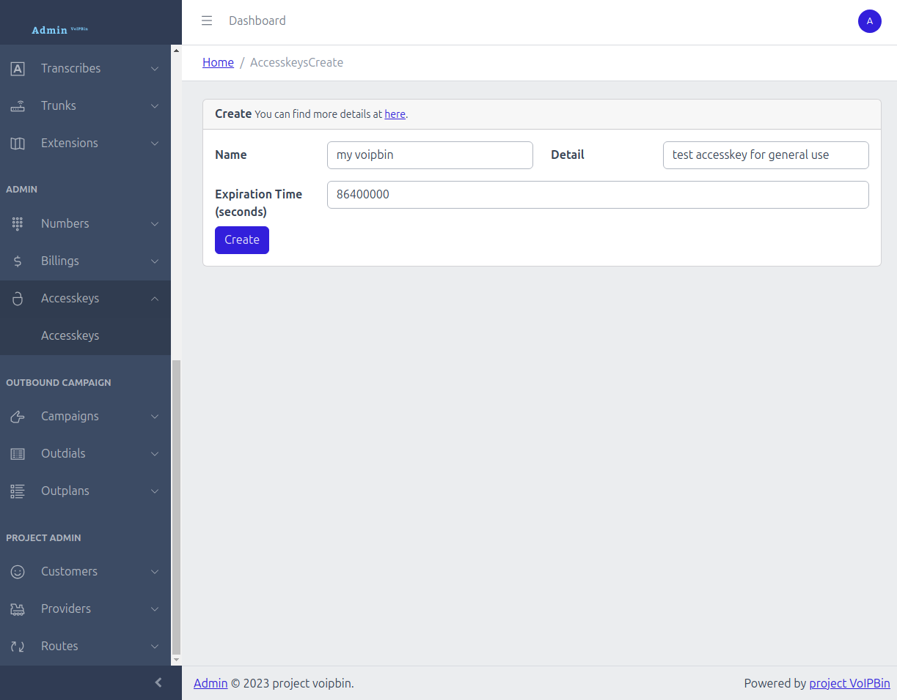

.. _quickstart_authentication:

Authentication
==============
Every API request must be authenticated using either a **Token** (JWT) or an **Accesskey**. Both serve the same purpose — choose whichever fits your workflow.

Generate a Token
----------------
Send a login request with your username and password to receive a JWT token. The token is valid for 7 days.

.. code::

    $ curl --request POST 'https://api.voipbin.net/auth/login' \
        --header 'Content-Type: application/json' \
        --data-raw '{
            "username": "your-voipbin-username",
            "password": "your-voipbin-password"
        }'

Response:

.. code::

    {
        "username": "your-voipbin-username",
        "token": "eyJhbGciOiJIUzI1NiIsInR5cCI6IkpXVCJ9..."
    }

Use the token in subsequent requests via the ``Authorization`` header:

.. code::

    $ curl -k --request GET 'https://api.voipbin.net/v1.0/accesskeys' \
        --header 'Authorization: Bearer <your-token>'

Or as a query parameter:

.. code::

    $ curl -k --request GET 'https://api.voipbin.net/v1.0/accesskeys?token=<your-token>'

Generate an Accesskey
---------------------
For long-lived authentication, generate an access key from the `admin console <https://admin.voipbin.net>`_. You can set a custom expiration when creating it.

Use the access key as a query parameter:

.. code::

    $ curl -k --request GET 'https://api.voipbin.net/v1.0/accesskeys?accesskey=<your-accesskey>'

For more details, see the full :ref:`Accesskey tutorial <accesskey-main>`.
