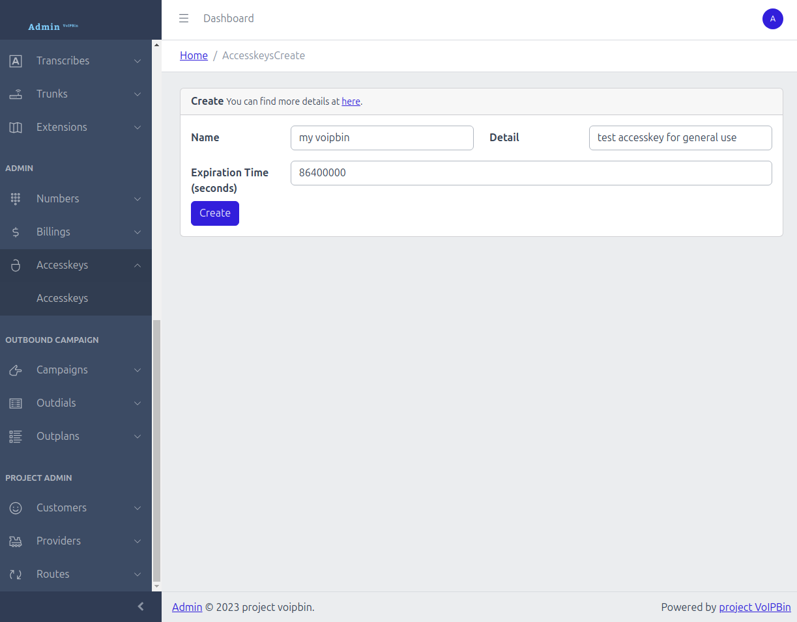

.. _quickstart-authentication:

Authentication
--------------
Every API request must be authenticated using either a **Token** (JWT string) or an **Accesskey** (API key string). Both serve the same purpose — choose whichever fits your workflow.

.. note:: **AI Implementation Hint**

   Use **Token** (JWT) for short-lived, session-based authentication (valid for 7 days). Use **Accesskey** for long-lived, programmatic access with custom expiration. For automated systems and AI agents, Accesskey is recommended because it does not require periodic re-authentication.

Generate a Token
~~~~~~~~~~~~~~~~
Send a ``POST`` request to ``/auth/login`` with your username (String) and password (String) to receive a JWT token. The token is valid for 7 days.

.. code::

    $ curl --request POST 'https://api.voipbin.net/auth/login' \
        --header 'Content-Type: application/json' \
        --data-raw '{
            "username": "your-voipbin-username",
            "password": "your-voipbin-password"
        }'

Response:

.. code::

    {
        "username": "your-voipbin-username",
        "token": "eyJhbGciOiJIUzI1NiIsInR5cCI6IkpXVCJ9..."
    }

Use the token in subsequent API requests. See `Using Credentials in API Requests`_ below for usage examples.

Generate an Accesskey
~~~~~~~~~~~~~~~~~~~~~
For long-lived authentication, generate an access key. You can create one from the `admin console <https://admin.voipbin.net>`_ or via the API.

**Via Admin Console:**

**Via API:**

.. code::

    $ curl --request POST 'https://api.voipbin.net/v1.0/accesskeys?token=<your-token>' \
        --header 'Content-Type: application/json' \
        --data-raw '{
            "name": "my-api-key",
            "detail": "API key for automated access"
        }'

Response:

.. code::

    {
        "id": "a1b2c3d4-e5f6-7890-abcd-ef1234567890",
        "token": "your-access-key-token",
        "name": "my-api-key",
        "detail": "API key for automated access",
        ...
    }

.. note:: **AI Implementation Hint**

   If you signed up via the API (``POST /auth/signup``), the response already includes an ``accesskey`` with a valid token — you do not need to create another one. Use ``POST /v1.0/accesskeys`` only if you need additional keys or want to set a custom expiration via the ``expire`` (Integer, Optional) field.

Direct Token (Boot)
~~~~~~~~~~~~~~~~~~~
For resource-scoped access without user credentials, use a **direct hash** to obtain a short-lived JWT. This is used for direct links (e.g., AI voice agent web widgets) where the end user does not have a VoIPBIN account.

Send a ``POST`` request to ``https://api.voipbin.net/auth/boot`` with the ``direct_hash`` (String, Required). The hash is obtained from a direct link URL or from the ``hash`` field of ``GET https://api.voipbin.net/v1.0/directs``. Must start with ``direct.``.

.. code::

    $ curl --request POST 'https://api.voipbin.net/auth/boot' \
        --header 'Content-Type: application/json' \
        --data-raw '{
            "direct_hash": "direct.abc123def456..."
        }'

Response:

.. code::

    {
        "token": "eyJhbGciOiJIUzI1NiIsInR5cCI6IkpXVCJ9...",
        "type": "direct",
        "resource_type": "ai",
        "resource_id": "a1b2c3d4-e5f6-7890-abcd-ef1234567890",
        "customer_id": "c1b2c3d4-e5f6-7890-abcd-ef1234567890",
        "expire": "2026-04-06T20:00:00Z"
    }

The returned token is valid for **4 hours** and grants access only to the resource types associated with the direct hash (e.g., ``aicall`` for an AI direct hash). Use it in subsequent API and WebSocket requests via the ``?token=`` query parameter.

.. note:: **AI Implementation Hint**

   Direct tokens have limited scope — they can only access specific resource types (e.g., ``aicall``), not the full API. For WebSocket subscriptions, direct tokens can only subscribe to 4-part topics: ``customer_id:<uuid>:<resource_type>:<resource_id>``. Broad customer-level topics (2-part or 3-part) are rejected.

Troubleshooting (Boot):

* **400 Bad Request:**
    * **Cause:** The ``direct_hash`` field is missing, empty, or does not start with ``direct.``.
    * **Fix:** Verify the hash was copied correctly from the direct link URL.

* **400 Bad Request (Hash not found):**
    * **Cause:** The direct hash does not resolve to any resource (deleted or invalid).
    * **Fix:** Verify the direct hash is still active via ``GET https://api.voipbin.net/v1.0/directs``.

* **400 Bad Request (Customer not active):**
    * **Cause:** The customer account associated with the direct hash is not active.
    * **Fix:** Contact the account owner to reactivate the customer account.

Using Credentials in API Requests
~~~~~~~~~~~~~~~~~~~~~~~~~~~~~~~~~~
The query parameter name depends on which credential type you are using:

+-------------------+-----------------------------------------------------+
| Credential        | Query Parameter                                     |
+===================+=====================================================+
| Token (JWT)       | ``?token=<your-token>``                             |
+-------------------+-----------------------------------------------------+
| Accesskey         | ``?accesskey=<your-accesskey>``                     |
+-------------------+-----------------------------------------------------+

**Token example:**

.. code::

    $ curl --request GET 'https://api.voipbin.net/v1.0/calls?token=<your-token>'

**Accesskey example:**

.. code::

    $ curl --request GET 'https://api.voipbin.net/v1.0/calls?accesskey=<your-accesskey>'

Tokens can also be passed via the ``Authorization`` header:

.. code::

    $ curl --request GET 'https://api.voipbin.net/v1.0/calls' \
        --header 'Authorization: Bearer <your-token>'

.. note:: **AI Implementation Hint**

   The parameter names are **not interchangeable** — use ``token=`` for JWT tokens and ``accesskey=`` for access keys. Using the wrong parameter name results in ``401 Unauthorized``. All quickstart examples use ``?token=<your-token>`` — if you are using an accesskey instead, replace ``token=`` with ``accesskey=`` in every request.

Troubleshooting
~~~~~~~~~~~~~~~

* **401 Unauthorized:**
    * **Cause:** Token has expired (older than 7 days) or is malformed.
    * **Fix:** Generate a new token via ``POST /auth/login``. Ensure the ``Authorization`` header uses the format ``Bearer <token>`` (with a space after "Bearer").

* **401 Unauthorized (Accesskey):**
    * **Cause:** Accesskey has expired (past ``tm_expire``) or has been deleted.
    * **Fix:** Check the accesskey's expiration via ``GET /accesskeys``. Generate a new one from the admin console if expired.

* **403 Forbidden:**
    * **Cause:** The authenticated user lacks permission for the requested resource.
    * **Fix:** Verify the resource belongs to your customer account. Check your permission level (admin vs. manager).

For more details, see the full :ref:`Accesskey tutorial <accesskey-main>`.
