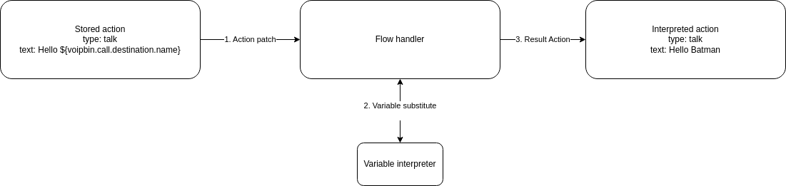

.. _variable_overview:

Overview
========

.. note:: **AI Context**

   * **Complexity:** Low
   * **Cost:** Free -- Variables are part of flow execution and do not incur separate charges.
   * **Async:** No. Variables are resolved synchronously at the time each flow action executes. There is no separate API endpoint for variables; they are used within flow action definitions.

VoIPBIN provides a powerful feature called Variables, enabling users to define, manipulate, and reference dynamic values throughout the lifecycle of a flow execution. Variables act as flexible placeholders for data that may change over time—such as user input, call metadata, or results from other applications—and can be injected into any compatible action in the flow.

This mechanism introduces contextual awareness and reactivity to flow logic, allowing users to build intelligent, data-driven call and messaging workflows that adapt in real time to current conditions and external inputs.

.. note:: **AI Implementation Hint**

   Variable syntax is ``${voipbin.<category>.<field>}`` for system variables and ``${<custom_key>}`` for user-defined variables. If a variable does not exist or is null, the placeholder is replaced with an empty string. Variables are scoped to the current activeflow instance and do not persist after the flow ends.

.. _variable-overview-variable_use:

Using Variables in Flows
========================

Variables can be used within flow actions by referencing them using the following syntax:

.. code::

    Hello, ${voipbin.call.destination.name}.

    -> Hello, Batman.

At runtime, VoIPBIN resolves this placeholder and replaces it with the actual value stored in the variable. This process occurs at the time the action is executed, ensuring that the most up-to-date value is used—even if the variable was set earlier or modified by another action.

Variables can be used in any field that supports templating. For example:

* Setting dynamic text in TTS or message actions
* Referencing phone numbers or user identifiers for routing or lookup
* Embedding values in external API calls via webhooks
* Controlling logic in conditional (branch) or fork actions

VoIPBIN supports nested variables and safely resolves deep paths like:

.. code::

    Hello, ${voipbin.invalid.variable}.

    -> Hello, .

If a variable does not exist or is null, the placeholder will be replaced with an empty string unless otherwise specified.

.. _variable-overview-dynamic_values:

Capturing and Setting Dynamic Values
====================================

Variables can be populated in several ways:

Automatically by the system 
---------------------------

VoIPBIN injects key metadata about the call or message, such as:

* voipbin.call.source.name
* voipbin.call.destination.number
* voipbin.message.source.number

By actions within the flow
--------------------------

Certain actions can store values as variables based on runtime results:

* transcribe can store transcription results
* recording can store the recording info
* queueing can store the queueed call info.

Manually via variable_set action
--------------------------------

Developers can explicitly define or override values in the flow.

.. code::

    {
        "type": "variable_set",
        "option": {
            "key": "user_selected_option",
            "value": "some_value"
        }
    }

Variables set during execution are scoped to the current flow instance, meaning they persist only during the lifetime of that flow unless explicitly passed elsewhere.

Integration with Applications
=============================

Each application in VoIPBIN can expose its own set of variables, which can be used by other parts of the flow. For example:

* Call Application: Sets variables like caller name, number, codec, and session info.
* SMS Application: Sets sender/receiver numbers and message content.
* AI and Chatbot Actions: Store extracted entities, intent, and raw responses.
* Webhook Application: Allows injection of third-party data as variables.

Email, Recording, or Summary Services: Can expose post-processing data such as email status or transcription content.

Variables act as a shared communication layer between applications. This allows a webhook that receives CRM data to feed into an AI chatbot, or enables a transcription result to be emailed after a call ends—all within the same flow logic.

.. _variable-overview-best_practices:

Best Practices and Considerations
=================================

* Always validate input: Use branch or conditional logic to handle cases where variables may be missing or malformed.
* Avoid name collisions: Prefer namespaced keys (e.g., user.profile.email) to reduce risk of overwriting important data.
* Debugging: Use logging or flow monitoring to inspect variable states at different stages.
* Data persistence: Variables do not persist beyond a single flow execution unless saved externally (e.g., via webhook or external DB).

In conclusion, VoIPBIN's Variable system is a core feature that enables dynamic, data-aware flows. By using variables effectively, developers can create tailored communication experiences that respond intelligently to the context of each interaction—whether through voice, messaging, or external integrations.
