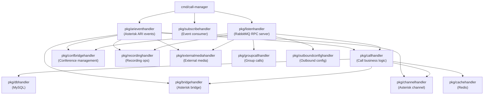

# Architecture: bin-call-manager

## Component Overview

## Layer Responsibilities

| Package | Role | Key Types |
|---------|------|-----------|
| `pkg/callhandler` | Core call business logic: create, hangup, hold, mute, play, talk, actions | `call.Call`, `call.Status`, `call.Type` |
| `pkg/confbridgehandler` | Conference bridge management: join/leave calls, recording, flags | `confbridge.Confbridge`, `confbridge.Status`, `confbridge.Flag` |
| `pkg/channelhandler` | Asterisk channel tracking; channel state transitions | `channel.Channel`, `ari.ChannelState` |
| `pkg/bridgehandler` | Asterisk bridge tracking; channel mixing | `bridge.Bridge` |
| `pkg/recordinghandler` | Recording lifecycle: start, stop, storage | `recording.Recording`, `recording.Status` |
| `pkg/externalmediahandler` | WebRTC / external media stream management | `externalmedia.ExternalMedia`, `externalmedia.Status` |
| `pkg/groupcallhandler` | Multi-call group: ring, answer, hangup coordination | `groupcall.Groupcall`, `groupcall.Status` |
| `pkg/outboundconfighandler` | Outbound dialing configuration (codecs, source) | `outboundconfig.OutboundConfig` |
| `pkg/arieventhandler` | Consumes Asterisk ARI events from RabbitMQ; routes to domain handlers | `ari.*Event` types |
| `pkg/listenhandler` | RabbitMQ RPC request router (regex pattern matching) | `sock.Request`, `sock.Response` |
| `pkg/subscribehandler` | Consumes events from customer-manager, flow-manager, sentinel-manager | queue event structs |
| `pkg/dbhandler` | MySQL CRUD operations using direct SQL (no query builder) | all model structs |
| `pkg/cachehandler` | Redis fast-path lookups for calls, channels, bridges, confbridges | all model structs |
| `models/call` | Call data model, status constants, hangup reason logic | `call.Call`, `call.Status` |
| `models/confbridge` | Confbridge data model, flags, reference types | `confbridge.Confbridge` |
| `models/channel` | Asterisk channel model | `channel.Channel` |
| `models/bridge` | Asterisk bridge model | `bridge.Bridge` |
| `models/recording` | Recording model, status lifecycle | `recording.Recording` |
| `models/externalmedia` | External media model, transport/encapsulation types | `externalmedia.ExternalMedia` |
| `models/groupcall` | Group call model, ring/answer methods | `groupcall.Groupcall` |
| `models/outboundconfig` | Outbound config model (codecs, source number) | `outboundconfig.OutboundConfig` |
| `models/ari` | Asterisk ARI event types and channel state definitions | `ari.ChannelState`, `ari.ChannelCause` |

## Request Routing

Requests arrive via RabbitMQ queue `bin-manager.call-manager.request`. The `listenhandler` matches each request's URI against regex patterns and dispatches to the appropriate handler function.

| Route Pattern | Method | Description |
|---------------|--------|-------------|
| `/v1/calls$` | POST | Create a new call |
| `/v1/calls\?` | GET | List calls with filters/pagination |
| `/v1/calls/{{UUID}}$` | GET/POST/DELETE | Get, update, or delete a call |
| `/v1/calls/{{UUID}}/health-check$` | POST | Health check for a call |
| `/v1/calls/{{UUID}}/digits$` | POST | Send DTMF digits to a call |
| `/v1/calls/{{UUID}}/action-next$` | POST | Advance call to next flow action |
| `/v1/calls/{{UUID}}/action-timeout$` | POST | Trigger call action timeout |
| `/v1/calls/{{UUID}}/chained-call-ids$` | GET/POST | Get or add chained call IDs |
| `/v1/calls/{{UUID}}/chained-call-ids/{{UUID}}$` | DELETE | Remove a chained call ID |
| `/v1/calls/{{UUID}}/external-media$` | POST/DELETE | Add or remove external media |
| `/v1/calls/{{UUID}}/hangup$` | POST | Hang up a call |
| `/v1/calls/{{UUID}}/hold$` | POST/DELETE | Hold or unhold a call |
| `/v1/calls/{{UUID}}/mute$` | POST/DELETE | Mute or unmute a call |
| `/v1/calls/{{UUID}}/moh$` | POST/DELETE | Enable or disable music on hold |
| `/v1/calls/{{UUID}}/silence$` | POST/DELETE | Enable or disable silence |
| `/v1/calls/{{UUID}}/confbridge_id$` | POST | Associate a confbridge with a call |
| `/v1/calls/{{UUID}}/recording_id$` | POST | Associate a recording with a call |
| `/v1/calls/{{UUID}}/recording_start$` | POST | Start recording a call |
| `/v1/calls/{{UUID}}/recording_stop$` | POST | Stop recording a call |
| `/v1/calls/{{UUID}}/talk$` | POST | Play TTS audio on a call |
| `/v1/calls/{{UUID}}/play$` | POST | Play media file on a call |
| `/v1/calls/{{UUID}}/media_stop$` | POST | Stop active media playback |
| `/v1/channels/{{UUID}}/health-check$` | POST | Health check for a channel |
| `/v1/channels/{{UUID}}$` | GET/DELETE | Get or delete a channel |
| `/v1/confbridges$` | POST | Create a conference bridge |
| `/v1/confbridges/{{UUID}}$` | GET/DELETE | Get or delete a confbridge |
| `/v1/confbridges/{{UUID}}/answer$` | POST | Answer a confbridge |
| `/v1/confbridges/{{UUID}}/external-media$` | POST/DELETE | Add or remove external media |
| `/v1/confbridges/{{UUID}}/calls/{{UUID}}$` | POST/DELETE | Add or remove a call from confbridge |
| `/v1/confbridges/{{UUID}}/recording_start$` | POST | Start recording a confbridge |
| `/v1/confbridges/{{UUID}}/recording_stop$` | POST | Stop recording a confbridge |
| `/v1/confbridges/{{UUID}}/ring$` | POST | Ring all participants |
| `/v1/confbridges/{{UUID}}/flags$` | POST | Update confbridge flags |
| `/v1/confbridges/{{UUID}}/terminate$` | POST | Terminate a confbridge |
| `/v1/external-medias$` | POST | Create an external media stream |
| `/v1/external-medias\?` | GET | List external media streams |
| `/v1/external-medias/{{UUID}}$` | GET/DELETE | Get or delete external media |
| `/v1/groupcalls$` | POST | Create a group call |
| `/v1/groupcalls\?` | GET | List group calls |
| `/v1/groupcalls/{{UUID}}$` | GET/DELETE | Get or delete a group call |
| `/v1/groupcalls/{{UUID}}/hangup$` | POST | Hang up calls in a group |
| `/v1/groupcalls/{{UUID}}/hangup_groupcall$` | POST | Hang up the group call entity |
| `/v1/groupcalls/{{UUID}}/hangup_call$` | POST | Hang up a specific call in the group |
| `/v1/groupcalls/{{UUID}}/answer_groupcall_id$` | POST | Set which call answered the group call |
| `/v1/outbound_configs$` | POST | Create an outbound config |
| `/v1/outbound_configs\?` | GET | List outbound configs |
| `/v1/outbound_configs/{{UUID}}$` | GET/POST/DELETE | Get, update, or delete outbound config |
| `/v1/recovery$` | POST | Recover call state from Homer SIP capture |
| `/v1/recordings\?` | GET | List recordings |
| `/v1/recordings$` | POST | Create a recording |
| `/v1/recordings/{{UUID}}$` | GET/DELETE | Get or delete a recording |
| `/v1/recordings/{{UUID}}/stop$` | POST | Stop an active recording |
