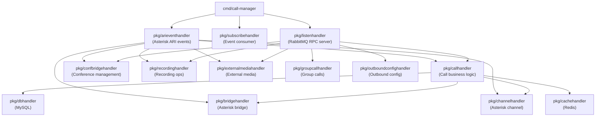

# Architecture: bin-call-manager

## Component Overview

```mermaid
graph TD
    CMD["cmd/call-manager"] --> LH["pkg/listenhandler\n(RabbitMQ RPC server)"]
    CMD --> SH["pkg/subscribehandler\n(Event consumer)"]
    CMD --> ARI["pkg/arieventhandler\n(Asterisk ARI events)"]

    LH --> CH["pkg/callhandler\n(Call business logic)"]
    LH --> CBH["pkg/confbridgehandler\n(Conference management)"]
    LH --> RH["pkg/recordinghandler\n(Recording ops)"]
    LH --> EMH["pkg/externalmediahandler\n(External media)"]
    LH --> GCH["pkg/groupcallhandler\n(Group calls)"]
    LH --> OCH["pkg/outboundconfighandler\n(Outbound config)"]

    CH --> BRH["pkg/bridgehandler\n(Asterisk bridge)"]
    CH --> ChanH["pkg/channelhandler\n(Asterisk channel)"]
    CH --> DBH["pkg/dbhandler\n(MySQL)"]
    CH --> Cache["pkg/cachehandler\n(Redis)"]

    ARI --> CH
    ARI --> CBH
    ARI --> ChanH
    ARI --> BRH
    ARI --> RH
    ARI --> EMH
```

## Layer Responsibilities

| Package | Role | Key Types |
|---------|------|-----------|
| `pkg/callhandler` | Core call business logic: create, hangup, hold, mute, play, talk, actions | `call.Call`, `call.Status`, `call.Type` |
| `pkg/confbridgehandler` | Conference bridge management: join/leave calls, recording, flags | `confbridge.Confbridge`, `confbridge.Status`, `confbridge.Flag` |
| `pkg/channelhandler` | Asterisk channel tracking; channel state transitions | `channel.Channel`, `ari.ChannelState` |
| `pkg/bridgehandler` | Asterisk bridge tracking; channel mixing | `bridge.Bridge` |
| `pkg/recordinghandler` | Recording lifecycle: start, stop, storage | `recording.Recording`, `recording.Status` |
| `pkg/externalmediahandler` | WebRTC / external media stream management | `externalmedia.ExternalMedia`, `externalmedia.Status` |
| `pkg/groupcallhandler` | Multi-call group: ring, answer, hangup coordination | `groupcall.Groupcall`, `groupcall.Status` |
| `pkg/outboundconfighandler` | Outbound dialing configuration (codecs, source) | `outboundconfig.OutboundConfig` |
| `pkg/arieventhandler` | Consumes Asterisk ARI events from RabbitMQ; routes to domain handlers | `ari.*Event` types |
| `pkg/listenhandler` | RabbitMQ RPC request router (regex pattern matching) | `sock.Request`, `sock.Response` |
| `pkg/subscribehandler` | Consumes events from customer-manager, flow-manager, sentinel-manager | queue event structs |
| `pkg/dbhandler` | MySQL CRUD operations using direct SQL (no query builder) | all model structs |
| `pkg/cachehandler` | Redis fast-path lookups for calls, channels, bridges, confbridges | all model structs |
| `models/call` | Call data model, status constants, hangup reason logic | `call.Call`, `call.Status` |
| `models/confbridge` | Confbridge data model, flags, reference types | `confbridge.Confbridge` |
| `models/channel` | Asterisk channel model | `channel.Channel` |
| `models/bridge` | Asterisk bridge model | `bridge.Bridge` |
| `models/recording` | Recording model, status lifecycle | `recording.Recording` |
| `models/externalmedia` | External media model, transport/encapsulation types | `externalmedia.ExternalMedia` |
| `models/groupcall` | Group call model, ring/answer methods | `groupcall.Groupcall` |
| `models/outboundconfig` | Outbound config model (codecs, source number) | `outboundconfig.OutboundConfig` |
| `models/ari` | Asterisk ARI event types and channel state definitions | `ari.ChannelState`, `ari.ChannelCause` |

## Request Routing

Requests arrive via RabbitMQ queue `bin-manager.call-manager.request`. The `listenhandler` matches each request's URI against regex patterns and dispatches to the appropriate handler function.

| Route Pattern | Method | Description |
|---------------|--------|-------------|
| `/v1/calls$` | POST | Create a new call |
| `/v1/calls\?` | GET | List calls with filters/pagination |
| `/v1/calls/{{UUID}}$` | GET/POST/DELETE | Get, update, or delete a call |
| `/v1/calls/{{UUID}}/health-check$` | POST | Health check for a call |
| `/v1/calls/{{UUID}}/digits$` | POST | Send DTMF digits to a call |
| `/v1/calls/{{UUID}}/action-next$` | POST | Advance call to next flow action |
| `/v1/calls/{{UUID}}/action-timeout$` | POST | Trigger call action timeout |
| `/v1/calls/{{UUID}}/chained-call-ids$` | GET/POST | Get or add chained call IDs |
| `/v1/calls/{{UUID}}/chained-call-ids/{{UUID}}$` | DELETE | Remove a chained call ID |
| `/v1/calls/{{UUID}}/external-media$` | POST/DELETE | Add or remove external media |
| `/v1/calls/{{UUID}}/hangup$` | POST | Hang up a call |
| `/v1/calls/{{UUID}}/hold$` | POST/DELETE | Hold or unhold a call |
| `/v1/calls/{{UUID}}/mute$` | POST/DELETE | Mute or unmute a call |
| `/v1/calls/{{UUID}}/moh$` | POST/DELETE | Enable or disable music on hold |
| `/v1/calls/{{UUID}}/silence$` | POST/DELETE | Enable or disable silence |
| `/v1/calls/{{UUID}}/confbridge_id$` | POST | Associate a confbridge with a call |
| `/v1/calls/{{UUID}}/recording_id$` | POST | Associate a recording with a call |
| `/v1/calls/{{UUID}}/recording_start$` | POST | Start recording a call |
| `/v1/calls/{{UUID}}/recording_stop$` | POST | Stop recording a call |
| `/v1/calls/{{UUID}}/talk$` | POST | Play TTS audio on a call |
| `/v1/calls/{{UUID}}/play$` | POST | Play media file on a call |
| `/v1/calls/{{UUID}}/media_stop$` | POST | Stop active media playback |
| `/v1/channels/{{UUID}}/health-check$` | POST | Health check for a channel |
| `/v1/channels/{{UUID}}$` | GET/DELETE | Get or delete a channel |
| `/v1/confbridges$` | POST | Create a conference bridge |
| `/v1/confbridges/{{UUID}}$` | GET/DELETE | Get or delete a confbridge |
| `/v1/confbridges/{{UUID}}/answer$` | POST | Answer a confbridge |
| `/v1/confbridges/{{UUID}}/external-media$` | POST/DELETE | Add or remove external media |
| `/v1/confbridges/{{UUID}}/calls/{{UUID}}$` | POST/DELETE | Add or remove a call from confbridge |
| `/v1/confbridges/{{UUID}}/recording_start$` | POST | Start recording a confbridge |
| `/v1/confbridges/{{UUID}}/recording_stop$` | POST | Stop recording a confbridge |
| `/v1/confbridges/{{UUID}}/ring$` | POST | Ring all participants |
| `/v1/confbridges/{{UUID}}/flags$` | POST | Update confbridge flags |
| `/v1/confbridges/{{UUID}}/terminate$` | POST | Terminate a confbridge |
| `/v1/external-medias$` | POST | Create an external media stream |
| `/v1/external-medias\?` | GET | List external media streams |
| `/v1/external-medias/{{UUID}}$` | GET/DELETE | Get or delete external media |
| `/v1/groupcalls$` | POST | Create a group call |
| `/v1/groupcalls\?` | GET | List group calls |
| `/v1/groupcalls/{{UUID}}$` | GET/DELETE | Get or delete a group call |
| `/v1/groupcalls/{{UUID}}/hangup$` | POST | Hang up calls in a group |
| `/v1/groupcalls/{{UUID}}/hangup_groupcall$` | POST | Hang up the group call entity |
| `/v1/groupcalls/{{UUID}}/hangup_call$` | POST | Hang up a specific call in the group |
| `/v1/groupcalls/{{UUID}}/answer_groupcall_id$` | POST | Set which call answered the group call |
| `/v1/outbound_configs$` | POST | Create an outbound config |
| `/v1/outbound_configs\?` | GET | List outbound configs |
| `/v1/outbound_configs/{{UUID}}$` | GET/POST/DELETE | Get, update, or delete outbound config |
| `/v1/recovery$` | POST | Recover call state from Homer SIP capture |
| `/v1/recordings\?` | GET | List recordings |
| `/v1/recordings$` | POST | Create a recording |
| `/v1/recordings/{{UUID}}$` | GET/DELETE | Get or delete a recording |
| `/v1/recordings/{{UUID}}/stop$` | POST | Stop an active recording |

## Incoming Call Domain Classification

Incoming calls arrive in a single Asterisk context; `getDomainTypeIncomingCall` (`pkg/callhandler/start.go`) classifies them by the requested SIP domain: exact matches for `conference.{base}` / `pstn.{base}` / `sip.{base}`, suffix matches for `.trunk.{base}` (trunk) and `.reg.{base}` (registrar). The old `.registrar.{base}` suffix is NOT accepted: the VOIP-1385 cutover removed legacy acceptance deliberately (downtime during the cutover window was accepted), so a `.registrar.{base}` domain classifies as none and the call is rejected.

Customer resolution for registrar calls is a registrar-manager lookup (`RegistrarV1CustomerDomainGetByRealm` with the full realm) mirroring the trunk path (`RegistrarV1TrunkGetByDomainName`). Unknown realm or lookup error hangs the call up fail-closed (no-route-destination). The same realm lookup resolves the customer in `pkg/arieventhandler`'s `ContactStatusChange` handler; there an unknown realm logs a warning and skips the contact refresh without erroring the event loop.

## Event Subscriptions

`pkg/subscribehandler` declares the durable queue `bin-manager.call-manager.subscribe`. Since VOIP-1406, inter-service events arrive via pattern bindings on the global topic exchange `bin-manager.event` (`topicPatterns` in `pkg/subscribehandler/main.go`, pinned by `binding_golden_test.go`):

| Pattern | Publishing Service |
|---------|--------------------|
| `customer-manager.customer.*.deleted` | customer-manager |
| `customer-manager.customer.*.frozen` | customer-manager |
| `flow-manager.activeflow.*.updated` | flow-manager |
| `sentinel-manager.pod.*.deleted` | sentinel-manager |

The `asterisk.all.event` fanout subscription is permanently retained: asterisk-proxy does not publish to the topic exchange, so the Asterisk ARI leg stays on fanout.

| Retained fanout exchange | Publishing Service |
|--------------------------|--------------------|
| `asterisk.all.event` | Asterisk media server (via asterisk-proxy) |

Inside `Run()`, the migration block runs synchronously after the fanout subscribes and before `ConsumeMessage`: idempotent declare of `bin-manager.event` (on failure the service stays fully on fanout), then all-or-nothing pattern binds (a partial failure rolls the topic binds back best-effort and keeps fanout), then -- only on full bind success -- unbind of each old fanout event exchange (`fanoutUnbindTargets` = the customer/flow/sentinel exchanges; unbind failure logs CRITICAL but is not fatal). The fanout `QueueSubscribe` calls for `bin-manager.customer-manager.event`, `bin-manager.flow-manager.event`, and `bin-manager.sentinel-manager.event` remain in the code as the rollback surface until VOIP-1407 removes fanout publishing.

**Sentinel exchange declare before bind.** `sentinel-manager` requires the Kubernetes API and is therefore only deployed in Kubernetes environments. In every other deployment (for example Docker Compose based self-hosting) nothing declares the `bin-manager.sentinel-manager.event` exchange, so binding to it fails with an AMQP 404, which closes the channel shared by all of this queue's bindings and makes `Run()` return a fatal error at boot. To avoid that, `Run()` calls `sockHandler.TopicCreate` for the sentinel target specifically, immediately before that target's `QueueSubscribe` call. `TopicCreate` declares a durable fanout exchange, the same parameters `sentinel-manager`'s own `notifyhandler` uses, so the declare is an idempotent no-op when sentinel-manager is deployed and creates the exchange when it is not.

The guard is scoped to the sentinel target only, not applied to every target. Other targets are owned by services that are always deployed, and a blanket fanout declare would silently paper over a future non-fanout (topic-kind) target rather than surface the mismatch.

## Event Publishing

Both `cmd/call-manager` and `cmd/call-control` construct their NotifyHandler with `notifyhandler.WithGlobalTopicPublish()` (VOIP-1405), so every event is published twice: once to the per-service fanout exchange `bin-manager.call-manager.event` (unchanged, still the system of record) and once to the global topic exchange `bin-manager.event` with the routing key `call-manager.<resource>.<subscription-id>.<action>`. The two cmds must stay in lockstep on this option — enabling it in only one would leave consumers with gaps depending on which process published. A topic publish failure never propagates to the caller and never affects the fanout publish.

See [docs/domain.md](domain.md) for the per-event routing keys and the subscription-address overrides, and the monorepo `docs/plans/2026-08-27-voip-1404-global-topic-exchange-design.md` for the schema.
