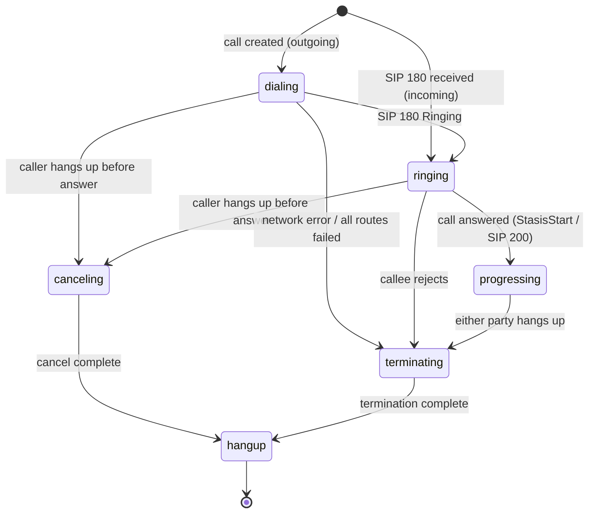
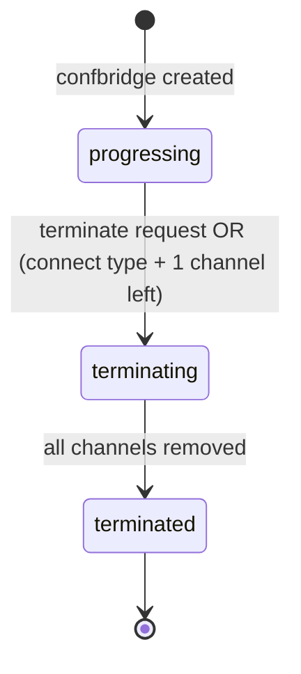
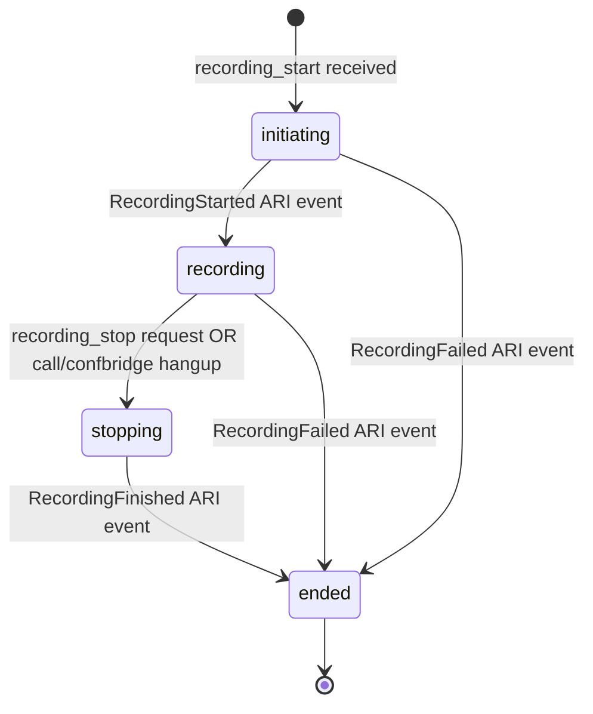

# Domain: bin-call-manager

## Domain Entities

### Call

The core telephony resource. Represents one SIP leg or WebRTC connection tracked from dial to hangup.

Key fields: `channel_id`, `bridge_id`, `confbridge_id`, `status`, `type`, `direction`, `source`, `destination`, `recording_id`, `groupcall_id`, `chained_call_ids`, `action` (current flow action), `mute_direction`, `hangup_by`, `hangup_reason`.

Types: `flow` (executing a call-flow), `conference` (joined a conference), `sip-service` (pre-defined SIP service destination).

Directions: `incoming`, `outgoing`.

### Confbridge

An Asterisk conference bridge joining one or more calls. Each confbridge owns the `ChannelCallIDs` map (asterisk channel → call UUID), its own `RecordingID`, and a list of `ExternalMediaIDs`.

Types: `connect` (auto-terminates when only 1 leg remains), `conference` (persists until explicit terminate).

Statuses: `progressing`, `terminating`, `terminated`.

Flags: `no_auto_leave` (blocks auto-leave for connect type).

### Channel

An Asterisk channel: a single media endpoint (SIP leg or WebRTC). Managed by `pkg/channelhandler`. Channels map to Calls; their lifecycle events (`StasisStart`, `StasisEnd`, `ChannelStateChange`, `ChannelDestroyed`) drive call status updates.

### Bridge

An Asterisk bridge that connects channels for media mixing. Managed by `pkg/bridgehandler`. Bridges are created for confbridges; `ChannelEnteredBridge` / `ChannelLeftBridge` ARI events trigger confbridge participant updates.

### Recording

A recording session attached to either a Call or a Confbridge (`reference_type`: `call` | `confbridge`).

Statuses: `initiating`, `recording`, `stopping`, `ended`.

Format: `wav`. Filenames tracked in the `filenames` slice for multi-segment recordings.

### ExternalMedia

A WebRTC or RTP stream injected into a call or confbridge. Carries transport/encapsulation configuration and tracks the Asterisk `channel_id` and `bridge_id` used to splice it in.

Reference types: `call`, `confbridge`.

### GroupCall

Coordinates simultaneous outbound calls to multiple destinations, implementing ring strategies.

Ring methods: `ring_all` (dial all at once), `linear` (dial one at a time through the list).

Answer methods: `hangup_others` (when one answers, hang up the rest), `none` (do nothing).

Statuses: `progressing`, `hangingup`, `hangup`.

### OutboundConfig

Per-customer configuration for outbound dialing: source number override, permitted codec list, and SIP-provider constraints. Looked up at call creation time.

## Key Business Rules

1. **Call status transitions are one-directional**: calls progress through `dialing → ringing → progressing → terminating/canceling → hangup`. The `IsUpdatableStatus` function enforces valid transitions; backwards or lateral jumps are rejected.

2. **ARI events are the source of truth for channel state**: the service does NOT poll Asterisk. All state changes originate from `asterisk.all.event` queue messages processed by `pkg/arieventhandler`. The database and Redis cache are updated reactively.

3. **Confbridge auto-termination**: a `connect`-type confbridge is automatically terminated when only one channel remains (the last participant left). A `conference`-type confbridge persists until an explicit `/terminate` request is received. The `no_auto_leave` flag overrides auto-termination for connect type.

4. **Recording exclusivity per resource**: each call or confbridge may have at most one active `recording_id` at a time. A second `recording_start` on the same resource is rejected while the first recording is active. Multiple completed recordings are accumulated in `recording_ids`.

5. **ExternalMedia splicing requires bridge creation**: when external media is added to a call or confbridge, a dedicated snoop channel and bridge are created in Asterisk to route media to the external endpoint. The `bridge_id` and `channel_id` fields on `ExternalMedia` track these Asterisk objects.

6. **GroupCall answer semantics**: when `answer_method = hangup_others`, the first call to answer causes all other in-progress calls in the group to be hung up. The `answer_call_id` is set to the answering call, and `answer_groupcall_id` identifies the nested group that answered (for linear/nested strategies).

7. **Cache is write-through**: every write to MySQL (call create, update, delete) is also mirrored to Redis. ARI event processing uses Redis for low-latency lookups before falling back to MySQL.

8. **Hangup reason is computed, not stored at creation**: `HangupReason` is derived from `direction`, `lastStatus`, and the Asterisk `ChannelCause` code via `CalculateHangupReason()`. This ensures the reason accurately reflects what happened in the media layer, not what the caller requested.

9. **Outbound calls use dial routes with failover**: outgoing calls carry a `dialroutes` list ordered by preference. The `dialroute_id` field tracks which route is currently active. If a route fails, the next route is tried until the list is exhausted.

10. **Recovery from Homer**: the `/v1/recovery` endpoint reconstructs call state by replaying SIP messages from the Homer SIP capture system. This is a last-resort operation for recovering orphaned calls when Asterisk state is lost (e.g., after an Asterisk crash).

## State Machines

### Call Lifecycle

### Confbridge Lifecycle

### Recording Lifecycle

