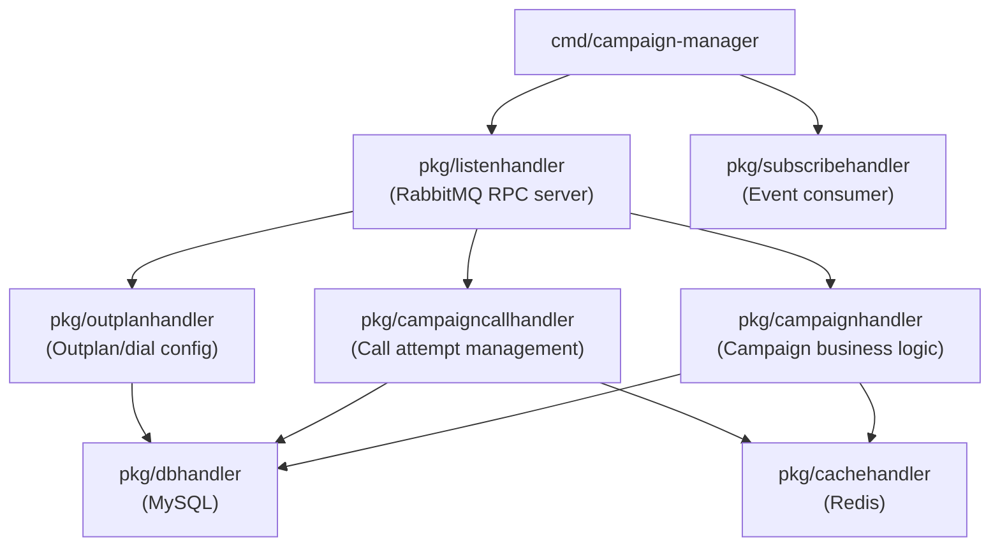

# Architecture: bin-campaign-manager

## Component Overview

## Layer Responsibilities

| Package | Role | Key Types |
|---------|------|-----------|
| `pkg/campaignhandler` | Campaign lifecycle: create, execute, status transitions (stop/run/stopping), service level management, next campaign chaining | `campaign.Campaign`, `campaign.Status` |
| `pkg/campaigncallhandler` | Individual call attempt management: create calls, track outcomes, retry logic | `campaigncall.Campaigncall`, `campaigncall.Status` |
| `pkg/outplanhandler` | Outplan CRUD: dialing configuration (timeouts, retries, source), dial list management | `outplan.Outplan`, `outplan.Dial` |
| `pkg/listenhandler` | RabbitMQ RPC request router (regex pattern matching) | `sock.Request`, `sock.Response` |
| `pkg/subscribehandler` | Consumes events from call-manager and flow-manager to track call outcomes | queue event structs |
| `pkg/dbhandler` | MySQL CRUD operations | all model structs |
| `pkg/cachehandler` | Redis fast-path lookups for campaigns and campaigncalls | `campaign.Campaign`, `campaigncall.Campaigncall` |
| `models/campaign` | Campaign data model, status constants, event types | `campaign.Campaign`, `campaign.Status` |
| `models/campaigncall` | Campaigncall data model, status constants | `campaigncall.Campaigncall`, `campaigncall.Status` |
| `models/outplan` | Outplan and dial configuration data model | `outplan.Outplan`, `outplan.Dial` |

## Request Routing

Requests arrive via RabbitMQ queue `bin-manager.campaign-manager.request`. The `listenhandler` matches each request's URI against regex patterns and dispatches to the appropriate handler function.

| Route Pattern | Method | Description |
|---------------|--------|-------------|
| `/v1/campaigns$` | POST | Create a new campaign |
| `/v1/campaigns\?` | GET | List campaigns with filters/pagination |
| `/v1/campaigns/{{UUID}}$` | GET/PUT/DELETE | Get, update, or delete a campaign |
| `/v1/campaigns/{{UUID}}/execute$` | POST | Execute (start dialing) a campaign |
| `/v1/campaigns/{{UUID}}/status$` | PUT | Update campaign status (run/stop/stopping) |
| `/v1/campaigns/{{UUID}}/service_level$` | PUT | Update campaign service level throttle |
| `/v1/campaigns/{{UUID}}/actions$` | GET/PUT | Get or update campaign actions (flow actions to run on connect) |
| `/v1/campaigns/{{UUID}}/resource_info$` | GET | Get resource usage info for a campaign |
| `/v1/campaigns/{{UUID}}/next_campaign_id$` | PUT | Set the next campaign to run after this one completes |
| `/v1/campaigncalls\?` | GET | List campaigncalls with filters/pagination |
| `/v1/campaigncalls/{{UUID}}$` | GET/DELETE | Get or delete a campaigncall |
| `/v1/outplans$` | POST | Create a new outplan |
| `/v1/outplans\?` | GET | List outplans with filters/pagination |
| `/v1/outplans/{{UUID}}$` | GET/PUT/DELETE | Get, update, or delete an outplan |
| `/v1/outplans/{{UUID}}/dials$` | GET/POST | List or add dial entries to an outplan |
