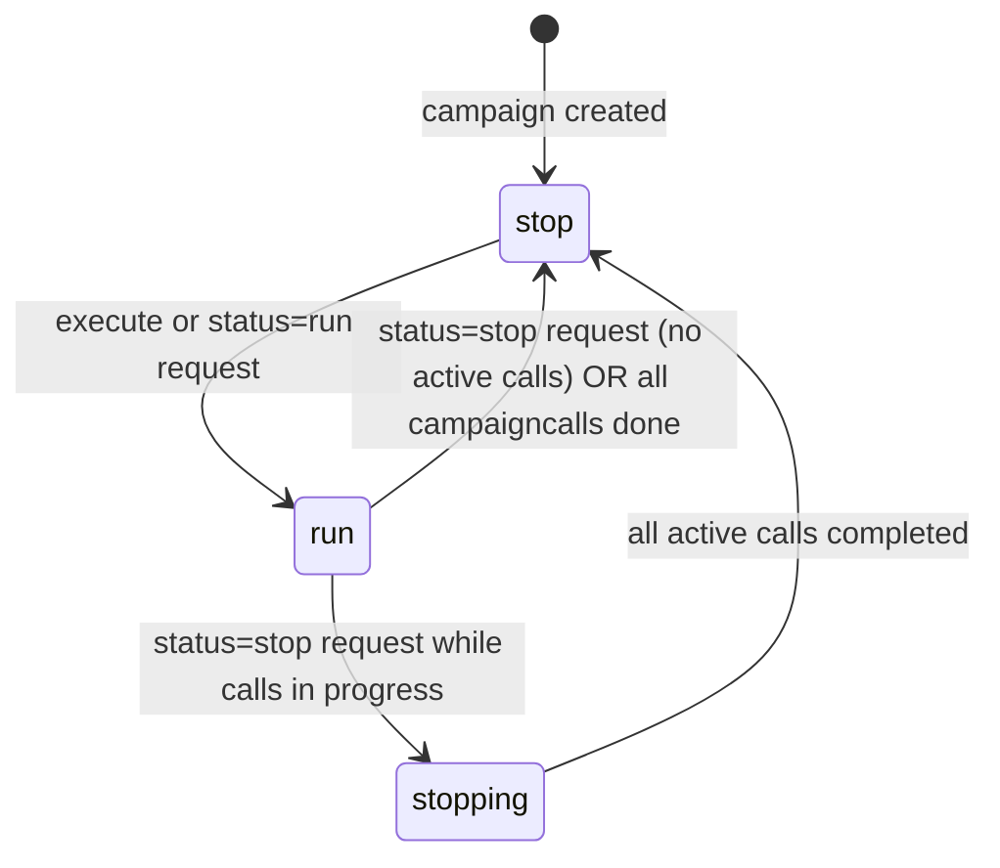
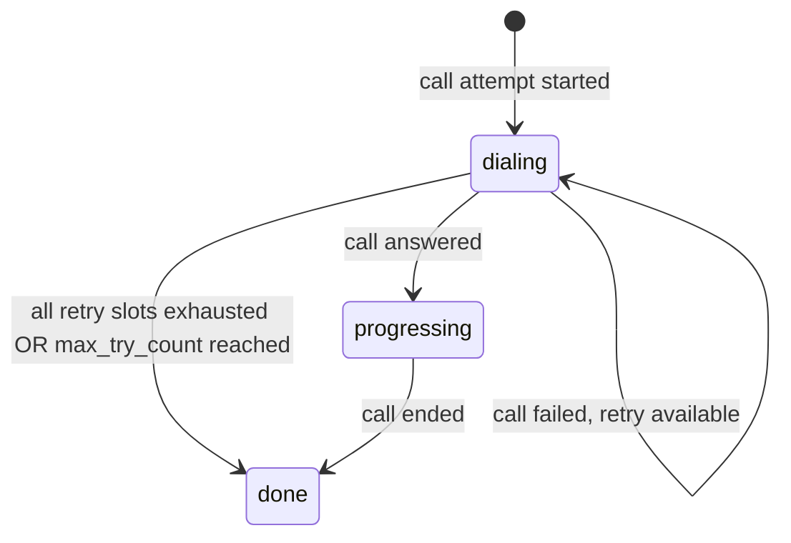

# Domain: bin-campaign-manager

## Domain Entities

### Campaign

An outbound calling campaign that orchestrates mass dialing operations. A campaign references an outdial (target list), an outplan (dialing config), and optionally a queue (for service level throttling). It runs through a list of destinations and tracks success/failure rates.

Key fields: `customer_id`, `name`, `status`, `outdial_id` (target contact list), `outplan_id`, `queue_id` (optional — for service level), `actions` (flow actions to execute on connect), `service_level`, `next_campaign_id`.

Statuses: `stop`, `run`, `stopping`.

### Campaigncall

A single call attempt within a campaign. Each campaigncall has up to 5 destination addresses, independent retry counters per destination, and references either a Call (in call-manager) or an Activeflow (in flow-manager) for the actual call.

Key fields: `campaign_id`, `reference_id` (UUID of the Call or Activeflow), `reference_type`, `destination_0` through `destination_4` (phone numbers to try), `try_0` through `try_4` (attempt counts per destination), `status`.

Statuses: `dialing`, `progressing`, `done`.

### Outplan

Dialing configuration shared across one or more campaigns. Defines the dial timing and retry policy.

Key fields: `customer_id`, `name`, `source` (caller ID to use), `dial_timeout` (seconds to wait for answer), `try_interval` (seconds between retries), `max_try_count_0` through `max_try_count_4` (max retries per destination slot), `dials` (list of phone numbers or patterns to dial).

## Key Business Rules

1. **Campaign status controls dialing**: Only campaigns in `run` status make new call attempts. A campaign in `stop` state will not dial. The `stopping` state is a transitional state while in-progress calls are being wrapped up before the campaign fully stops.

2. **Service level throttles concurrency**: If a `queue_id` is set on the campaign, the `service_level` (percentage) controls how many concurrent calls are made relative to available queue agents. This prevents overwhelming the agent pool.

3. **Each campaigncall has multiple destination slots**: A single campaigncall can hold up to 5 phone numbers (destination_0 through destination_4). Each slot has its own retry counter (`try_0` through `try_4`). This enables failover dialing within a single contact record.

4. **Call outcomes drive retry logic**: This service subscribes to call-manager and flow-manager events. When a call ends with a non-answer result (busy, no answer, error), the campaigncall's retry counter is incremented and another attempt may be scheduled per outplan policy.

5. **Next campaign chaining**: The `next_campaign_id` field enables sequential campaign execution. When a campaign finishes (all campaigncalls done), the next campaign in the chain is automatically started.

6. **Events published on campaign state changes**: Campaign created, deleted, updated, and status change (run/stop/stopping) events are published to `bin-manager.campaign-manager.event` for downstream consumers.

7. **Actions define on-connect behavior**: The campaign's `actions` field specifies the flow actions to execute when a call is answered (e.g., play a message, transfer to queue). This is analogous to the flow actions in a call flow.

## State Machines

### Campaign Status Lifecycle

### Campaigncall Lifecycle

