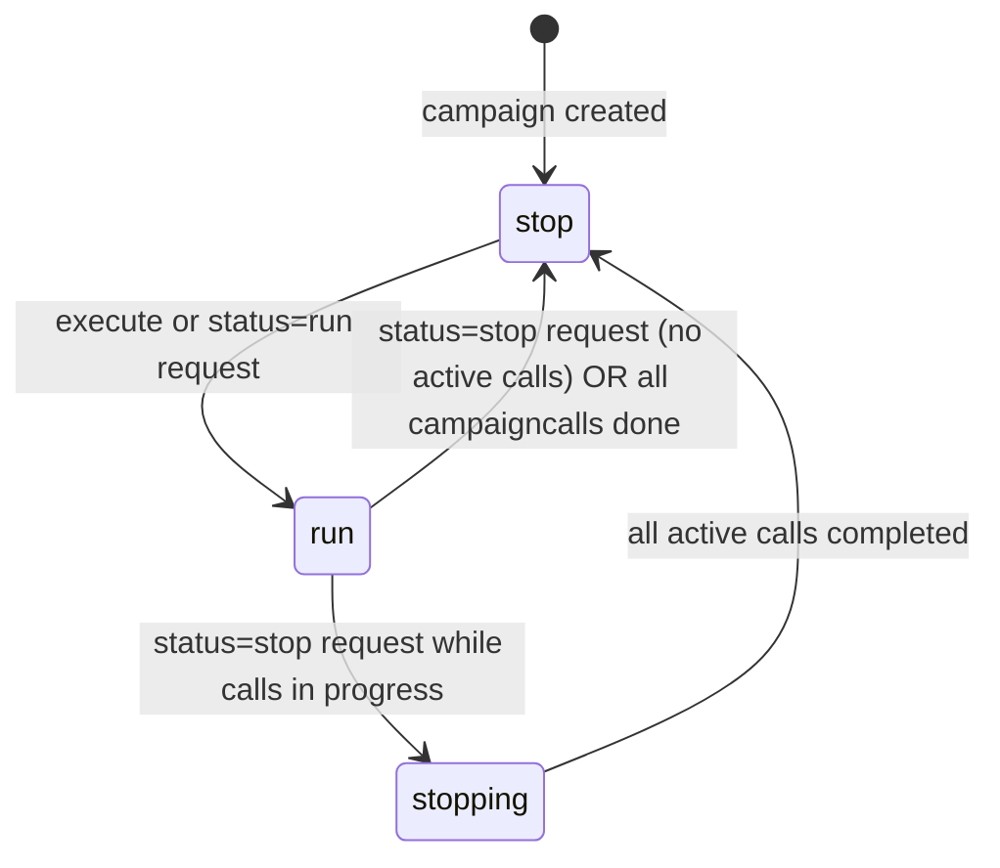
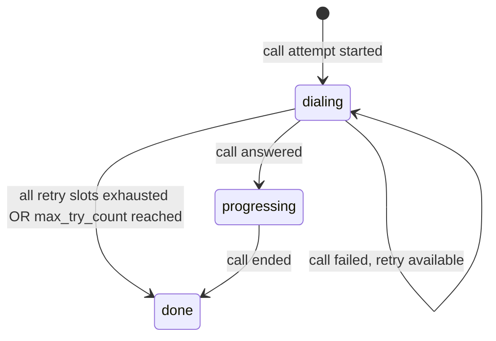

# Domain: bin-campaign-manager

## Domain Entities

### Campaign

An outbound calling campaign that orchestrates mass dialing operations. A campaign references an outdial (target list), an outplan (dialing config), and optionally a queue (for service level throttling). It runs through a list of destinations and tracks success/failure rates.

Key fields: `customer_id`, `name`, `status`, `outdial_id` (target contact list), `outplan_id`, `queue_id` (optional — for service level), `actions` (flow actions to execute on connect), `service_level`, `next_campaign_id`.

Statuses: `stop`, `run`, `stopping`.

### Campaigncall

A single call attempt within a campaign. Each campaigncall has up to 5 destination addresses, independent retry counters per destination, and references either a Call (in call-manager) or an Activeflow (in flow-manager) for the actual call.

Key fields: `campaign_id`, `reference_id` (UUID of the Call or Activeflow), `reference_type`, `destination_0` through `destination_4` (phone numbers to try), `try_0` through `try_4` (attempt counts per destination), `status`.

Statuses: `dialing`, `progressing`, `done`.

### Outplan

Dialing configuration shared across one or more campaigns. Defines the dial timing and retry policy.

Key fields: `customer_id`, `name`, `source` (caller ID to use), `dial_timeout` (seconds to wait for answer), `try_interval` (seconds between retries), `max_try_count_0` through `max_try_count_4` (max retries per destination slot), `dials` (list of phone numbers or patterns to dial).

### ReconcileResult (VOIP-1444)

The result of a single orphaned-flow reconciliation pass
(`pkg/campaignhandler.ReconcileOrphanedFlows`, `models/campaign/reconcile.go`).
This is a domain type that also serves directly as the wire shape for
`POST /v1/campaigns/flows/reconcile`'s response (style (A): the
`listenhandler` marshals it as-is, with no separate `response.*` DTO — see
the root CLAUDE.md's transport-DTO layering rule).

Key fields: `cleaned` (orphaned flows successfully deleted this pass),
`skipped` (candidates needing no action: flow already deleted, a typed
not-found from `bin-flow-manager`, or the defensive nil-`TMDelete` guard),
`failed` (row-level failures — a non-not-found `FlowV1FlowGet` error or a
`FlowV1FlowDelete` error on a genuine orphan; both share one counter, see
[docs/operations.md](operations.md#orphaned-flow-reconciliation-voip-1444)),
`saturated` (this pass's batch reached the compiled `scanLimit`;
informational only), `recent_saturated` (the actionable rate-risk signal —
deletions within the caller-supplied `recent_interval_sec` alone already
fill `scanLimit`), `partial` (the pass's own self-imposed timeout cut the
RPC loop short before every candidate was examined).

`err` from `ReconcileOrphanedFlows` is non-nil only when the initial
`CampaignListDeletedSince` (`pkg/dbhandler/campaign.go`) query itself
fails; every other outcome is counted in `ReconcileResult`, never
propagated as an error.

## Key Business Rules

1. **Campaign status controls dialing**: Only campaigns in `run` status make new call attempts. A campaign in `stop` state will not dial. The `stopping` state is a transitional state while in-progress calls are being wrapped up before the campaign fully stops.

2. **Service level throttles concurrency**: If a `queue_id` is set on the campaign, the `service_level` (percentage) controls how many concurrent calls are made relative to available queue agents. This prevents overwhelming the agent pool.

3. **Each campaigncall has multiple destination slots**: A single campaigncall can hold up to 5 phone numbers (destination_0 through destination_4). Each slot has its own retry counter (`try_0` through `try_4`). This enables failover dialing within a single contact record.

4. **Call outcomes drive retry logic**: This service subscribes to call-manager and flow-manager events. When a call ends with a non-answer result (busy, no answer, error), the campaigncall's retry counter is incremented and another attempt may be scheduled per outplan policy.

5. **Next campaign chaining**: The `next_campaign_id` field enables sequential campaign execution. When a campaign finishes (all campaigncalls done), the next campaign in the chain is automatically started.

6. **Events published on campaign state changes**: Campaign created, deleted, updated, and status change (run/stop/stopping) events are published to `bin-manager.campaign-manager.event` for downstream consumers. See [Published Events](#published-events) below.

7. **Actions define on-connect behavior**: The campaign's `actions` field specifies the flow actions to execute when a call is answered (e.g., play a message, transfer to queue). This is analogous to the flow actions in a call flow.

## Published Events

Every event below is published to the per-service fanout exchange `bin-manager.campaign-manager.event`, and — since VOIP-1405 — also to the global topic exchange `bin-manager.event` with the routing key `campaign-manager.<resource>.<campaign-id>.<action>`. The third key segment is the *subscription address*: it is always the campaign-id, across both resource namespaces, so one campaign is followed with `campaign-manager.campaign.<id>.#` and `campaign-manager.campaigncall.<id>.#`.

| Event | Data | Topic routing key |
|---|---|---|
| `campaign_created` | `campaign.Campaign` | `campaign-manager.campaign.<campaign-id>.created` |
| `campaign_updated` | `campaign.Campaign` | `campaign-manager.campaign.<campaign-id>.updated` |
| `campaign_deleted` | `campaign.Campaign` | `campaign-manager.campaign.<campaign-id>.deleted` |
| `campaign_status_run` | `campaign.Campaign` | `campaign-manager.campaign.<campaign-id>.status_run` |
| `campaign_status_stopping` | `campaign.Campaign` | `campaign-manager.campaign.<campaign-id>.status_stopping` |
| `campaign_status_stop` | `campaign.Campaign` | `campaign-manager.campaign.<campaign-id>.status_stop` |
| `campaigncall_created` | `campaigncall.Campaigncall` | `campaign-manager.campaigncall.<campaign-id>.created` |
| `campaigncall_updated` | `campaigncall.Campaigncall` | `campaign-manager.campaigncall.<campaign-id>.updated` |
| `campaigncall_deleted` | `campaigncall.Campaigncall` | `campaign-manager.campaigncall.<campaign-id>.deleted` |

The event type splits on its FIRST underscore into `<resource>_<action>`, which is why the status trio keeps `status_` in the action segment.

`Campaigncall` implements `eventtopic.SubscriptionIdentifier` (pointer receiver) returning `CampaignID`: its own id is stable but is not a subscription axis — it first becomes known inside its own `campaigncall_created` event, and every real consumption pattern follows a campaign. `Campaign` needs no override — its own id already is the subscription address. The `outplan_created/updated/deleted` constants in `models/outplan` have no publish site and are therefore not part of either stream.

## State Machines

### Campaign Status Lifecycle

```mermaid
stateDiagram-v2
    [*] --> stop : campaign created
    stop --> run : execute or status=run request
    run --> stopping : status=stop request while calls in progress
    run --> stop : status=stop request (no active calls) OR all campaigncalls done
    stopping --> stop : all active calls completed
```

### Campaigncall Lifecycle

```mermaid
stateDiagram-v2
    [*] --> dialing : call attempt started
    dialing --> progressing : call answered
    dialing --> dialing : call failed, retry available
    dialing --> done : all retry slots exhausted OR max_try_count reached
    progressing --> done : call ended
```
