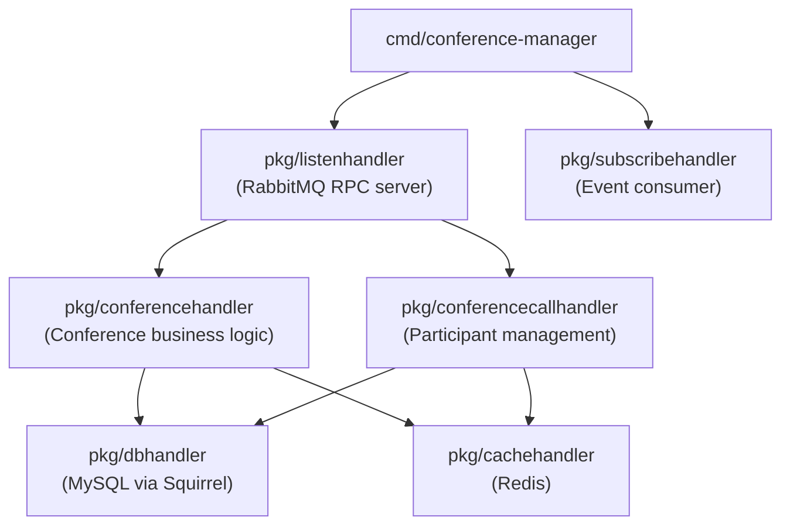

# Architecture: bin-conference-manager

## Component Overview

## Layer Responsibilities

| Package | Role | Key Types |
|---------|------|-----------|
| `pkg/conferencehandler` | Conference lifecycle: create, stop, recording start/stop, transcribe start/stop, hash regeneration | `conference.Conference`, `conference.Status`, `conference.Type` |
| `pkg/conferencecallhandler` | Participant management: create/terminate conferencecalls, health checks, service type queries | `conferencecall.Conferencecall`, `conferencecall.Status` |
| `pkg/listenhandler` | RabbitMQ RPC request router (regex pattern matching) | `sock.Request`, `sock.Response` |
| `pkg/subscribehandler` | Consumes call-manager events (confbridge join/leave) to update conference participant state | queue event structs |
| `pkg/dbhandler` | MySQL CRUD using Squirrel query builder | all model structs |
| `pkg/cachehandler` | Redis fast-path lookups for conferences and conferencecalls | `conference.Conference`, `conferencecall.Conferencecall` |
| `models/conference` | Conference data model, type/status constants, webhook types | `conference.Conference`, `conference.Type`, `conference.Status` |
| `models/conferencecall` | Conferencecall data model, reference types, status constants | `conferencecall.Conferencecall`, `conferencecall.Status` |

## Request Routing

Requests arrive via RabbitMQ queue `bin-manager.conference-manager.request`. The `listenhandler` matches each request's URI against regex patterns and dispatches to the appropriate handler function.

| Route Pattern | Method | Description |
|---------------|--------|-------------|
| `/v1/conferences/count_by_customer$` | GET | Count conferences by customer ID |
| `/v1/conferences$` | POST | Create a new conference |
| `/v1/conferences\?` | GET | List conferences with filters/pagination |
| `/v1/conferences/{{UUID}}/direct-hash-regenerate$` | POST | Regenerate direct-access hash for a conference |
| `/v1/conferences/{{UUID}}$` | GET/PUT/DELETE | Get, update, or delete a conference |
| `/v1/conferences/{{UUID}}/recording_id$` | POST | Set recording ID on a conference |
| `/v1/conferences/{{UUID}}/recording_start$` | POST | Start recording a conference |
| `/v1/conferences/{{UUID}}/recording_stop$` | POST | Stop recording a conference |
| `/v1/conferences/{{UUID}}/stop$` | POST | Stop (terminate) a conference |
| `/v1/conferences/{{UUID}}/transcribe_start$` | POST | Start live transcription on a conference |
| `/v1/conferences/{{UUID}}/transcribe_stop$` | POST | Stop live transcription on a conference |
| `/v1/conferencecalls\?` | GET | List conferencecalls with filters/pagination |
| `/v1/conferencecalls/{{UUID}}$` | GET/DELETE | Get or delete a conferencecall |
| `/v1/conferencecalls/{{UUID}}/health-check$` | POST | Health check for a conferencecall |
| `/v1/services/type/conferencecall$` | POST | Create a conferencecall via service type routing |
