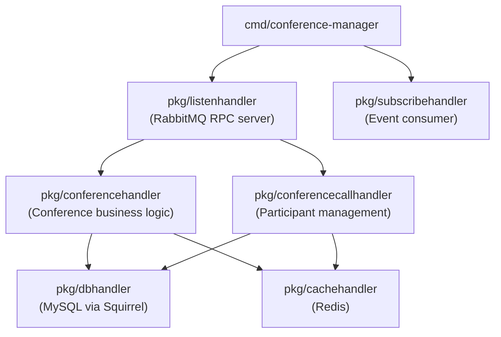

# Architecture: bin-conference-manager

## Component Overview

```mermaid
graph TD
    CMD["cmd/conference-manager"] --> LH["pkg/listenhandler\n(RabbitMQ RPC server)"]
    CMD --> SH["pkg/subscribehandler\n(Event consumer)"]

    LH --> CH["pkg/conferencehandler\n(Conference business logic)"]
    LH --> CCH["pkg/conferencecallhandler\n(Participant management)"]

    CH --> DBH["pkg/dbhandler\n(MySQL via Squirrel)"]
    CH --> Cache["pkg/cachehandler\n(Redis)"]
    CCH --> DBH
    CCH --> Cache
```

## Layer Responsibilities

| Package | Role | Key Types |
|---------|------|-----------|
| `pkg/conferencehandler` | Conference lifecycle: create, stop, recording start/stop, transcribe start/stop, hash regeneration | `conference.Conference`, `conference.Status`, `conference.Type` |
| `pkg/conferencecallhandler` | Participant management: create/terminate conferencecalls, health checks, service type queries | `conferencecall.Conferencecall`, `conferencecall.Status` |
| `pkg/listenhandler` | RabbitMQ RPC request router (regex pattern matching) | `sock.Request`, `sock.Response` |
| `pkg/subscribehandler` | Consumes call-manager events (confbridge join/leave) to update conference participant state | queue event structs |
| `pkg/dbhandler` | MySQL CRUD using Squirrel query builder | all model structs |
| `pkg/cachehandler` | Redis fast-path lookups for conferences and conferencecalls | `conference.Conference`, `conferencecall.Conferencecall` |
| `models/conference` | Conference data model, type/status constants, webhook types | `conference.Conference`, `conference.Type`, `conference.Status` |
| `models/conferencecall` | Conferencecall data model, reference types, status constants | `conferencecall.Conferencecall`, `conferencecall.Status` |

## Event Subscriptions

SubscribeHandler (`pkg/subscribehandler/`) consumes from the queue `bin-manager.conference-manager.subscribe`. Since VOIP-1406 the queue is bound to the **global topic exchange `bin-manager.event`** with one pattern per dispatched (publisher, event-type) pair — 2 patterns total, pinned byte-for-byte by the binding golden test (`pkg/subscribehandler/binding_golden_test.go`):

| Pattern | Purpose |
|---------|---------|
| `call-manager.confbridge.*.joined` / `call-manager.confbridge.*.leaved` | Confbridge join/leave — updates conference participant (conferencecall) state |

As of VOIP-1407 this topic-pattern binding is the **sole intake mechanism**; the old per-service fanout subscription (`QueueSubscribe` to `bin-manager.call-manager.event`) has been removed from `Run()` entirely, along with the fanout-unbind step that used to follow a successful topic bind. A topic bind failure is now fatal to `Run()` — there is no fanout fallback left to degrade to.

## Event Publishing

Both `cmd/conference-manager` and `cmd/conference-control` construct their NotifyHandler with `notifyhandler.WithGlobalTopicPublish()`. **As of VOIP-1407, this is the sole publish path** — the previous per-service fanout exchange `bin-manager.conference-manager.event` is no longer published to, and (per the operational runbook in `docs/reference/rabbitmq-queues-reference.md`) will eventually be deleted from the broker. Events publish to the global topic exchange `bin-manager.event` with the routing key `conference-manager.<resource>.<conference-id>.<action>`. This service's publish-side behavior change comes entirely from `bin-common-handler/pkg/notifyhandler`'s shared library update (its own consumer-side subscribehandler code also changed separately for VOIP-1407, see the Event Subscriptions section above). The two cmds must stay in lockstep on this option — enabling it in only one would leave consumers with gaps depending on which process published. A topic publish failure now propagates to the caller as an error (previously it was swallowed silently). See [docs/domain.md](domain.md) for the per-event routing keys and the monorepo `docs/plans/2026-08-27-voip-1404-global-topic-exchange-design.md` for the schema.

## Request Routing

Requests arrive via RabbitMQ queue `bin-manager.conference-manager.request`. The `listenhandler` matches each request's URI against regex patterns and dispatches to the appropriate handler function.

| Route Pattern | Method | Description |
|---------------|--------|-------------|
| `/v1/conferences/count_by_customer$` | GET | Count conferences by customer ID |
| `/v1/conferences$` | POST | Create a new conference |
| `/v1/conferences\?` | GET | List conferences with filters/pagination |
| `/v1/conferences/{{UUID}}/direct-hash-regenerate$` | POST | Regenerate direct-access hash for a conference |
| `/v1/conferences/{{UUID}}$` | GET/PUT/DELETE | Get, update, or delete a conference |
| `/v1/conferences/{{UUID}}/recording_id$` | POST | Set recording ID on a conference |
| `/v1/conferences/{{UUID}}/recording_start$` | POST | Start recording a conference |
| `/v1/conferences/{{UUID}}/recording_stop$` | POST | Stop recording a conference |
| `/v1/conferences/{{UUID}}/stop$` | POST | Stop (terminate) a conference |
| `/v1/conferences/{{UUID}}/transcribe_start$` | POST | Start live transcription on a conference |
| `/v1/conferences/{{UUID}}/transcribe_stop$` | POST | Stop live transcription on a conference |
| `/v1/conferencecalls\?` | GET | List conferencecalls with filters/pagination |
| `/v1/conferencecalls/{{UUID}}$` | GET/DELETE | Get or delete a conferencecall |
| `/v1/conferencecalls/{{UUID}}/health-check$` | POST | Health check for a conferencecall |
| `/v1/services/type/conferencecall$` | POST | Create a conferencecall via service type routing |
