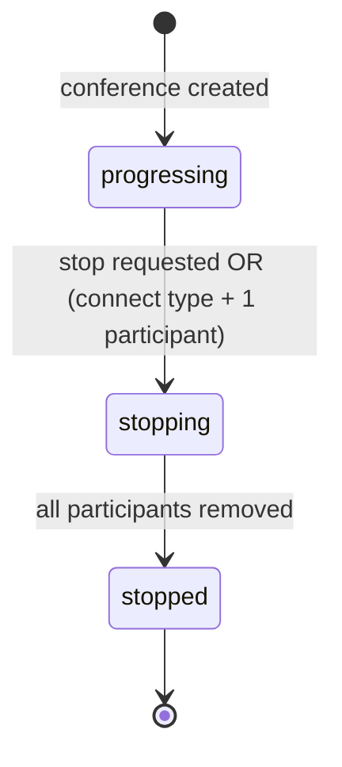
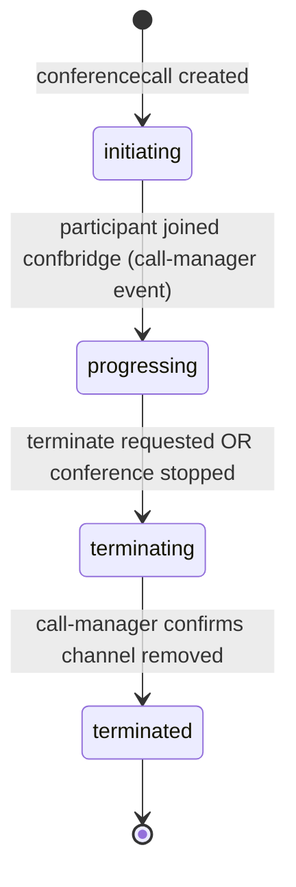

# Domain: bin-conference-manager

## Domain Entities

### Conference

The top-level resource representing a multi-party audio conference session. A conference coordinates one or more participants (conferencecalls) and manages the shared audio bridge (confbridge) in call-manager.

Key fields: `customer_id`, `name`, `type`, `status`, `confbridge_id` (reference to call-manager confbridge), `recording_id`, `transcribe_id`, `pre_flow_id`, `post_flow_id`, `timeout`, `direct_hash`.

Types: `conference` (standard multi-party, persists until explicit stop), `connect` (auto-terminates when one participant remains), `queue` (used internally by queue-manager for agent routing).

Statuses: `progressing`, `stopping`, `stopped`.

### Conferencecall

A single participant within a conference — typically a call from call-manager that has joined the conference's confbridge. The conferencecall entity tracks the participant's state within the conference.

Key fields: `conference_id`, `reference_id` (call UUID), `reference_type` (e.g., `call`), `status`.

Statuses: `initiating`, `progressing`, `terminating`, `terminated`.

## Key Business Rules

1. **Conference type governs termination behavior**: A `conference`-type conference persists until an explicit `/stop` request. A `connect`-type conference auto-terminates (via call-manager confbridge logic) when only one participant remains. A `queue`-type conference is managed by queue-manager and should not be manually terminated.

2. **Confbridge in call-manager is the audio layer**: This service manages the metadata (conference entity, participant list, recording state); the actual audio mixing happens in call-manager's confbridge. The `confbridge_id` field links the two.

3. **Recording and transcription are mutually coordinated**: Starting a recording creates a recording resource in call-manager and stores the `recording_id` on the conference. Transcription similarly stores a `transcribe_id`. Both are stopped when the conference stops.

4. **Pre/post flows execute at conference boundaries**: If `pre_flow_id` is set, that flow runs before participants can speak. If `post_flow_id` is set, it runs after the conference ends (e.g., to play a summary or trigger a webhook).

5. **Participant events are event-driven, not polled**: This service subscribes to call-manager events (confbridge join/leave) to update conferencecall status. It does not poll call-manager for participant state.

6. **Health checks prevent orphaned conferencecalls**: The `health-check` endpoint on conferencecalls allows call-manager to verify that a participant is still tracked. If the conferencecall is not found, call-manager can clean up the associated channel.

7. **Events published on conference state changes**: Conference created, updated, and deleted events are published to `bin-manager.conference-manager.event` for downstream consumers (e.g., webhook-manager for customer notifications).

## State Machines

### Conference Lifecycle

### Conferencecall Lifecycle

