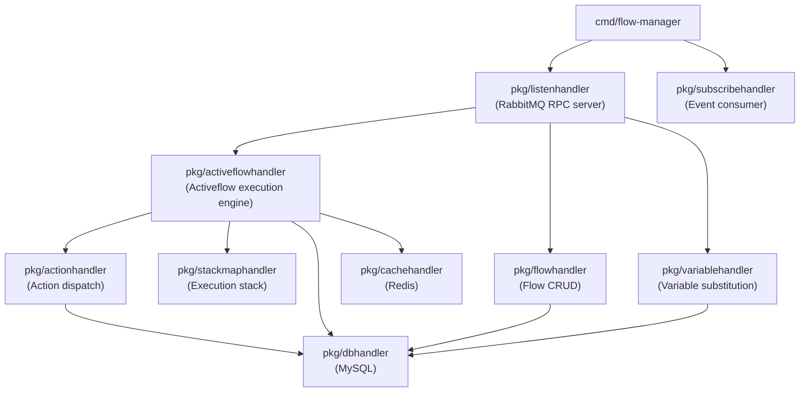

# Architecture: bin-flow-manager

## Component Overview

## Layer Responsibilities

| Package | Role | Key Types |
|---------|------|-----------|
| `pkg/activeflowhandler` | Core execution engine: create, execute, advance, stop activeflows; manages stack and variables | `activeflow.Activeflow`, `activeflow.Status` |
| `pkg/flowhandler` | Flow CRUD: create, update, delete, list flow templates; manages action sequences | `flow.Flow`, `flow.Action` |
| `pkg/actionhandler` | Action dispatch: translates flow actions into RPC calls to target services (call-manager, ai-manager, etc.) | `action.Action`, `action.Type` |
| `pkg/stackmaphandler` | Stack management: push/pop nested flow stacks for sub-flow execution | `stack.Stack` |
| `pkg/variablehandler` | Variable resolution and substitution: replaces `{{variable}}` tokens in action parameters | `variable.Variable` |
| `pkg/listenhandler` | RabbitMQ RPC request router (regex pattern matching) | `sock.Request`, `sock.Response` |
| `pkg/subscribehandler` | Consumes events from customer-manager to react to tenant lifecycle changes | queue event structs |
| `pkg/dbhandler` | MySQL CRUD using Squirrel query builder | all model structs |
| `pkg/cachehandler` | Redis fast-path lookups for activeflows | `activeflow.Activeflow` |
| `models/flow` | Flow and Action data model, action types | `flow.Flow`, `flow.Action` |
| `models/activeflow` | Activeflow execution state, status constants | `activeflow.Activeflow`, `activeflow.Status` |
| `models/action` | Action type definitions | `action.Action`, `action.Type` |
| `models/stack` | Execution stack model for nested flows | `stack.Stack` |
| `models/variable` | Variable substitution model | `variable.Variable` |

## Request Routing

Requests arrive via RabbitMQ queue `bin-manager.flow-manager.request`. The `listenhandler` matches each request's URI against regex patterns and dispatches to the appropriate handler function.

| Route Pattern | Method | Description |
|---------------|--------|-------------|
| `/v1/activeflows\?` | GET | List activeflows with filters/pagination |
| `/v1/activeflows$` | POST | Create a new activeflow |
| `/v1/activeflows/{{UUID}}$` | GET/DELETE | Get or delete an activeflow |
| `/v1/activeflows/{{UUID}}/continue$` | POST | Continue an activeflow from a paused state |
| `/v1/activeflows/{{UUID}}/execute$` | POST | Execute the current action of an activeflow |
| `/v1/activeflows/{{UUID}}/next$` | POST | Advance activeflow to next action |
| `/v1/activeflows/{{UUID}}/forward_action_id$` | POST | Set forward action ID for branching |
| `/v1/activeflows/{{UUID}}/stop$` | POST | Stop an activeflow |
| `/v1/activeflows/{{UUID}}/add_actions$` | POST | Append actions to an activeflow |
| `/v1/activeflows/{{UUID}}/push_actions$` | POST | Push a new action set onto the stack |
| `/v1/activeflows/{{UUID}}/service_stop$` | POST | Stop an activeflow (service-initiated) |
| `/v1/flows/count_by_customer$` | GET | Count flows by customer ID |
| `/v1/flows\?` | GET | List flows with filters/pagination |
| `/v1/flows$` | POST | Create a new flow |
| `/v1/flows/{{UUID}}$` | GET/PUT/DELETE | Get, update, or delete a flow |
| `/v1/flows/{{UUID}}/actions$` | GET/POST | List or add actions to a flow |
| `/v1/flows/{{UUID}}/actions/{{UUID}}$` | GET/PUT/DELETE | Get, update, or delete a specific action |
| `/v1/flows/{{UUID}}/direct-hash-regenerate$` | POST | Regenerate the direct-access hash for a flow |
| `/v1/variables/{{UUID}}$` | GET | Get variables for an activeflow |
| `/v1/variables/{{UUID}}/substitute$` | POST | Perform variable substitution in a template string |
| `/v1/variables/{{UUID}}/variables$` | GET/POST | List or set variables on an activeflow |
| `/v1/variables/{{UUID}}/variables/{{UUID}}$` | GET/PUT/DELETE | Get, update, or delete a specific variable |
