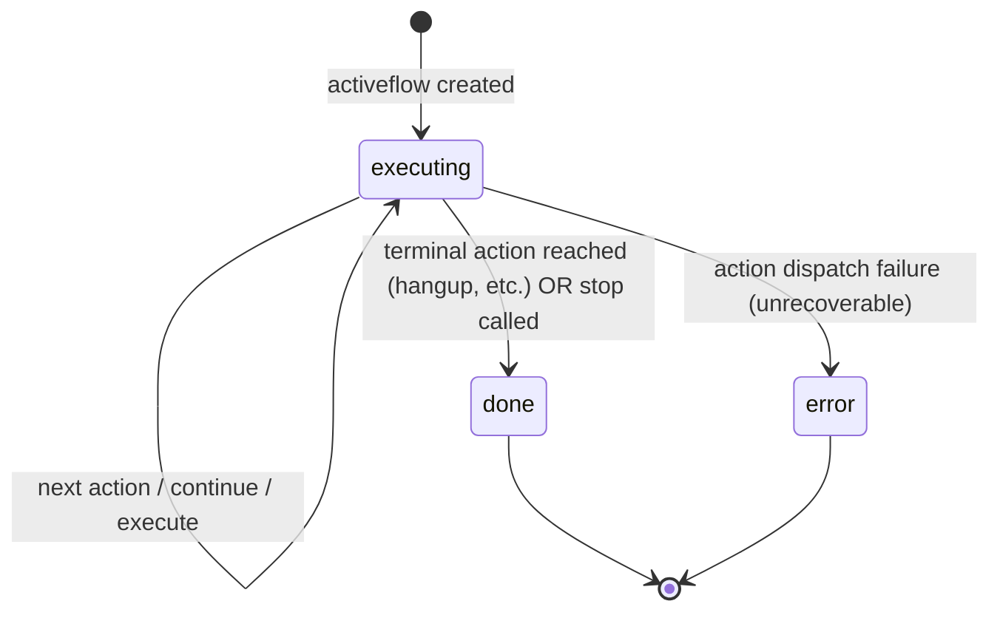

# Domain: bin-flow-manager

## Domain Entities

### Flow

A named template for call behavior — an ordered sequence of Actions that defines what should happen during a call (answer, play TTS, collect digits, transfer, hang up, etc.). Flows are authored at design time and stored in the database; they are not executed directly.

Key fields: `customer_id`, `name`, `actions` (ordered list), `direct_hash` (for direct execution without API auth).

### Action

An atomic step within a Flow. Each action specifies a `type` (the operation to perform) and a `param` map (type-specific configuration). Actions are executed in sequence during activeflow execution; branching is handled by setting the next action ID or by pushing a new action stack.

Common action types: `answer`, `hangup`, `play`, `talk`, `gather`, `condition`, `queue`, `conference`, `connect`, `transfer`, `silence`, `ai_talk`, `record`, `transcribe`.

### Activeflow

A live execution instance of a Flow attached to a specific call (or other resource). Tracks the current position in the action sequence, execution stack (for nested/branching flows), and runtime variables.

Key fields: `reference_id` (the call/resource UUID), `flow_id`, `current_action_id`, `stack_map` (nested execution stacks), `status`.

Statuses: `executing`, `done`, `error`.

### Stack

The activeflow execution uses a stack structure to support nested flows and branching. When a flow calls a sub-flow or branches, a new stack frame is pushed. When the sub-flow completes, the frame is popped and execution returns to the parent context.

### Variable

Named values scoped to an activeflow instance. Variables are set by flow actions (e.g., DTMF gather results, external API responses) and substituted into subsequent action parameters using `{{variable_name}}` syntax.

## Key Business Rules

1. **Flows are templates; activeflows are instances**: Modifying a flow template does not affect already-running activeflows. Each activeflow captures its action sequence at creation time.

2. **Action execution is sequential with stack-based branching**: Actions execute in order. Branching (e.g., a `condition` action) works by setting `forward_action_id` or pushing a new action stack. The `next` endpoint advances execution to the next action in the current stack frame.

3. **Variable substitution is late-bound**: Variable tokens (`{{var_name}}`) in action parameters are resolved at execution time, not at flow design time. This allows dynamic values (caller input, API responses) to be injected into later actions.

4. **Activeflows stop on terminal actions or explicit stop**: Execution halts when a terminal action (e.g., `hangup`) is reached, when `service_stop` or `stop` is called externally (e.g., by call-manager when the call hangs up), or when an error occurs.

5. **Stack push enables sub-flow execution**: The `push_actions` endpoint inserts a new action stack frame, allowing a set of actions (e.g., a queue wait sequence) to be injected mid-flow and then return to the original flow when complete.

6. **Direct hash enables webhook-triggered execution**: Flows have a `direct_hash` field that allows them to be triggered directly (e.g., from an external webhook) without going through the normal API authentication path. This hash can be regenerated via the `direct-hash-regenerate` endpoint.

7. **Customer deletion cascades to flows**: The service subscribes to `customer-manager` events. When a customer is deleted, all associated flows and activeflows are cleaned up.

8. **Action dispatch is service-specific**: The `actionhandler` routes each action type to the appropriate downstream service via RabbitMQ RPC (e.g., `talk` → `bin-tts-manager`, `queue` → `bin-queue-manager`, `ai_talk` → `bin-ai-manager`). The flow-manager is the central orchestrator of call behavior.

## State Machines

### Activeflow Lifecycle

