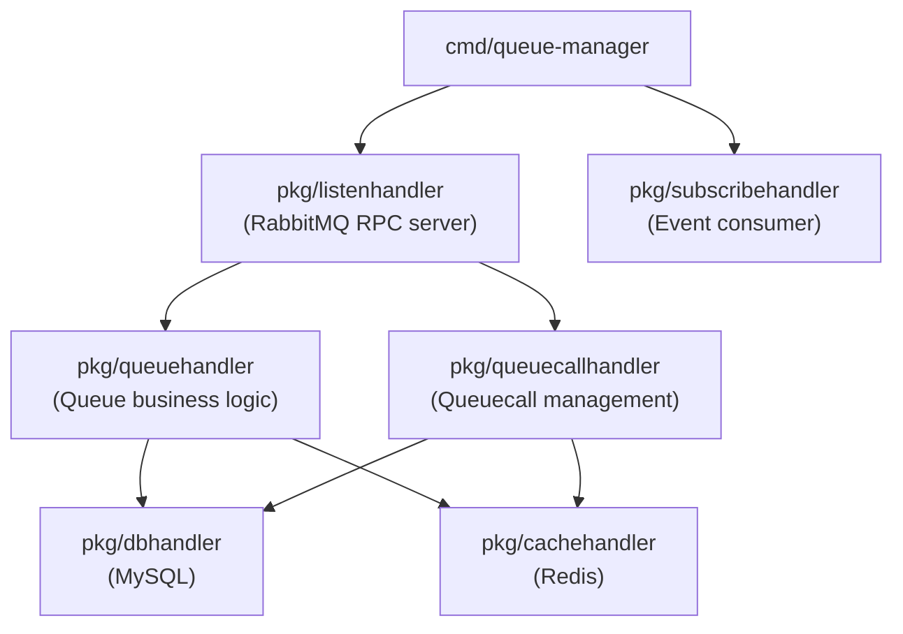

# Architecture: bin-queue-manager

## Component Overview

## Layer Responsibilities

| Package | Role | Key Types |
|---------|------|-----------|
| `pkg/queuehandler` | Queue CRUD, routing configuration, agent membership management, queue execution logic | `queue.Queue`, `queue.RoutingMethod` |
| `pkg/queuecallhandler` | Queuecall lifecycle: create, execute, kick, timeout handling, health checks, status transitions | `queuecall.Queuecall`, `queuecall.Status` |
| `pkg/listenhandler` | RabbitMQ RPC request router (regex pattern matching) | `sock.Request`, `sock.Response` |
| `pkg/subscribehandler` | Consumes events from call-manager, agent-manager, and conference-manager | queue event structs |
| `pkg/dbhandler` | MySQL CRUD operations | all model structs |
| `pkg/cachehandler` | Redis fast-path lookups for queues and queuecalls | `queue.Queue`, `queuecall.Queuecall` |
| `models/queue` | Queue data model, routing method constants | `queue.Queue`, `queue.RoutingMethod` |
| `models/queuecall` | Queuecall data model, status constants | `queuecall.Queuecall`, `queuecall.Status` |

## Request Routing

Requests arrive via RabbitMQ queue `bin-manager.queue-manager.request`. The `listenhandler` matches each request's URI against regex patterns and dispatches to the appropriate handler function.

| Route Pattern | Method | Description |
|---------------|--------|-------------|
| `/v1/queues/count_by_customer$` | GET | Count queues by customer ID |
| `/v1/queues$` | POST | Create a new queue |
| `/v1/queues\?{{UUID}}$` | GET | List queues with filters/pagination |
| `/v1/queues/{{UUID}}$` | GET/PUT/DELETE | Get, update, or delete a queue |
| `/v1/queues/{{UUID}}/tag_ids$` | PUT | Update queue tag IDs (agent filter) |
| `/v1/queues/{{UUID}}/routing_method$` | PUT | Update queue routing method |
| `/v1/queues/{{UUID}}/agents(\\?.*)$` | GET | List agents eligible for this queue |
| `/v1/queues/{{UUID}}/execute$` | POST | Trigger queue execution (attempt agent routing) |
| `/v1/queues/{{UUID}}/execute_run$` | POST | Run queue execution loop |
| `/v1/queues/{{UUID}}/direct-hash-regenerate$` | POST | Regenerate direct-access hash |
| `/v1/queuecalls\?{{UUID}}$` | GET | List queuecalls with filters/pagination |
| `/v1/queuecalls/{{UUID}}$` | GET/DELETE | Get or delete a queuecall |
| `/v1/queuecalls/{{UUID}}/timeout_wait$` | POST | Trigger wait timeout for a queuecall |
| `/v1/queuecalls/{{UUID}}/timeout_service$` | POST | Trigger service timeout for a queuecall |
| `/v1/queuecalls/{{UUID}}/execute$` | POST | Execute routing for a specific queuecall |
| `/v1/queuecalls/{{UUID}}/health-check$` | POST | Health check for a queuecall |
| `/v1/queuecalls/{{UUID}}/status_waiting$` | POST | Set queuecall back to waiting status |
| `/v1/queuecalls/{{UUID}}/kick$` | POST | Remove a queuecall from the queue |
| `/v1/queuecalls/reference_id/{{UUID}}$` | GET | Look up a queuecall by reference call ID |
| `/v1/queuecalls/reference_id/{{UUID}}/kick$` | POST | Kick a queuecall by reference call ID |
| `/v1/services/type/queuecall$` | POST | Create a queuecall via service type routing |
