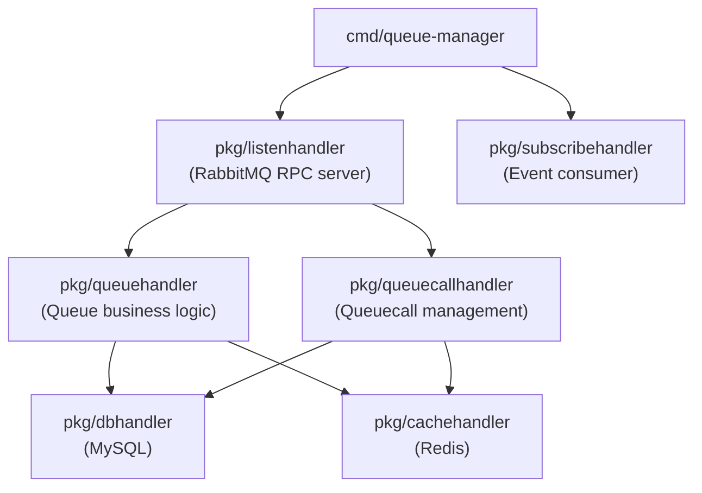

# Architecture: bin-queue-manager

## Component Overview

```mermaid
graph TD
    CMD["cmd/queue-manager"] --> LH["pkg/listenhandler\n(RabbitMQ RPC server)"]
    CMD --> SH["pkg/subscribehandler\n(Event consumer)"]

    LH --> QH["pkg/queuehandler\n(Queue business logic)"]
    LH --> QCH["pkg/queuecallhandler\n(Queuecall management)"]

    QH --> DBH["pkg/dbhandler\n(MySQL)"]
    QH --> Cache["pkg/cachehandler\n(Redis)"]
    QCH --> DBH
    QCH --> Cache
```

## Layer Responsibilities

| Package | Role | Key Types |
|---------|------|-----------|
| `pkg/queuehandler` | Queue CRUD, routing configuration, agent membership management, queue execution logic | `queue.Queue`, `queue.RoutingMethod` |
| `pkg/queuecallhandler` | Queuecall lifecycle: create, execute, kick, timeout handling, health checks, status transitions | `queuecall.Queuecall`, `queuecall.Status` |
| `pkg/listenhandler` | RabbitMQ RPC request router (regex pattern matching) | `sock.Request`, `sock.Response` |
| `pkg/subscribehandler` | Consumes call-manager events via pattern bindings on the global topic exchange `bin-manager.event` (sole intake mechanism since VOIP-1407) | queue event structs |
| `pkg/dbhandler` | MySQL CRUD operations | all model structs |
| `pkg/cachehandler` | Redis fast-path lookups for queues and queuecalls | `queue.Queue`, `queuecall.Queuecall` |
| `models/queue` | Queue data model, routing method constants | `queue.Queue`, `queue.RoutingMethod` |
| `models/queuecall` | Queuecall data model, status constants | `queuecall.Queuecall`, `queuecall.Status` |

## Event Subscriptions

SubscribeHandler (`pkg/subscribehandler/`) consumes from the queue `bin-manager.queue-manager.subscribe`. Since VOIP-1406 the queue is bound to the **global topic exchange `bin-manager.event`** with one pattern per dispatched (publisher, event-type) pair — 3 patterns total, pinned byte-for-byte by the binding golden test (`pkg/subscribehandler/binding_golden_test.go`). As of VOIP-1407 this topic-pattern binding is the **sole intake mechanism**; the old per-service fanout subscriptions (`QueueSubscribe` to `bin-manager.call-manager.event`, `bin-manager.agent-manager.event`, `bin-manager.conference-manager.event`) have been removed from `Run()` entirely, along with the fanout-unbind step that used to follow a successful topic bind:

| Pattern | Purpose |
|---------|---------|
| `call-manager.call.*.hangup` | Call hangup — kicks the queuecall out of the queue |
| `call-manager.confbridge.*.joined` / `call-manager.confbridge.*.leaved` | Confbridge join/leave — drives queuecall service/done transitions |

The `customer-manager.customer.*.deleted` pair is deliberately NOT bound: its dispatch case is unreachable today (the customer-manager fanout exchange was never subscribed) and stays that way (VOIP-1406 design §4; follow-up VOIP-1422 decides activate-or-delete — a latent-bug candidate, since queue records are likely meant to be cleaned on customer deletion).

## Event Publishing

All three NotifyHandler construction sites — `cmd/queue-manager`, and both instances in `cmd/queue-control` — are built with `notifyhandler.WithGlobalTopicPublish()`. **As of VOIP-1407, this is the sole publish path** — the previous per-service fanout exchange `bin-manager.queue-manager.event` is no longer published to, and (per the operational runbook in `docs/reference/rabbitmq-queues-reference.md`) will eventually be deleted from the broker. Events publish to the global topic exchange `bin-manager.event` with the routing key `queue-manager.<resource>.<queue-id>.<action>`. This service's publish-side behavior change comes entirely from `bin-common-handler/pkg/notifyhandler`'s shared library update (its own consumer-side subscribehandler code also changed separately for VOIP-1407, see the Event Subscriptions section above). The three sites must stay in lockstep on this option — enabling it in only some would leave consumers with gaps depending on which process published. A topic publish failure now propagates to the caller as an error (previously it was swallowed silently). See [docs/domain.md](domain.md) for the per-event routing keys and the monorepo `docs/plans/2026-08-27-voip-1404-global-topic-exchange-design.md` for the schema.

## Request Routing

Requests arrive via RabbitMQ queue `bin-manager.queue-manager.request`. The `listenhandler` matches each request's URI against regex patterns and dispatches to the appropriate handler function.

| Route Pattern | Method | Description |
|---------------|--------|-------------|
| `/v1/queues/count_by_customer$` | GET | Count queues by customer ID |
| `/v1/queues$` | POST | Create a new queue |
| `/v1/queues\?{{UUID}}$` | GET | List queues with filters/pagination |
| `/v1/queues/{{UUID}}$` | GET/PUT/DELETE | Get, update, or delete a queue |
| `/v1/queues/{{UUID}}/tag_ids$` | PUT | Update queue tag IDs (agent filter) |
| `/v1/queues/{{UUID}}/routing_method$` | PUT | Update queue routing method |
| `/v1/queues/{{UUID}}/agents(\\?.*)$` | GET | List agents eligible for this queue |
| `/v1/queues/{{UUID}}/execute$` | POST | Trigger queue execution (attempt agent routing) |
| `/v1/queues/{{UUID}}/execute_run$` | POST | Run queue execution loop |
| `/v1/queues/{{UUID}}/direct-hash-regenerate$` | POST | Regenerate direct-access hash |
| `/v1/queuecalls\?{{UUID}}$` | GET | List queuecalls with filters/pagination |
| `/v1/queuecalls/{{UUID}}$` | GET/DELETE | Get or delete a queuecall |
| `/v1/queuecalls/{{UUID}}/timeout_wait$` | POST | Trigger wait timeout for a queuecall |
| `/v1/queuecalls/{{UUID}}/timeout_service$` | POST | Trigger service timeout for a queuecall |
| `/v1/queuecalls/{{UUID}}/execute$` | POST | Execute routing for a specific queuecall |
| `/v1/queuecalls/{{UUID}}/health-check$` | POST | Health check for a queuecall |
| `/v1/queuecalls/{{UUID}}/status_waiting$` | POST | Set queuecall back to waiting status |
| `/v1/queuecalls/{{UUID}}/kick$` | POST | Remove a queuecall from the queue |
| `/v1/queuecalls/reference_id/{{UUID}}$` | GET | Look up a queuecall by reference call ID |
| `/v1/queuecalls/reference_id/{{UUID}}/kick$` | POST | Kick a queuecall by reference call ID |
| `/v1/services/type/queuecall$` | POST | Create a queuecall via service type routing |
