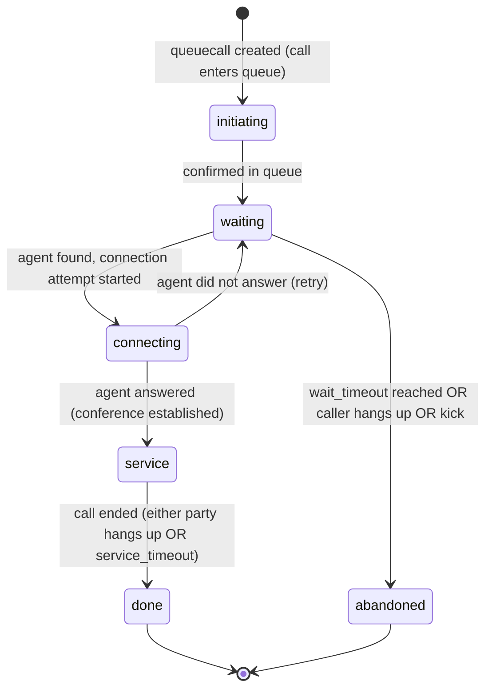

# Domain: bin-queue-manager

## Domain Entities

### Queue

A named call queue configuration that holds the routing rules and policies for directing callers to available agents. A queue does not hold calls directly — it holds queuecalls (individual call instances waiting for service).

Key fields: `customer_id`, `name`, `routing_method`, `tag_ids` (agent filter), `wait_timeout` (seconds before wait timeout), `service_timeout` (max agent service duration), `direct_hash`.

Routing methods: `random` (pick a random available agent matching tag IDs).

### Queuecall

A single call instance that is waiting in or being serviced by a queue. Created when a call enters the queue (via flow action or API) and lives until the call is serviced, abandoned, or times out.

Key fields: `queue_id`, `reference_id` (the call UUID), `reference_type`, `status`, `agent_id` (set when an agent is connected), `conference_id` (the conference used for agent-caller connection).

Statuses: `initiating` → `waiting` → `connecting` → `service` → `done` | `abandoned`.

## Key Business Rules

1. **Queue routing is tag-based**: Queues filter available agents by matching `tag_ids`. An agent is eligible for a queue if their tags overlap with the queue's required tags. Updating either the queue's tags or an agent's tags takes effect immediately.

2. **Wait timeout triggers abandon**: If a queuecall reaches its `wait_timeout` without being connected to an agent, the `timeout_wait` endpoint is called (typically by a scheduler), which transitions the queuecall to `abandoned` and may trigger a post-queue flow.

3. **Service timeout caps agent time**: Once an agent is connected (status `service`), `service_timeout` limits the maximum duration. The `timeout_service` endpoint forces disconnection and cleanup when the limit is reached.

4. **Agent availability is event-driven**: This service subscribes to agent-manager events to maintain awareness of agent status changes (available/busy/offline). When an agent becomes available, the queue execution loop attempts to route waiting queuecalls to them.

5. **Conference is the connection mechanism**: When a queuecall is matched to an agent, a conference is created (via conference-manager) to bridge the caller and the agent. The `conference_id` is stored on the queuecall.

6. **Health checks prevent orphaned queuecalls**: The `health-check` endpoint allows call-manager to verify that a queuecall's reference call is still active. If the call is gone, the queuecall should be kicked.

7. **Kick removes a queuecall from the queue**: Either by UUID or by reference call ID. This is used when a caller hangs up while waiting, or when an operator removes a caller manually.

## State Machines

### Queuecall Lifecycle

