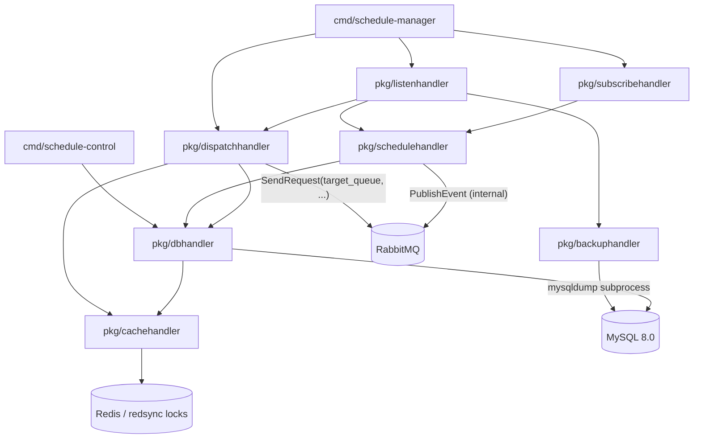

# bin-schedule-manager Architecture

## Component Overview

`bin-schedule-manager` is the platform-internal cron scheduler. Schedules live in MySQL; every replica runs the same dispatch tick loop and competes for due slots via Redis locks plus a DB compare-and-swap claim, then fires the schedule's RPC target over RabbitMQ and records an execution audit row.

## Layer Responsibilities

| Package | Role | Key Types |
|---------|------|-----------|
| `cmd/schedule-manager` | Daemon entry point; wires handlers, starts listen/subscribe/dispatch loops | cobra `rootCmd` |
| `cmd/schedule-control` | Admin CLI over direct DB/cache (no RabbitMQ) — emergency disable path | cobra commands |
| `internal/config` | Flag/env binding (Viper), global config singleton | `config.Config` |
| `pkg/listenhandler` | Consumes `bin-manager.schedule-manager.request`; regex-routes to handlers; error → `cerrors.VoipbinError` envelope | `ListenHandler` |
| `pkg/subscribehandler` | Subscribes `bin-manager.customer-manager.event`; `customer_deleted` cascade | `SubscribeHandler` |
| `pkg/schedulehandler` | Schedule CRUD, cron/method/target-queue validation, name uniqueness, next-run computation, internal event publishing | `ScheduleHandler` |
| `pkg/dispatchhandler` | Tick loop: reap abandoned → refresh gauges → init `tm_next_run` → claim + dispatch due slots; manual execute | `DispatchHandler` |
| `pkg/backuphandler` | `mysqldump --single-transaction` subprocess, gzip to `SCHEDULE_BACKUP_DIR`, retention pruning | `BackupHandler` |
| `pkg/dbhandler` | MySQL via squirrel; CAS claim transaction; sqlite-backed tests | `DBHandler` |
| `pkg/cachehandler` | Redis + redsync try-once claim locks (`schedule:lock:<id>`) | `CacheHandler` |
| `models/schedule` | Schedule entity, cron helpers, filters, internal event type constants | `schedule.Schedule` |
| `models/execution` | Execution audit entity, status machine, filters | `execution.Execution` |

## Request Routing

Requests arrive on the RabbitMQ queue `bin-manager.schedule-manager.request`. The `listenhandler` dispatches by matching the URI against compiled regexes (`pkg/listenhandler/main.go`).

| Route Pattern | Handler Function | Description |
|---------------|------------------|-------------|
| `/v1/schedules$` (POST) | `processV1SchedulesPost` | Create schedule; validates cron parse + non-zero `Next()`, method whitelist, `target_queue` against the `commonoutline` request-queue allowlist, active-name uniqueness |
| `/v1/schedules\?(.*)$` (GET) | `processV1SchedulesGet` | List schedules with `page_size`/`page_token`/filters (customer_id, enabled, deleted) |
| `/v1/schedules/<uuid>$` (GET) | `processV1SchedulesIDGet` | Get schedule |
| `/v1/schedules/<uuid>$` (PUT) | `processV1SchedulesIDPut` | Update schedule; a cron or enabled change resets `tm_next_run` to NULL (recomputed next scan) |
| `/v1/schedules/<uuid>$` (DELETE) | `processV1SchedulesIDDelete` | Soft-delete schedule |
| `/v1/schedules/<uuid>/execute$` (POST) | `processV1SchedulesIDExecutePost` | Manual fire-now; never touches `tm_next_run`/`tm_last_run`; 409 while a run is in flight; works on disabled schedules |
| `/v1/executions\?(.*)$` (GET) | `processV1ExecutionsGet` | Execution audit trail with filters (schedule_id, status) |
| `/v1/executions/prune$` (POST) | `processV1ExecutionsPrunePost` | Batched retention delete (internal; fired by the seeded `execution-retention` schedule) |
| `/v1/backups$` (POST) | `processV1BackupsPost` | Run DB backup now (internal; fired by the seeded `database-backup` schedule) |

Self-RPC note: `/v1/executions/prune` and `/v1/backups` arrive on the service's own request queue via the dispatch engine (housekeeping dogfoods the engine). Each occupies one of the 10 listenhandler consumer workers for its duration; with at most two internal schedules and Forbid overlap, worst case is 2 of 10 workers busy. The shared RPC consume path acks before processing, so a long-running backup cannot trip broker consumer timeouts.

## Events

### Events Published (internal only — no customer webhooks in Phase 1)

CRUD and execution outcomes publish internal events via notifyhandler on `bin-manager.schedule-manager.event`:

| Event | Trigger |
|-------|---------|
| `schedule_created` | Successful `POST /v1/schedules` |
| `schedule_updated` | Successful `PUT /v1/schedules/<id>` |
| `schedule_deleted` | Successful `DELETE /v1/schedules/<id>` or customer-deleted cascade |
| `execution_succeeded` | Dispatch completed with a success response |
| `execution_failed` | Dispatch exhausted its retry budget with failures |

Every Phase 1 schedule is nil-customer, so `PublishWebhook` short-circuits — there is deliberately no `WebhookMessage` and no RST struct documentation until Phase 3 exposes customer-owned schedules.

### Events Subscribed

| Queue | Event | Handler |
|-------|-------|---------|
| `bin-manager.customer-manager.event` | `customer_deleted` | Delete all schedules owned by the customer (Phase 1 platform schedules are nil-customer and unaffected) |
