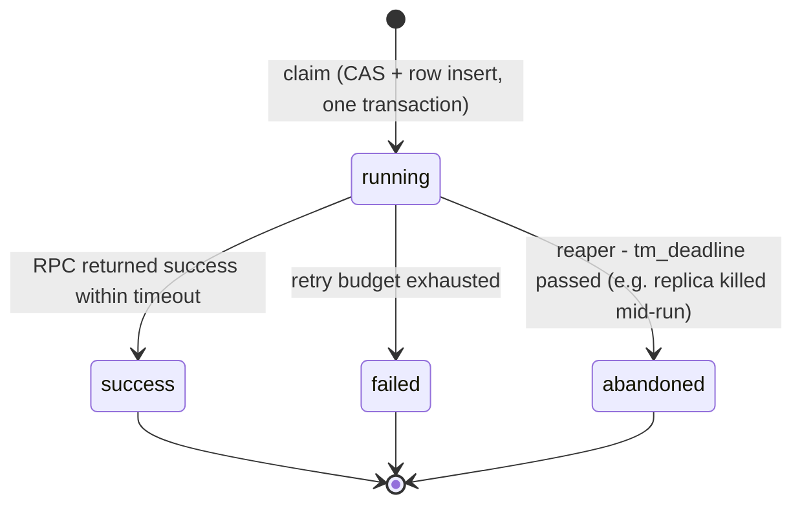

# bin-scheduler-manager Domain

## Domain Entities

### Schedule

A named cron entry owned by the platform (nil `customer_id` in Phase 1; the schema already carries `customer_id` for Phase 3 multi-tenancy). Stored in `scheduler_schedules`.

Fields (see `models/schedule/schedule.go`):
- `id`, `customer_id` — identity (`customer_id` is nil for all Phase 1 platform schedules)
- `name` — schedule name, unique per customer among active rows (application-level check)
- `detail` — description
- `type` — execution type; Phase 1 supports `rpc` only
- `cron` — 5-field cron expression, evaluated in UTC
- `target_queue`, `target_uri`, `target_method`, `target_data_type`, `target_data` — the RPC request to dispatch; `target_queue` is validated at CRUD time against the `commonoutline` request-queue allowlist
- `timeout_ms` — RPC timeout for the dispatch
- `retry_max` — in-run immediate retries on failure (0 for destructive jobs like `number-renew`)
- `enabled` — disabled schedules never fire from cron (manual execute still works)
- `tm_next_run` — next due slot; NULL means "compute on next scan" (set NULL on create and on cron change)
- `tm_last_run` — timestamp of the last successful claim
- `tm_create` / `tm_update` / `tm_delete` — lifecycle timestamps; soft-delete via `tm_delete`

### Execution

The audit-trail / dead-letter record for every run, stored in `scheduler_executions`. One row per claimed slot or manual fire.

Fields (see `models/execution/execution.go`):
- `id`, `schedule_id` — identity and owning schedule
- `trigger_type` — `cron` or `manual`
- `status` — see state machine below
- `status_code` — RPC response status code (0 on transport error)
- `error` — error string on failure/abandonment
- `result` — RPC response body on success (the backup job records `{"path": ..., "bytes": ...}` here)
- `attempt_count` — 1 + retries actually used
- `duration_ms` — total wall time of the run
- `tm_scheduled` — the `tm_next_run` slot this row consumed (`(schedule_id, trigger_type, tm_scheduled)` is unique — the double-fire backstop)
- `tm_deadline` — reap deadline; a `running` row past this is abandoned
- `tm_start` / `tm_end` — run window

#### Execution status machine

`success`, `failed`, and `abandoned` are terminal. There is no automatic re-dispatch of `failed` or `abandoned` runs — the next cron slot is the retry (Forbid + at-most-once semantics).

## Key Business Rules

1. **At-most-once per slot.** A due slot is claimed by atomically CAS-advancing `tm_next_run` and inserting the execution row in a single DB transaction, behind a try-once Redis lock (`scheduler:lock:<id>`). Losing the lock (`skipped_lock`) or the CAS (`skipped_cas`) means another replica owns the slot. The unique key on `(schedule_id, trigger_type, tm_scheduled)` is the last-resort backstop.
2. **Forbid overlap.** A schedule never runs concurrently with itself. If a run is still in flight when the next slot comes due, the slot waits (late, not lost); the skip is counted once per slot (`skipped_overlap`), not once per tick.
3. **Catch-up is single-fire.** After downtime, exactly one run fires and `tm_next_run` advances from now. Missed slots are not replayed.
4. **Manual execute never consumes the cron slot.** `POST /v1/schedules/<id>/execute` touches neither `tm_next_run` nor `tm_last_run` — test-firing `number-renew` at 14:00 must not consume tonight's 01:00 slot. Manual runs work on disabled schedules, use the same lock + overlap guard (409 while any run is in flight), and insert their row with `trigger_type='manual'`.
5. **Abandonment, not silent retry.** A `running` execution past `tm_deadline` (replica died mid-run) is reaped to `abandoned` by the tick loop. The loss is recorded and visible in metrics; the job fires again at its next cron slot.
6. **Name uniqueness is application-level.** Active (non-deleted) schedules must have a unique `name` per customer; the check lives in `schedulehandler` (soft-deleted rows would break a plain DB unique index).
7. **Validation at the boundary.** Create/update reject: cron expressions that fail to parse or whose `Next()` is zero (syntactically valid but never-matching, e.g. `0 0 30 2 *`), non-whitelisted methods, `target_queue` values not in the `commonoutline.QueueNameRequestAll()` enumeration, and types other than `rpc`.
8. **Customer cascade.** On `customer_deleted`, all schedules owned by that customer are deleted (Phase 3 relevance; Phase 1 platform schedules are nil-customer and unaffected).
