# Service Dependency Graph

> **Purpose:** Visualize service dependencies, communication patterns, and impact analysis for the VoIPbin monorepo.

## Overview

The monorepo contains 31+ services organized into layers:
- **Core Services** - Depended on by many services
- **Utility Services** - Medium dependency count
- **Leaf Services** - Consume but aren't consumed

## Dependency Diagram

```mermaid
graph TD
    subgraph Core["Core Services (Hub)"]
        CH[bin-common-handler]
        CALL[bin-call-manager]
        FLOW[bin-flow-manager]
        CUST[bin-customer-manager]
    end

    subgraph Telephony["Telephony Layer"]
        CONF[bin-conference-manager]
        TRANS[bin-transfer-manager]
        REC[bin-registrar-manager]
        TTS[bin-tts-manager]
        TRANSCR[bin-transcribe-manager]
        PIPE[bin-pipecat-manager]
    end

    subgraph Business["Business Logic Layer"]
        AGENT[bin-agent-manager]
        BILL[bin-billing-manager]
        CAMP[bin-campaign-manager]
        QUEUE[bin-queue-manager]
        OUTDIAL[bin-outdial-manager]
    end

    subgraph Messaging["Messaging Layer"]
        MSG[bin-message-manager]
        EMAIL[bin-email-manager]
        CHAT[bin-chat-manager]
        CONV[bin-conversation-manager]
    end

    subgraph Integration["Integration Layer"]
        HOOK[bin-hook-manager]
        WEBHOOK[bin-webhook-manager]
        STORE[bin-storage-manager]
        NUM[bin-number-manager]
    end

    subgraph Gateway["Gateway & Utilities"]
        API[bin-api-manager]
        TAG[bin-tag-manager]
        SENT[bin-sentinel-manager]
        TALK[bin-talk-manager]
        AI[bin-ai-manager]
    end

    subgraph External["External Systems"]
        AST[voip-asterisk-proxy]
    end

    %% Core dependencies
    CH --> CALL
    CH --> FLOW
    CH --> CUST

    %% Telephony dependencies
    CALL --> CONF
    CALL --> TRANS
    CALL --> TRANSCR
    CALL --> PIPE
    FLOW --> TTS

    %% Business dependencies
    CUST --> AGENT
    CUST --> BILL
    AGENT --> REC
    CALL --> CAMP
    FLOW --> CAMP
    CALL --> QUEUE
    AGENT --> QUEUE

    %% Messaging dependencies
    MSG --> CONV
    HOOK --> EMAIL
    HOOK --> MSG

    %% Integration dependencies
    STORE --> EMAIL
    STORE --> TRANSCR
    NUM --> MSG
    NUM --> BILL

    %% AI dependencies
    CALL --> AI
    FLOW --> AI
    PIPE --> AI

    %% Gateway calls everything
    API -.-> CALL
    API -.-> FLOW
    API -.-> CUST
    API -.-> AGENT
    API -.-> BILL

    %% Asterisk events
    AST ==> CALL
```



## Service Classification

### Core Services (Hub Dependencies)

| Service | Dependents | Description |
|---------|-----------|-------------|
| `bin-common-handler` | 31 (all) | Shared library - handlers, models, utilities |
| `bin-call-manager` | 12 | Telephony core - call lifecycle, recordings |
| `bin-flow-manager` | 9 | Workflow orchestration - IVR flows, actions |
| `bin-customer-manager` | 8 | Tenant management - accounts, access keys |

### Utility Services (Medium Dependencies)

| Service | Dependents | Description |
|---------|-----------|-------------|
| `bin-agent-manager` | 6 | Agent presence, permissions |
| `bin-conference-manager` | 5 | Audio conferencing |
| `bin-billing-manager` | 5 | Balance tracking, subscriptions |
| `bin-storage-manager` | 5 | File storage (GCP) |

### Leaf Services (No Dependents)

| Service | Type | Description |
|---------|------|-------------|
| `bin-api-manager` | Gateway | REST API gateway (calls 15+ services) |
| `bin-sentinel-manager` | Monitoring | Pod lifecycle events |
| `bin-openapi-manager` | Tooling | OpenAPI spec (not a runtime service) |
| `voip-asterisk-proxy` | Proxy | Asterisk ARI bridge |

## Communication Patterns

### RPC Calls (Request/Response)

Services call each other via `requestHandler.ServiceV1*` methods:

```
bin-api-manager ──RPC──> bin-call-manager ──RPC──> bin-conference-manager
                         bin-flow-manager ──RPC──> bin-webhook-manager
                         bin-customer-manager
```

**High-Traffic RPC Paths:**
- `api-manager` → `call-manager` (call creation)
- `flow-manager` → `call-manager` (call actions)
- `billing-manager` → `call-manager` (CDR lookup)

### Event Subscriptions (Pub/Sub)

Services subscribe to events via RabbitMQ:

| Publisher | Event | Subscribers |
|-----------|-------|-------------|
| `call-manager` | `call_hungup` | billing, ai, campaign, queue, transfer |
| `call-manager` | `confbridge_joined` | conference, queue |
| `customer-manager` | `customer_deleted` | billing, agent, tag, webhook, registrar |
| `flow-manager` | `activeflow_deleted` | campaign |
| `message-manager` | `message_created` | billing, conversation |

### Event Flow Diagram

```
asterisk-proxy                call-manager              flow-manager
     │                             │                          │
     │ asterisk.all.event          │                          │
     └────────────────────────────>│                          │
                                   │ call_hungup              │
                                   ├─────────────────────────>│
                                   │      │                   │
                                   │      │ call_hungup       │ activeflow_deleted
                                   │      ├──────────────────>├──────────────────>
                                   │      │                   │                  │
                                   │      v                   v                  v
                                billing-manager      campaign-manager     queue-manager
```

## Impact Analysis

### If bin-common-handler Changes

**Impact: ALL SERVICES**

```bash
# Must update and test all 31 services
ls -d bin-*/ | xargs -I {} bash -c "cd '{}' && go mod tidy && go mod vendor && go test ./..."
```

### If bin-call-manager Changes

**Impact: 12 services**

| Service | Impact Type |
|---------|-------------|
| agent-manager | Model imports |
| billing-manager | RPC + Events |
| ai-manager | RPC |
| campaign-manager | RPC + Events |
| conference-manager | Model imports |
| flow-manager | RPC |
| pipecat-manager | RPC |
| transfer-manager | Events |
| tts-manager | Model imports |
| queue-manager | RPC + Events |
| transcribe-manager | RPC + Events |
| hook-manager | Model imports |

### If bin-customer-manager Changes

**Impact: 8 services + cascading deletions**

All services subscribe to `customer_deleted` events for cleanup.

## Dependency Rules

### Allowed Dependencies

1. **Any service → bin-common-handler** (universal)
2. **Leaf services → Core services** (api-manager → call-manager)
3. **Same-layer peers** (call-manager ↔ flow-manager via RPC)

### Prohibited Dependencies

1. **Core → Leaf** (call-manager should NOT import api-manager)
2. **Circular module imports** (Go compiler prevents this)
3. **Direct database access across services** (use RPC)

## Adding New Dependencies

When adding a dependency between services:

1. **Update go.mod** - Add replace directive
2. **Update go.sum** - Run `go mod tidy`
3. **Vendor** - Run `go mod vendor`
4. **Document** - Update this file if significant
5. **Test** - Run verification workflow

```bash
# In the dependent service
cd bin-new-service
echo 'replace monorepo/bin-target-service => ../bin-target-service' >> go.mod
go mod tidy
go mod vendor
```

## Queue Reference

For complete queue naming, see [RabbitMQ Queues Reference](rabbitmq-queues-reference.md).

## See Also

- [Architecture Deep Dive](architecture-deep-dive.md) - Service categories
- [RabbitMQ Queues Reference](rabbitmq-queues-reference.md) - Queue naming
- [Common Workflows](common-workflows.md) - Adding services
