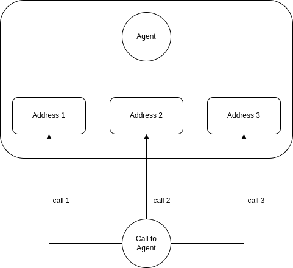

.. _agent_overview:

Overview
========
The agent, also known as the call center agent or phone agent, plays a crucial role as a representative of a company, handling calls with private or business customers on behalf of the organization. Typically, agents work in a call center environment, where multiple agents are employed to efficiently manage incoming and outgoing calls. The call center may be operated by the company itself or outsourced to an external service provider. In the case of external service providers, a single site may serve various clients from different businesses.

Call to agent
-------------
To reach an agent, VoIPBIN employs a system that allows the agent to have multiple addresses. When a call is initiated to agents, VoIPBIN generates calls to every agent's address simultaneously. If an agent answers one of the calls, VoIPBIN automatically terminates the other calls, streamlining the communication process and ensuring that only one connection is established with the available agent.

This approach enables efficient call handling, minimizing the time customers spend waiting for an available agent. The call distribution mechanism ensures that agents are optimally utilized, enhancing customer service and overall call center productivity.
