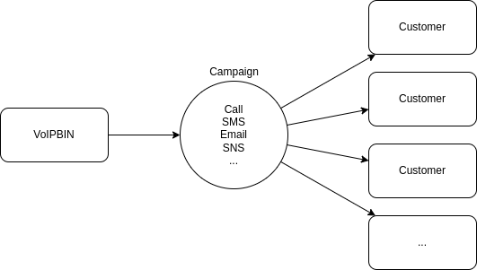
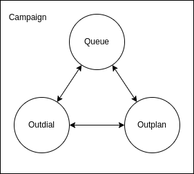
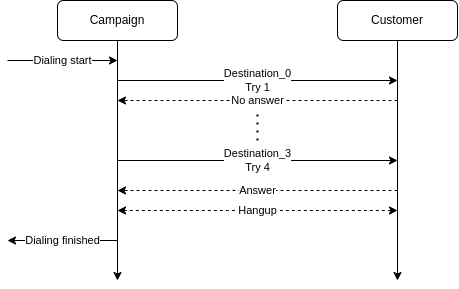

.. _campaign-overview:

Overview
========
The VoIPBIN campaign API provides campaign service for massive outbound calling.

An outbound campaign desigend for massive outgoing Call/SMS/Email/SNS with flow to the given destinations for telemarketing, telesales, collections, notification, etc.

Resource
--------
The VoIPBIN's campaign concist of these resources.

- Queue: Call's waiting place and set of agents group.
- Outdial: Target destination list.
- Outplan: Dial strategy. Determine which dial info would be dialling.

5W1H
----
The campaign has a 5W1H principle. Each resource

- Campaign : Determine why make a call and what will going to do with a created call(Why/What)
- Queue(Agents) : Determine who get a call after answer.(Who)
- Outdial : Determine where call heading for.(Where)
- Outplan : Determine how/when to make a call.(How/When)

Dialing strategy
----------------
Reaching out to the customers are important. So, the VoIPBIN provides multiple retry options.

