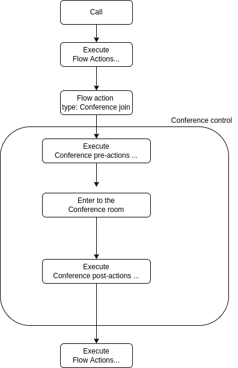

.. _conference-overview:

Overview
========

The Conference API is a low-level API that allows you to create a conference room for various objects such as voice, video, and chat.
Conferences are the fundamental concept the API revolves around. Conferences are containers of communcations exchanged between two or more users which could be a sinble interaction or the history of all interactions between them.

The API also allows you to create voice/video/WebRTC calls to enable voice and video communications exchaged between two Users and store them in Conferences.

