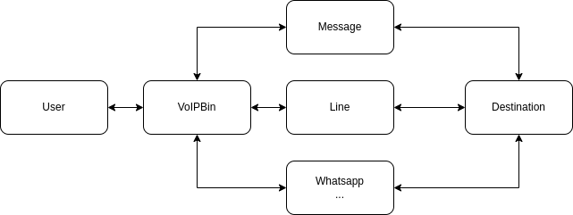

.. _conversation-overview:

Overview
========
Build conversational, cross-channel messaging through a few API calls with VoIPBIN Conversations.

User can start a conversation with SMS and seamlessly continue it over another channel such as Chat or SNS.
Use the VoIPBIN Conversations API to create conversations, add participants, and set up webhooks to monitor and intercept anything that happens in a Conversation that may be of interest to you.

Unified conversation
--------------------
VoIPBIN's conversation supports various types of methods.

