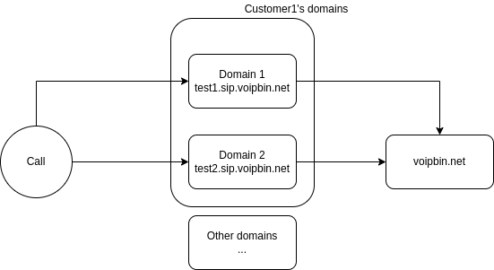

.. _domain-overview:

Overview
========

A SIP Domain resource describes a custom DNS hostname that can be accept SIP traffic for your account. A SIP request to that domain, such as to
`sip:alice@example.sip.voipbin.net`, routes to Voipbin. Voipbin authenticates the request and requests Voipbin from the voice_url of the SIP domain.

