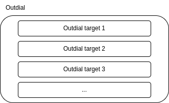

.. _outdial_overview:

Overview
========
The VoIPBIN's Outdial API offers functionalities for managing outdials and outdial targets, enabling users to efficiently handle the process of outbound calling.

VoIPBIN's Outdial API, with its Outdial and Outdial Target resources, provides a reliable and scalable solution for outbound calling needs. It streamlines the process of managing multiple destinations, controlling retry attempts, and optimizing the efficiency of outbound calling campaigns. Whether it's for telemarketing, customer outreach, or any other outbound communication, the Outdial API is a valuable tool for businesses and developers looking to engage with their audience effectively.

Outdial
-------
The Outdial resource represents a collection of outdial targets.

An outdial is a set of destinations that are intended for outbound calling. It contains a group of outdial targets, each representing an individual destination address and the number of times it should be attempted.

Outdials are a fundamental concept in the Outdial API, allowing users to organize and manage groups of outbound calls. This feature is particularly useful for telemarketing, notifications, reminders, or any scenario where multiple outbound calls need to be made to specific destinations.

Outdial target
--------------
The Outdial Target is a critical component of the Outdial API, representing the actual destination addresses and the associated retry count for each address.

Each Outdial Target contains the address (phone number, SIP URI, etc.) of the destination that needs to be dialed. Additionally, it includes the number of times the destination should be attempted, also known as the retry count. The retry count specifies how many times the system should try to connect to the destination in case the call is not successfully answered or completed.

.. image:: _static/images/outdial_overview_outdialtarget.png
