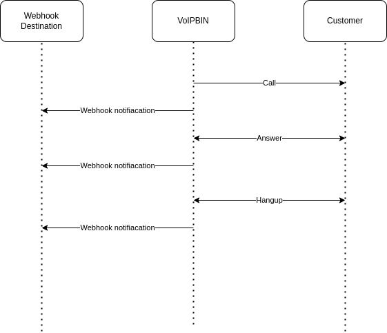

.. _webhook-overview:

Overview
========
Webhooks are a powerful feature provided by VoIPBIN that allows users to receive event data for their calls and associated resources directly on their own servers. With webhooks, users can set up custom endpoints on their server to receive real-time notifications and data updates related to their VoIPBIN resources.

Overall, webhooks empower users with greater control, customization, and real-time visibility into their VoIPBIN resources, making it an essential tool for building sophisticated communication workflows and integrations.

Notification Mechanism
----------------------
VoIPBIN sends webhook events as a form of event notification. When specific events or actions occur in the VoIPBIN system, such as call events, message events, or changes to resources like queues or agents, the system generates webhook events and sends them to the user's configured webhook endpoint.

Types of Webhooks
-----------------0
Every resource in the VoIPBIN generates its own set of webhooks to provide progress and updates for different events. This ensures that users can receive notifications and data specific to each resource type, allowing for granular control and monitoring of their VoIPBIN resources.

For example, when a call is placed or received, VoIPBIN can generate call-specific webhook events that provide information such as the call status, call duration, and caller ID. Similarly, message-specific webhook events can provide details about SMS or MMS messages sent or received, such as message content, sender ID, and delivery status.

Custom Endpoints
----------------
To utilize webhooks, users must configure their own custom webhook endpoints on their server. This endpoint is the URL to which VoIPBIN will send the webhook events. When an event occurs, VoIPBIN makes an HTTP request to the configured endpoint, including relevant data in the request payload, allowing users to process and respond to the event as needed.

Benefits of Webhooks
--------------------
Webhooks offer several benefits for users of VoIPBIN:

* Real-Time Updates: Webhooks provide real-time event notifications, allowing users to receive immediate updates about their VoIPBIN resources.
* Customization: Users can configure their own webhook endpoints and process data according to their specific needs, enabling custom workflows and integrations.
* Automated Actions: With webhooks, users can automate actions based on event data, such as updating records, sending notifications, or triggering additional processes.
* Enhanced Monitoring: Webhooks provide a proactive way to monitor and track changes in the VoIPBIN system, allowing users to stay informed and take timely actions.
